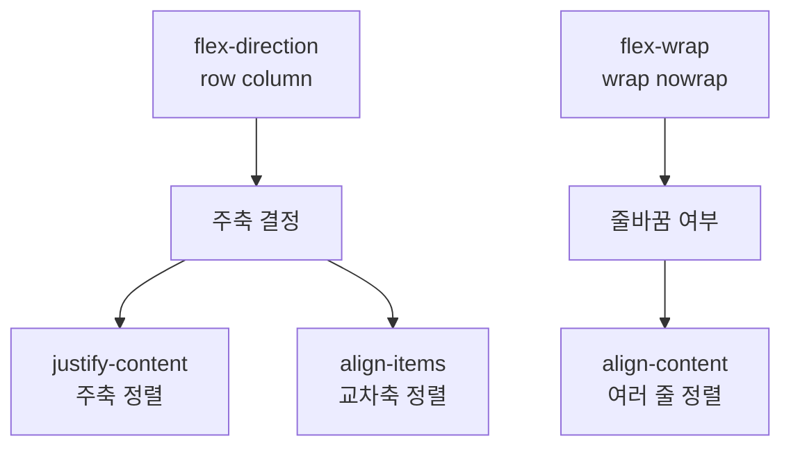

## 들어가며 (Situation)

부트캠프에서 HTML과 CSS를 배우면서 페이지 레이아웃의 기초를 다지고 있습니다. 초기에는 CSS 개념들이 단편적으로 느껴졌지만, **CSS Diner**와 **Flexbox Froggy** 같은 게임 형태의 학습 사이트를 통해 각 개념이 서로 어떻게 연결되는지 깨달을 수 있었습니다.

---

## 문제 상황 (Task)

처음 CSS를 배울 때 마주친 어려움은 두 가지였습니다.

1. **선택자의 한계**: 특정 요소를 선택하는 방법이 하나의 답만 있다고 생각했습니다. "이 요소를 선택하려면 이 선택자를 써야 한다"는 식의 고정된 생각이 있었던 것이죠.
2. **Flexbox의 직관성 부족**: `flex-direction`, `justify-content`, `align-items` 같은 속성들이 각각 무엇을 하는지는 알지만, 이들이 좌표계에서 어떻게 동작하는지 명확하지 않았습니다. 특히 행(row)과 열(column)의 개념이 헷갈렸습니다.

---

## 해결 과정 (Action)

### 1. CSS 선택자 — 창의적으로 접근하기

**CSS Diner** 게임을 풀면서 깨달은 가장 중요한 사실은 **같은 요소를 선택하는 방법은 무수히 많다**는 것입니다.

#### 선택자의 다양한 접근법

예를 들어, 다음 HTML에서 세 번째 `<li>` 요소만 선택한다고 가정해봅시다.

```html
<ul>
  <li>첫 번째</li>
  <li>두 번째</li>
  <li class="highlight">세 번째</li>
  <li>네 번째</li>
</ul>
```

**일반적인 방법:**
```css
li:nth-child(3) { /* 스타일 */ }
.highlight { /* 스타일 */ }
```

**창의적인 방법:**
```css
/* 일반 형제 선택자 활용 */
li:first-child ~ li:nth-child(3) { /* 스타일 */ }

/* 인접 형제 선택자 + nth-child 조합 */
li:nth-child(2) + li { /* 스타일 */ }
```

이렇게 **같은 목표를 여러 방식으로 달성**할 수 있다는 사실이 CSS의 유연성을 보여줍니다.

#### 인접 형제 선택자 vs 일반 형제 선택자

| 선택자 | 기호 | 설명 | 예시 |
|--------|------|------|------|
| **인접 형제** | `+` | 바로 다음에 오는 형제 요소 선택 | `h2 + p { }` : h2 바로 다음의 p만 |
| **일반 형제** | `~` | 뒤따르는 모든 형제 요소 선택 | `h2 ~ p { }` : h2 다음의 모든 p |

**실제 코드 예시:**

```html
<article>
  <h2>제목</h2>
  <p>첫 번째 문단</p>
  <p>두 번째 문단</p>
  <p>세 번째 문단</p>
</article>
```

```css
/* 제목 바로 다음의 첫 문단만 강조 */
h2 + p {
  font-weight: bold;
}

/* 제목 다음의 모든 문단에 색상 적용 */
h2 ~ p {
  color: #333;
}
```

---

### 2. Flexbox — 좌표계로 이해하기

**Flexbox Froggy** 게임을 풀면서 가장 큰 깨달음은 **Flexbox의 모든 속성이 사실 좌표계에 기반**한다는 것입니다.

#### Flexbox의 핵심 개념도



#### 각 속성의 역할

| 속성 | 설명 | 주요 값 |
|------|------|---------|
| **flex-direction** | Flex 컨테이너의 주축 방향 결정 | `row`, `column`, `row-reverse`, `column-reverse` |
| **justify-content** | 주축(행 또는 열)을 따라 아이템 정렬 | `flex-start`, `center`, `flex-end`, `space-between`, `space-around` |
| **align-items** | 교차축을 따라 아이템 정렬 (한 줄) | `flex-start`, `center`, `flex-end`, `stretch` |
| **flex-wrap** | 컨테이너 크기 초과 시 줄바꿈 여부 | `nowrap`, `wrap`, `wrap-reverse` |
| **align-content** | flex-wrap이 활성화된 상태에서 여러 줄 정렬 | `flex-start`, `center`, `flex-end`, `space-between` |

**실제 코드 예시:**

```html
<div class="container">
  <div class="item">1</div>
  <div class="item">2</div>
  <div class="item">3</div>
</div>
```

```css
.container {
  display: flex;
  flex-direction: row;           /* 주축: 가로(행) */
  justify-content: space-between; /* 주축 따라 정렬 */
  align-items: center;            /* 교차축 따라 정렬 */
  height: 200px;
}
```

---

### 3. flex-direction: reverse — 행과 열의 전환

**Flexbox Froggy**를 풀다가 발견한 가장 흥미로운 부분은 **`flex-direction: row-reverse`와 `flex-direction: column-reverse`** 속성입니다.

처음에는 단순히 "요소들의 순서를 반대로 배열한다"고 생각했지만, 실제로는 **좌표계 자체를 뒤집는 것**입니다.

#### Before/After 비교

**HTML (공통):**
```html
<div class="container">
  <div>1</div>
  <div>2</div>
  <div>3</div>
</div>
```

**flex-direction: row (기본값)**
```css
.container {
  display: flex;
  flex-direction: row;
}
/* 결과: [1] [2] [3] 가로로 배열 */
```

**flex-direction: row-reverse**
```css
.container {
  display: flex;
  flex-direction: row-reverse;
}
/* 결과: [3] [2] [1] 순서 반전 + 주축 뒤집기 */
```

**flex-direction: column**
```css
.container {
  display: flex;
  flex-direction: column;
  height: 300px;
}
/* 결과: 세로로 배열 */
/* [1]
   [2]
   [3] */
```

**flex-direction: column-reverse**
```css
.container {
  display: flex;
  flex-direction: column-reverse;
  height: 300px;
}
/* 결과: 세로로 배열되지만 하단부터 시작 */
/* [3]
   [2]
   [1] */
```

#### 실무에서의 활용

`flex-direction: reverse`를 활용하면 다음과 같은 상황을 쉽게 해결할 수 있습니다.

- **댓글 목록을 최신순(역순)으로 표시**하되, 마크업은 시간 순서대로 작성
- **모바일 레이아웃에서 요소 순서 변경** (마크업 수정 없이 CSS만으로)
- **RTL(오른쪽에서 왼쪽) 언어 지원**

---

## 결과 (Result)

이 학습 경험을 통해 얻은 깨달음:

### 1. CSS 선택자의 유연성 이해
- 같은 요소를 여러 방식으로 선택할 수 있음을 알게 됨
- 이를 통해 CSS의 창의성과 유연성을 느낄 수 있음
- 실무에서 마크업을 수정하지 않고도 스타일로 해결하는 능력 향상

### 2. Flexbox의 원리 체계화
- 좌표계(주축/교차축) 개념 이해로 모든 flex 속성의 동작 원리 파악
- `justify-content`, `align-items`, `align-content`의 관계성 명확화
- 반응형 레이아웃 설계 능력 향상

### 3. flex-direction reverse의 실용성 발견
- 단순한 시각적 효과가 아닌 **레이아웃 제어 도구**로서의 가치 인식
- 마크업을 변경하지 않고도 요소 순서를 재배치할 수 있는 강력함 체감

---

## 더 학습하면 좋은 개념

- **CSS Grid** — Flexbox는 1차원(행 또는 열), Grid는 2차원(행과 열 동시) 레이아웃을 다룬다. Flexbox를 익혔다면 Grid로 한 단계 더 나아갈 수 있다.
  
- **CSS Cascade와 Specificity** — 선택자를 다양하게 사용할수록 특이성(Specificity) 관리의 중요성이 드러난다. 여러 선택자가 같은 요소를 겨룰 때 어느 것이 이기는지 이해하면 CSS 버그를 예방할 수 있다.

- **Position과 Z-index** — Flexbox는 정상 흐름(Normal Flow) 내의 레이아웃이다. Position을 조합하면 더 복잡한 레이아웃이 가능하고, z-index로 겹침 순서를 제어할 수 있다.

- **Responsive Design (Media Queries)** — flex-direction을 미디어 쿼리와 결합하면 화면 크기에 따라 레이아웃을 동적으로 변경할 수 있다. 진정한 반응형 디자인의 기초다.

- **CSS 변수(Custom Properties)** — 복잡한 Flexbox 구조에서 간격이나 정렬값을 반복 사용할 때, CSS 변수로 관리하면 유지보수성이 크게 향상된다.

---

## 참고 자료

- [MDN - CSS Selectors](https://developer.mozilla.org/en-US/docs/Web/CSS/CSS_Selectors)
- [MDN - CSS Flexible Box Layout (Flexbox)](https://developer.mozilla.org/en-US/docs/Web/CSS/CSS_Flexible_Box_Layout)
- [CSS Diner - Interactive CSS Selector Learning](https://flukeout.github.io/)
- [Flexbox Froggy - Interactive Flexbox Game](https://flexboxfroggy.com/)
- [MDN - flex-direction](https://developer.mozilla.org/en-US/docs/Web/CSS/flex-direction)
- [W3C CSS Flexible Box Layout Module Level 1](https://www.w3.org/TR/css-flexbox-1/)

---

## 요약

CSS 선택자는 같은 요소를 여러 창의적인 방식으로 선택할 수 있으며, Flexbox의 모든 속성은 주축/교차축 좌표계에 기반한다. `flex-direction: reverse`는 단순 시각 효과가 아닌 레이아웃 제어 도구로, 마크업 수정 없이 요소 순서를 재배치할 수 있게 해준다.
