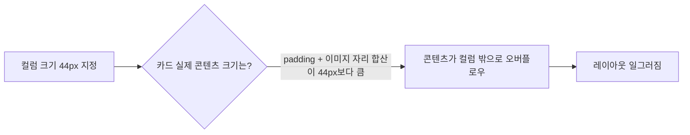

## 들어가며 (Situation)

Tailwind CSS로 만든 카드 목록 실습 파일(`card.html`)에서 커피 메뉴 카드 6개를 화면 가로 기준 정중앙에 배치하려다 막힌 경험을 정리한다. 카드는 아래처럼 `.card-list`라는 grid 컨테이너 안에 들어있는 구조였다.

```html
<div class="card-list" style="display: grid; grid-template-columns: 1fr 1fr 1fr; gap: 10px; width: 200px;">
  <div class="bg-white p-16 border-1 border-[#e5e7eb] rounded-lg">
    <div class="w-44 h-28 bg-gray-200 rounded"></div>
    <h2 class="text-lg font-bold mt-2 mb-1">아메리카노</h2>
    <p class="text-red-700">4,500원</p>
  </div>
  <!-- 카드가 총 6개 반복됨 -->
</div>
```

## 문제 상황 (Task)

`.card-list`(부모)에 `justify-content: center`를 넣으면 카드 묶음이 가운데로 올 거라 생각했는데, 아무리 넣어도 정렬되지 않았다. 목표는 카드 6개가 들어있는 그리드 전체를 페이지 가로 기준 정중앙으로 옮기는 것이었다.

## 해결 과정 (Action)

### 처음 가설: "부모에 넣으면 자식이 정렬된다"

`justify-content: center`를 부모(`.card-list`)에 넣었다. 하지만 `grid-template-columns: 1fr 1fr 1fr`에 `width: 200px`인 상태에서도 변화가 없었다.

처음에는 `1fr` 한 칸이 카드 안쪽 이미지 자리 div의 `w-44` 클래스(44px)와 관련 있다고 착각했다. "1칸이 44px라서 44px * 3인가?"라고 생각했지만, `w-44`는 카드 **안쪽 자식 div**의 값이고 grid 컬럼 값과는 무관하다는 걸 되짚어보며 정정했다.

### 실험 1: 컨테이너를 키워보기

`fr` 단위가 "남은 공간을 나누는 비율"이라는 걸 이해한 뒤, `.card-list`의 `width`를 200px → 600px로 늘려서 `justify-content: center`가 작동하는지 확인했다. 결과는 동일 — 여전히 작동하지 않았다.

이 실험으로 `fr` 단위의 성질을 스스로 확인했다: **컬럼이 모두 `fr`이면 컨테이너 크기와 무관하게 항상 남는 공간을 100% 채운다.** 즉 `justify-content`가 움직일 여유 공간 자체가 생기지 않는 구조였다.

### 실험 2: 컬럼을 고정값으로 바꿔보기 (실패)

남는 공간을 만들기 위해 `grid-template-columns`를 `44px 44px 44px`로 바꿔봤다. 결과는 오히려 레이아웃이 더 일그러졌다.

개발자도구(Inspect)로 카드 하나의 실제 렌더링 너비를 확인해보니, 지정한 컬럼 크기(44px)보다 카드 실제 콘텐츠 크기(패딩 `p-16`, 이미지 자리 `w-44 h-28` 등)가 훨씬 컸다. **grid item에 지정한 컬럼 크기가 콘텐츠 크기보다 작아서 오버플로우가 나는 상황**이었던 것이다.



### 핵심 정정: 정렬 대상이 달랐다

여기서 목표를 다시 짚었다. 내가 원한 건 (1) 카드 묶음 전체를 화면 정중앙에 배치하는 것이지, (2) 좁은 박스 안에서 카드끼리 재배치하는 게 아니었다.

`justify-content`는 **부모(grid 컨테이너) 안의 자식들**을 정렬하는 속성이라, `.card-list` 자기 자신을 페이지 중앙으로 보내는 데는 애초에 쓸 수 없는 속성이었다. 정렬하고 싶었던 대상(`.card-list` 자신)과 `justify-content`가 실제로 움직이는 대상(그 자식들)이 서로 달랐던 것.

### 해결: margin: 0 auto

컬럼을 다시 `1fr 1fr 1fr`로, `width`는 카드 6개가 다 들어갈 만큼 넉넉하게(800px) 되돌린 뒤, `.card-list`에 `margin: 0 auto`를 적용했다.

```css
.card-list {
  display: grid;
  grid-template-columns: 1fr 1fr 1fr;
  gap: 10px;
  width: 800px;
  margin: 0 auto;
}
```

바로 가운데로 정렬됐다. `margin: 0 auto`는 남는 공간을 요소의 왼쪽/오른쪽에 똑같이 나눠주기 때문에, 고정 너비를 가진 요소 자신을 부모(페이지) 안에서 가운데로 보낼 수 있다.

## 결과 (Result)

| 시도 | 대상 | 결과 |
|------|------|------|
| `justify-content: center` (부모에 적용) | 컨테이너 안 자식들 | 자식이 이미 공간을 꽉 채우고 있어 효과 없음 |
| `grid-template-columns: 44px 44px 44px` | 컬럼 크기 축소 | 콘텐츠 오버플로우로 레이아웃 붕괴 |
| `margin: 0 auto` | `.card-list` 자기 자신 | 페이지 정중앙 정렬 성공 |

정량 지표는 별도로 측정하지 않았다. 대신 이번 문제로 명확해진 개념 하나를 남긴다:

- **부모에 적용하는 정렬 속성**(`justify-content`)과 **자기 자신에게 적용하는 정렬 방법**(`margin: 0 auto`)은 서로 다른 대상을 움직인다.
- `fr` 단위는 grid 컨테이너의 남는 공간을 항상 100% 나눠 가지므로, 컬럼이 모두 `fr`이면 컨테이너를 아무리 키워도 `justify-content`가 작동할 여유 공간이 생기지 않는다.
- Tailwind 클래스명 속 숫자(`w-44`)를 실제 px 값으로 착각하면 안 되고, grid 컬럼 크기는 개발자도구로 확인한 실제 콘텐츠 크기를 기준으로 잡아야 한다.

## 더 학습하면 좋은 개념

- **justify-self** — grid에서 부모 전체가 아니라 자식 하나하나를 개별적으로 정렬하는 속성이다. 이번에 배운 "부모용 정렬 vs 자기 자신 정렬"의 구분과 바로 이어지는 개념이라 다음 학습으로 자연스럽다.
- **min-width: auto와 grid item 오버플로우** — 이번에 `grid-template-columns: 44px 44px 44px`가 왜 카드를 찌그러뜨렸는지, 그 근본 메커니즘(grid item의 기본 `min-width`가 `auto`라서 콘텐츠보다 작은 트랙 크기를 줘도 강제로 줄어들지 않고 넘친다)을 더 깊이 이해하려면 이어서 봐야 할 개념이다.
- **Tailwind 유틸리티 클래스의 숫자 체계(spacing scale)** — `w-44` 같은 클래스의 숫자는 실제 px이 아니라 Tailwind의 spacing scale(기본적으로 `0.25rem` 배수) 값이다. 이번 착각의 근본 원인과 바로 연결된다.

## 참고 자료

- [MDN - justify-content](https://developer.mozilla.org/en-US/docs/Web/CSS/justify-content)
- [MDN - CSS Grid Layout](https://developer.mozilla.org/en-US/docs/Web/CSS/CSS_grid_layout)
- [MDN - margin](https://developer.mozilla.org/en-US/docs/Web/CSS/margin)

---

**요약**
1. `fr` 단위로만 이루어진 grid는 컨테이너 크기와 무관하게 항상 공간을 꽉 채우기 때문에 `justify-content`가 작동할 여지가 없다.
2. `justify-content`는 부모 안의 자식을 정렬하고, `margin: 0 auto`는 요소 자신을 부모 안에서 정렬한다 — 둘은 다른 문제를 푼다.
3. grid 컬럼 크기를 임의의 숫자로 줄이기 전에, 개발자도구로 실제 콘텐츠 크기를 먼저 확인해야 한다.
