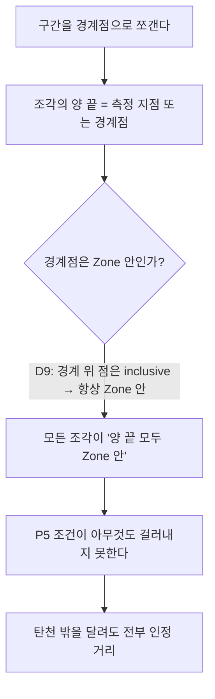

## 들어가며 (Situation)

4명이 3주 동안 **탄천런**이라는 러닝 앱을 만들었다. 탄천에서 달린 거리만 「인정 거리」로 세고,
그 값으로 랭킹을 매기는 앱이다.

내가 맡은 건 화면 6개와 디자인 반입, CI, 그리고 **측정 도메인**이었다.
이 글은 그중 측정 도메인([#93](https://github.com/NextComm1T/tanchunrun/pull/93)) 하나만 다룬다.

측정 도메인은 `src/domain/measure` 라는 폴더 하나다. GPS 측정 지점 배열을 받아서
총 거리 · 탄천 인정 거리 · 평균 페이스 · 현재 페이스를 낸다.
React 도 DB 도 모르는 순수 계산 모듈이고, **실시간 표시(client)와 종료 시 저장값 확정(server)이
같은 식 하나를 쓰게** 하려고 따로 뗀 자리였다. 기록 화면과 랭킹이 각자 계산하면 두 값이 어긋난다.

## 문제 상황 (Task)

인정 거리를 내려면 결국 「이 구간이 탄천 안인가」를 판정해야 한다.
그 판정 규칙은 기획 문서에 이미 적혀 있었다.

> **P5** — 경계에 경계점을 넣어 쪼갠 뒤 **양 끝이 모두 Zone 안인 구간만** 인정 거리에 더한다.
> (`docs/05-policy.md:18`)

그리고 같은 시기에 팀이 결정 ledger에서 Zone 규격을 확정했다.

> **D9** — **경계 위 점은 Zone 안**이다(inclusive). point-in-polygon 은 ray casting.

각각 따로 읽으면 둘 다 멀쩡하다. 그런데 **같이 적용하면 P5가 아무것도 걸러내지 못한다.**

경계점은 정의상 경계 위에 있다. D9에 따라 경계 위 점은 Zone 안이다.
그러면 경계점으로 쪼갠 모든 조각은 「양 끝이 모두 Zone 안」이 된다.



이게 이 작업에서 내가 해결해야 했던 것이었다.
**터지지 않고 조용히 틀리는 종류**라서, 돌려 보고 아는 게 아니라 읽어서 알아야 했다.

문제가 하나 더 있었다. Zone 의 좌표 자체가 아직 없었다 —
`docs/06-data.md:48` 의 「Zone 이 탄천의 어디부터 어디까지인지」가 `[?]` 로 비어 있었다.
판정 규칙을 고치기 전에 **판정할 대상부터 만들어야 했다.**

## 해결 과정 (Action)

### 막힌 곳 1 — 문서대로 구현하면 문서대로 틀린다

처음 나온 구현은 P5 문장을 정직하게 옮긴 것이었다. 조각의 양 끝 `inZone` 을 둘 다 확인하는 코드.
**문서만 놓고 보면 맞는 코드고, lint 도 build 도 통과한다.**

문제는 두 문장이 **서로 다른 곳에 있었다**는 거였다.
P5는 `docs/05-policy.md` 에 있고, D9는 GitHub 이슈 #78의 결정 ledger에 있다.
각각 따로 읽으면 둘 다 말이 되고, 모순은 문장 **안**이 아니라 문장 **사이**에 있다.
문서를 입력으로 주면 문서대로 나온다 — 문서가 스스로 모순된다는 건 문서 안에 안 적혀 있으니까.

그래서 고친 건 지시 문구가 아니라 **착수 순서**였다.
구현을 시작하기 전에, 이 이슈가 기대고 있는 결정이 ledger에서 `CONFIRMED` 인지 먼저 확인한다.
#93 에 걸린 건 세 개였다 — **D9**(Zone 규격) · **D10**(fix 분류·segment) · **D12**(domain 경계).
그리고 그 결정문을 **기획 문서 옆에 같이 놓고 읽는다.**

PR 본문에 그 순서가 그대로 남아 있다.

> 선행 결정 **D9**(Ranking Zone 규격)를 이번에 확정해서 Start Gate 를 열었고
> (`CONFIRMED: D9 · D10 · D12`), `docs/06-data.md:48` 의 Zone 범위 `[?]` 가 채워졌다.

바꾼 건 그것뿐이었다. 그 전에는 P5만 보고 구현한 뒤에 D9를 확인했고,
바꾼 뒤에는 두 문장이 한 화면에 들어왔다. 그러자 모순이 보였다.

팀 `CLAUDE.md` 1절 마지막 줄이 「요구사항과 코드가 충돌하면 임의로 추측하지 말고 차이를 명시한다」다.
읽을 때는 당연한 말 같았는데, **충돌을 발견하는 것 자체가 절차의 일**이라는 뜻이었다.

### 고친 방법 — 조각의 중점으로 판정한다

양 끝을 보는 대신 **조각의 중점 하나**를 본다.

```ts
const crossings = zoneCrossings(from.lat, from.lng, to.lat, to.lng, zone);
const bounds = [0, ...crossings, 1];
let tancheonM = 0;
for (let i = 0; i < bounds.length - 1; i++) {
  const mid = (bounds[i] + bounds[i + 1]) / 2;
  const midLat = from.lat + (to.lat - from.lat) * mid;
  const midLng = from.lng + (to.lng - from.lng) * mid;
  if (isInZone(midLat, midLng, zone)) {
    tancheonM += distanceM * (bounds[i + 1] - bounds[i]);
  }
}
```

중점은 경계 위가 아니라 **조각 안쪽**이라서 D9의 inclusive 규칙에 걸리지 않는다.
그리고 P5가 원래 걸러내려던 두 경우를 그대로 만족한다.

| 경우 | 경계점 | 중점 판정 결과 |
|---|---|---|
| 한쪽 끝만 Zone 안 | 1개 | 안쪽 조각만 인정 |
| 양 끝 다 밖인데 Zone을 가로지름 | 2개 | 가운데 조각만 인정 |
| 경계가 오목해 한 구간이 Zone을 두 번 드나듦 | 4개 | 조각마다 따로 판정 — 맞다 |

마지막 줄이 중점 판정을 고른 진짜 이유였다. 탄천 corridor 는 굽이가 많아서
직선 한 구간이 Zone 을 두 번 드나드는 경우가 실제로 생긴다.
양 끝 판정으로는 그 구간 전체가 한 덩어리라 표현할 수가 없다.

**문서는 고치지 않았다.** 팀 규칙이 「기획 문서는 나중에 한 번에 맞춘다」라서,
대신 `modify/2026-09-16-measure.md` 에 「문서가 말하는 것 / 실제로 한 것 / 고쳐야 할 문서 위치」
세 줄로 남겼다. 이 파일 하나에 갈라진 지점 7건이 들어갔다.

### 막힌 곳 2 — 폴리곤이 맞는지 알 방법이 없다

Zone 좌표는 OpenStreetMap 에서 만들었다.
relation 19279176(`waterway=river` · `name=탄천` · ODbL)의 member way 8개를 이어
본류 중심선(용인 기흥 → 한강 합류부 · 34,909m)을 뽑고, **좌우 150m** 로 밀어 corridor 를 만들었다.
250m 간격 resample → 이동평균 → ±150m 오프셋 → self-intersection 제거 → 10m 단순화 →
소수 6자리. 결과는 **185정점**짜리 단일 simple polygon 이다.

문제는 이걸 만들고 나서였다. **185개 숫자 배열을 보고 이게 탄천이 맞는지 판정할 방법이 없다.**
지도에 얹어 보면 되지만 「대충 비슷해 보인다」는 판정이 아니다.

그래서 **숫자로 판정할 수 있는 검사를 직접 설계했다.**

| 무엇을 확인했나 | 어떻게 | 결과 |
|---|---|---|
| 폴리곤이 자기를 뚫지 않는가 | self-intersection 개수 | **0** |
| 탄천을 전부 덮는가 | 원본 중심선 노드 349개가 전부 내부인가 | **349 / 349** |
| 폭이 의도한 300m인가 | 중심선에서 수직으로 0·50·100·140m / 160·200·300·500m | 앞 4개 전부 IN · 뒤 4개 전부 OUT |
| 면적이 말이 되는가 | 34.9km × 0.3km 와 비교 | **10.1km²** |
| 엉뚱한 데를 먹지 않았는가 | 랜드마크 9곳(합류부 IN / 강남역·판교역·잠실운동장 등 OUT) | **9 / 9** |

수직 140m는 안이고 160m는 밖 — 이 두 줄이 「좌우 150m」를 숫자로 증명한다.
「비슷해 보인다」를 「140은 안, 160은 밖」으로 바꾼 게 이 작업에서 제일 마음에 드는 부분이다.

**끝까지 못 한 것도 PR 에 적었다.** 지도 위에 얹어 눈으로 보지는 않았다고,
`TANCHEON_ZONE` 을 GeoJSON 으로 감싸 geojson.io 에 떨궈 한 번 봐 달라고 리뷰어에게 남겼다.
정량 검증 5개를 통과했다고 해서 눈으로 본 게 되는 건 아니다.

### 판정할 수 있게 만들기 — 테스트 러너를 들였다

이 시점까지 저장소에 **테스트 러너가 없었다.** `npm run lint` 와 `npm run build` 뿐이었다.
GPS 계산은 화면을 보고 맞는지 알 수 있는 종류가 아니라서, 먼저 판정할 수단이 필요했다.

Vitest 를 devDependency 하나로 넣고, `vitest.config.mts` 의 `include` 를
`src/domain/**/*.test.ts` **하나로만** 잡았다. 화면까지 넓히지 않았다 —
화면 테스트는 이번 작업 범위가 아니고, 범위를 넓히면 팀 전체가 쓰는 설정 파일을 내가 혼자 정하게 된다.

케이스는 39개를 썼다. 경계점 개수, 속도 초과 구간 제외, segment 끊김에서 거리 0,
총 거리 0일 때 평균 페이스 `null`, 입력 배열 불변 — 전부 **값만으로 판정되는 것들**이다.

## 결과 (Result)

**[#93](https://github.com/NextComm1T/tanchunrun/pull/93)** 은 2026-09-16에 머지됐다. `+2,357 / -22`.

| 항목 | 값 |
|---|---|
| 모듈 | 구현 5파일 **676줄** · 테스트 2파일 535줄 |
| Zone 폴리곤 | 185정점 · 10.1km² · `tancheon-zone-v1` |
| 폴리곤 정량 검증 | 중심선 노드 **349/349** · 랜드마크 **9/9** · self-intersection **0** |
| 테스트 | **39개** (2파일) — 저장소 최초 |
| 문서와 갈라진 지점 | `modify/2026-09-16-measure.md` 에 **7건** |
| 이 계약을 쓴 후속 작업 | #83 업로드 · #84 지도 표시 · #85 저장 확정 |

**남은 숫자가 하나 더 있다.** 내가 39개 · 2파일로 시작한 그 러너는
지금 저장소에서 **114개 · 8파일**이 됐고, 그중 5파일은 다른 팀원 2명이 쓴 것이다.
경계를 `src/domain` 으로 좁게 잡고 시작한 게 오히려 퍼지는 데 도움이 됐다.
「순수 함수면 여기 쓰면 된다」가 명확했기 때문이다.

### 이 작업에서 남은 것

**문서대로 구현하는 건 구현이 아니다.** 이번 건은 터지지도 않고 테스트도 통과하고
코드 리뷰도 통과할 수 있는 종류였다. 「탄천 밖을 달려도 인정 거리에 들어간다」는 걸
알아채려면 문서 두 줄을 **같이 놓고** 읽는 수밖에 없었다.
결국 고친 건 코드가 아니라 **읽는 순서**였다 — 무엇을 먼저 확인하고 시작하느냐.

**「맞는 것 같다」를 판정할 수 있는 형태로 바꾸는 게 일의 절반이었다.**
185개 좌표를 눈으로 확인할 수는 없지만, 「140m는 안이고 160m는 밖」은 확인할 수 있다.
GPS 계산이 맞는지는 화면으로 알 수 없지만, 「경계를 가로지르면 경계점이 2개」는 알 수 있다.
모르겠으면 먼저 **판정할 수 있는 질문으로 바꿔 놓고** 시작한다.

**못 한 건 못 했다고 적는다.** 지도 위에 눈으로 얹어 보지 않았다는 걸 PR 「미검증」에 적었고,
오목한 경계에서 표시 색이 어긋날 수 있다는 것도 `modify/` 에 남겼다.
「검증 완료」라고 적었으면 그건 나만 아는 거짓말이 됐을 거다.
