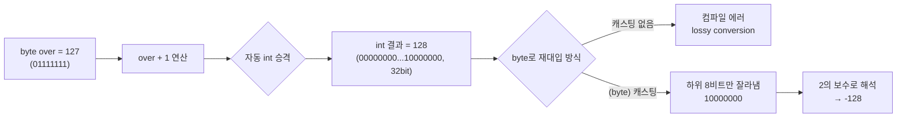

## 들어가며 (Situation)

부트캠프 강사님이 "오늘 생각해보면 좋은 키워드"로 아래 한 줄을 던져주셨다.

```java
// 금일 생각해보면 좋은 키워드
byte bnum = 127;
```

지난 글([자바 기초에서 자꾸 헷갈리던 형변환과 연산자]())의 "더 학습하면 좋은 개념"에 "오버플로우"를 다음 학습 대상으로 남겨뒀었는데, 그 숙제가 바로 이 한 줄로 돌아온 셈이다. `byte`의 최댓값 `127`을 주고 "생각해보라"고 한 이유를 코드로 직접 확인해봤다.

## 문제 상황 (Task)

`byte`는 `-128 ~ 127`까지만 표현할 수 있다는 건 알고 있었지만, **최댓값을 넘기면 정확히 무슨 일이 일어나는지**는 몰랐다. 확인해야 할 것은 두 가지였다.

- `127`에 `1`을 더하는 코드를 그대로 짜면 왜 컴파일이 안 되는가.
- 억지로 형변환을 해서 통과시키면 결과 값이 왜 하필 `-128`인가.

## 해결 과정 (Action)

### 1. 첫 번째 시도: `over = over + 1` — 컴파일 에러

가장 먼저 직관적으로 떠오른 코드를 그대로 써봤다.

```java
byte over = 127;
over = over + 1;
```

결과는 컴파일 에러였다.

```
java: incompatible types: possible lossy conversion from int to byte
```

왜 `byte`끼리(정확히는 `byte`와 `int` 리터럴 `1`) 더했는데 `int`로 취급되는지가 첫 번째 의문이었다. 자바에서는 `byte`, `short`, `char`를 산술 연산에 쓰면 연산 전에 **자동으로 `int`로 승격(binary numeric promotion)**시킨다. 그래서 `over + 1`의 타입은 이미 `int`이고, 그 `int` 결과(`128`)를 다시 `byte` 변수에 대입하려니 "손실 가능성이 있는 축소 변환"이라며 컴파일러가 막은 것이다. 지난 글에서 정리한 `double → int` 명시적 형변환 규칙과 정확히 같은 원리였다.

### 2. 왜 `over++`는 이 에러가 안 날까

같은 계산인데 증감 연산자로 쓰면 에러가 없다는 게 이상해서 비교해봤다.

| 코드 | 컴파일 결과 | 이유 |
|------|------------|------|
| `over = over + 1;` | ❌ 에러 | `over + 1`이 `int`로 승격된 뒤, 캐스팅 없이 `byte`에 대입 |
| `over++;` | ✅ 통과 | `++`/`--` 연산자는 언어 명세상 결과를 원래 타입으로 **암묵적으로 축소 캐스팅**하도록 정의되어 있음 |
| `over = (byte)(over + 1);` | ✅ 통과 | 개발자가 직접 명시적 캐스팅으로 손실을 감수하겠다고 표시 |

`over++`는 겉보기엔 `over = over + 1`과 같은 의미 같지만, 컴파일러 입장에서는 완전히 다른 연산자다. `++`/`--`는 내부적으로 `(byte)(over + 1)`처럼 결과를 다시 원래 타입으로 캐스팅하는 과정을 포함하도록 언어 명세(JLS)에 정의되어 있어서, 축소 변환 경고 없이 통과한다.

### 3. 캐스팅을 강제로 넣고 실행 — `-128`이 나온 이유

에러를 없애기 위해 명시적 캐스팅을 넣고 실제로 실행해봤다.

```java
byte over = 127;
over = (byte)(over + 1);
System.out.println(over);
```

출력은 `128`이 아니라 `-128`이었다. 이걸 이해하려면 컴파일 에러가 아니라 **비트 단위로** 따라가야 했다.



`byte`는 8비트다. `127`은 `01111111`이고, 여기에 `1`을 더하면 `10000000`이 된다. 문제는 이 8비트 조합을 **2의 보수(two's complement)** 방식으로 해석할 때 최상위 비트(맨 왼쪽)가 부호 비트 역할을 한다는 점이다.

| 8비트 값 | 부호 비트 | 2의 보수 해석 | 십진수 |
|----------|-----------|----------------|--------|
| `01111111` | 0 (양수) | 그대로 읽음 | `127` |
| `10000000` | 1 (음수) | 나머지 비트를 반전 후 +1 하는 규칙의 역산 | `-128` |

즉 `int` 단계에서는 분명 `128`이라는 "정상적인" 값이었는데, `(byte)` 캐스팅이 상위 비트를 다 잘라내고 하위 8비트(`10000000`)만 남기면서, 그 8비트를 부호 있는 값으로 재해석하는 순간 `-128`로 뒤집힌 것이다. 자바는 이 과정에서 예외를 던지지 않는다. 정수 연산은 오버플로우가 나도 조용히 값을 감싸고(wrap around) 넘어가도록 언어 명세에 정의되어 있기 때문이다.

## 결과 (Result)

- `byte over = 127; over = over + 1;`이 `int`로의 자동 승격 때문에 컴파일 에러가 난다는 것을 명확히 설명할 수 있게 됐다.
- `over++`와 `over = over + 1`이 결과는 같아 보여도, `++`만 암묵적 축소 캐스팅을 포함한다는 차이를 구분할 수 있게 됐다.
- `(byte)(over + 1)` 실행 결과가 `128`이 아니라 `-128`인 이유를, `01111111 → 10000000`이라는 8비트 값 변화와 2의 보수 해석 규칙으로 끝까지 따라갈 수 있게 됐다.
- 아직 명확히 이해하지 못한 부분: 2의 보수 표현이 왜 "반전 후 +1" 규칙으로 정의됐는지, 그리고 이 규칙이 하드웨어 덧셈 회로 설계와 어떻게 연결되는지는 이번 글에서 다루지 못했다 — 다음 학습 대상으로 남겨둔다.

## 더 학습하면 좋은 개념

- **2의 보수(Two's Complement) 표현 방식** — 이번 글에서는 "부호 비트가 뒤집힌다"까지만 확인했는데, 왜 컴퓨터가 뺄셈 없이 덧셈 회로만으로 음수를 표현하는지 알면 오버플로우가 왜 "에러"가 아니라 "규칙"인지 근본적으로 이해된다.
- **정수 오버플로우와 `Math.addExact` 같은 안전 연산** — 자바는 기본 연산자에서 오버플로우를 조용히 무시하지만, `Math.addExact()`처럼 오버플로우 시 예외를 던지는 메서드도 제공한다. 금액 계산처럼 오차가 치명적인 로직에서 왜 필요한지 이어진다.
- **이항 수치 승격(Binary Numeric Promotion)** — `byte`/`short`/`char`가 산술 연산에서 왜 항상 `int` 이상으로 승격되는지에 대한 자바 언어 명세 규칙. 이번 글의 컴파일 에러 원인이 바로 이 규칙이라, 전체 규칙을 한 번 정리해두면 비슷한 형변환 에러를 더 빨리 진단할 수 있다.
- **비트 연산자(`&`, `|`, `^`, `<<`, `>>`, `>>>`)** — 이번 글에서 비트 단위로 값을 추적해봤는데, 실제로 비트를 직접 조작하는 연산자들을 배우면 이런 추적을 코드로도 검증할 수 있다.

## 참고 자료

- [JLS 5.6.2 - Binary Numeric Promotion](https://docs.oracle.com/javase/specs/jls/se21/html/jls-5.html#jls-5.6.2)
- [JLS 4.2.2 - Integer Operations](https://docs.oracle.com/javase/specs/jls/se21/html/jls-4.html#jls-4.2.2)
- [JLS 15.14.2 - Postfix Increment Operator](https://docs.oracle.com/javase/specs/jls/se21/html/jls-15.html#jls-15.14.2)
- [Oracle Java Tutorials - Primitive Data Types](https://docs.oracle.com/javase/tutorial/java/nutsandbolts/datatypes.html)

---

**요약**
1. `byte`끼리(또는 `byte`와 `int` 리터럴)의 산술 연산은 자동으로 `int`로 승격되므로, 결과를 다시 `byte`에 대입하려면 명시적 캐스팅이 필요하다.
2. `over++`는 결과를 원래 타입으로 되돌리는 축소 캐스팅을 언어 명세상 내장하고 있어, `over = over + 1`과 달리 컴파일 에러가 나지 않는다.
3. `byte over = 127`에 `1`을 더해 캐스팅하면 `-128`이 나오는 이유는, 8비트 `10000000`을 2의 보수 규칙으로 해석하기 때문이며 자바는 이 오버플로우에 예외를 던지지 않고 조용히 값을 감싼다.
