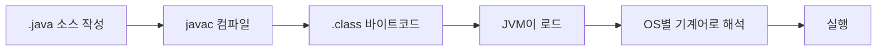

## 들어가며 (Situation)

학원 수업에서 자바 첫 챕터(`chap01-java-basic`)로 기본 문법을 배웠다. `Hello World` 출력부터 시작해서 변수, 자료형, 형변환, 연산자까지 다뤘는데, 코드 자체는 짧고 쉬워 보였지만 막상 주석으로 필기를 남기면서 보니 "왜 이렇게 동작하지?"를 바로 설명하지 못하는 부분들이 있었다. 이 글은 그 챕터에서 배운 내용을 다시 훑으면서, 특히 헷갈렸던 부분을 중심으로 정리한 기록이다.

## 문제 상황 (Task)

수업 코드에는 개념 하나하나마다 주석으로 필기를 남겼는데, 다시 읽어보니 세 군데에서 특히 이해가 얕았다.

- 자바 코드가 `.java` → `.class` → 실행까지 **어떤 순서**로 처리되는지 구조를 말로 설명하지 못했다.
- **묵시적 형변환과 명시적 형변환**이 왜 갈리는지, 왜 한쪽만 컴파일 에러가 나는지 이유를 정확히 몰랐다.
- **전위(`++age`)와 후위(`age++`) 증감 연산자**의 출력 순서를 코드만 보고 바로 예측하지 못했다.

이 세 가지를 다시 코드를 짚어가며 확인하는 게 이번 정리의 목표였다.

## 해결 과정 (Action)

### 1. 자바 코드는 어떻게 실행되는가

`com.wanted.a_basic.Main` 파일 주석에 실행 과정이 5단계로 적혀 있었는데, 이걸 흐름으로 그려보니 헷갈렸던 지점이 명확해졌다. 핵심은 "자바는 OS가 바로 읽는 언어가 아니라, JVM이라는 중간 실행기를 한 번 거친다"는 점이다.



여기서 이해가 얕았던 부분은 "바이트코드"와 "기계어"를 같은 말로 생각했던 것이다. `.class` 파일은 OS가 바로 실행할 수 있는 기계어가 아니라, **JVM이 각 OS에 맞게 다시 해석해주는 중간 형태**다. 그래서 같은 `.class` 파일이 Windows든 macOS든 JVM만 있으면 동일하게 동작한다.

### 2. 변수와 리터럴, 자료형

`b_variable/module01/Application.java`에서 정수·실수·문자·문자열·논리형을 각각 선언했다.

```java
byte b = 10;    // 1 byte
short s = 10;   // 2 byte
int i = 10;     // 4 byte
long l = 10;    // 8 byte

float f = 3.14f;    // 4 byte
double d = 3.14;    // 8 byte

char ch = 'ㅎ';
String str = "Hello";
boolean bl = true;
```

여기서 잡아야 했던 개념은 **리터럴과 변수의 차이**다. `10`, `3.14f`, `"Hello"` 자체는 리터럴(순수한 값)이고, `int i`처럼 그 값을 담는 이름 붙은 저장 공간이 변수다. `Application02.java`에서는 `Scanner`로 사용자 입력을 받아 변수에 저장하는 예제를 다뤘다.

```java
Scanner sc = new Scanner(System.in);
String name = sc.nextLine();
```

값이 코드 안에 고정되어 있으면 리터럴이고, 실행 중에 값이 채워지는 저장소가 변수라는 걸 이 두 예제를 비교하면서 정리할 수 있었다.

### 3. 형변환: 왜 한쪽은 에러가 나고 한쪽은 안 나는가

`b_variable/module02/Application.java`에서 다룬 형변환이 가장 헷갈렸던 부분이다. 자바의 형변환은 방향에 따라 안전성이 다르다.

| 구분 | 방향 | 예시 | 컴파일러 반응 |
|------|------|------|----------------|
| 묵시적(자동) 형변환 | 작은 타입 → 큰 타입 | `int → double` | 자동 변환, 에러 없음 |
| 명시적 형변환 | 큰 타입 → 작은 타입 | `double → int` | `(int)`로 직접 명시해야 함 |

```java
double dnum = 99.99;
int inum = (int)dnum;   // 명시적 형변환 → 소수점 손실 (99)

int num2 = 100;
double dnum2 = num2;    // 묵시적 형변환 → 손실 없음 (100.0)
```

왜 방향에 따라 컴파일러 태도가 다른지가 핵심이었다. `int`(4바이트)를 `double`(8바이트)에 넣는 건 담을 공간이 더 크니까 데이터가 손실될 일이 없다. 반대로 `double`을 `int`에 넣으면 소수점 이하 정보가 사라질 수 있는데, 이걸 **컴파일러가 조용히 허용해버리면 개발자가 의도하지 않은 데이터 손실을 눈치채지 못한다.** 그래서 자바는 손실 가능성이 있는 방향에는 `(int)`처럼 "내가 손실을 감수하겠다"는 표시를 강제한다.

`char`도 형변환으로 다뤘는데, 문자가 실제로는 정수(아스키 코드)로 저장되어 있다는 걸 확인했다.

```java
char a = 'a';
System.out.println("a = " + (int)a); // 97
```

### 4. 연산자: 산술 · 비교 · 논리 · 증감

`c_operator/Application.java`에서 연산자 네 종류를 실습했다.

| 종류 | 연산자 | 특징 |
|------|--------|------|
| 산술 연산 | `+ - * / %` | `%`는 나머지(모드 연산), 문자열과 `+`를 만나면 피연산자를 문자열로 변환 |
| 비교 연산 | `== != < > <= >=` | 두 값을 비교해 `boolean` 반환 |
| 논리 연산 | `&& \|\| !` | 여러 조건을 결합, `!`는 NOT |
| 증감 연산 | `++ --` | 전위/후위에 따라 **연산 순서가 다름** |

가장 오래 붙잡고 있었던 건 전위/후위 증감이다. `age = 20`에서 시작한 예제 출력을 직접 순서대로 따라가 봤다.

| 실행 코드 | age 값 변화 | 출력 |
|-----------|-------------|------|
| `println(age)` | 20 (변화 없음) | `20` |
| `println(++age)` | 19 → 20으로 먼저 증가 후 출력 | `21` |
| `println(age)` | 21 유지 | `21` |
| `println(age++)` | 먼저 출력 후 증가 | `21` |
| `println(age)` | 21 → 22로 증가된 상태 | `22` |

`++age`(전위)는 "증가부터 하고 그 값을 쓴다"이고, `age++`(후위)는 "지금 값을 먼저 쓰고 나중에 증가한다"는 차이다. 표로 한 줄씩 따라가니 코드만 봤을 때보다 훨씬 명확해졌다.

`&&`와 `||`도 조건 결합에서 왼쪽이 먼저 평가된다는 점(단축 평가)이 수업 주석에 "면접 질문"으로 언급되어 있었는데, 이번 정리에서는 동작 순서까지는 확인했지만 왜 단축 평가가 성능·부작용 측면에서 중요한지는 아직 깊이 들어가지 못했다. 이 부분은 다음 학습 대상으로 남겨둔다.

## 결과 (Result)

- 자바 실행 과정을 `.java → javac → .class → JVM → 기계어` 5단계 흐름으로 막힘없이 설명할 수 있게 됐다.
- 형변환에서 "왜 좁은 타입으로 갈 때만 `(int)`를 명시해야 하는가"를 데이터 손실 가능성 기준으로 설명할 수 있게 됐다.
- `++age`와 `age++`의 출력 차이(위 표 기준 `21`과 `21`이지만 그 이후 `age` 상태가 `21`과 `22`로 갈린다는 점)를 코드만 보고 트레이스할 수 있게 됐다.
- 반면 `&&`/`||`의 단축 평가가 실제로 어떤 상황에서 이점이 되는지는 이번 정리로 완전히 해결하지 못했다 — 다음 학습 주제.

## 더 학습하면 좋은 개념

- **오버플로우(Overflow)** — `byte`, `short`처럼 크기가 작은 정수형에 범위를 넘는 값을 넣으면 어떤 일이 생기는지 이해하면, 왜 자료형 크기를 신경 써서 골라야 하는지 알 수 있다.
- **단축 평가(Short-circuit evaluation)** — `&&`/`||`에서 왼쪽 조건만으로 결과가 확정되면 오른쪽을 아예 평가하지 않는 동작. 이번 글에서 순서까지만 확인했는데, `null` 체크 뒤에 조건을 잇는 패턴(`obj != null && obj.value()`)을 이해하려면 반드시 필요하다.
- **기본형(Primitive)과 참조형(Reference) 타입의 차이** — `int`, `char` 같은 기본형과 `String` 같은 참조형은 저장 방식과 비교 연산(`==` vs `.equals()`)이 다르다. 지금은 값만 다뤘지만 다음 단계에서 반드시 부딪히는 개념이다.
- **아스키(ASCII)와 유니코드(Unicode)** — `char`를 `(int)`로 변환하면 나오는 숫자의 정체. 문자 인코딩의 기초를 알면 `char` 연산이 왜 가능한지 근본적으로 이해된다.
- **오토박싱/언박싱(Autoboxing/Unboxing)** — 기본형과 래퍼 클래스(`Integer`, `Double` 등) 사이의 자동 변환. 형변환 개념을 컬렉션(`ArrayList<Integer>` 등)으로 확장할 때 꼭 필요하다.

## 참고 자료

- [Oracle Java Tutorials - Primitive Data Types](https://docs.oracle.com/javase/tutorial/java/nutsandbolts/datatypes.html)
- [Oracle Java Tutorials - Variables](https://docs.oracle.com/javase/tutorial/java/nutsandbolts/variables.html)
- [Oracle Java Tutorials - Operators](https://docs.oracle.com/javase/tutorial/java/nutsandbolts/operators.html)
- [Oracle Java Language Specification - Casting](https://docs.oracle.com/javase/specs/jls/se21/html/jls-5.html)

---

**요약**
1. 자바 코드는 `javac`로 컴파일된 뒤 `.class` 바이트코드를 JVM이 각 OS에 맞게 해석해 실행한다.
2. 형변환은 데이터 손실 가능성이 있는 방향(넓은 타입 → 좁은 타입)에서만 명시적 표기를 강제한다.
3. 전위(`++age`)·후위(`age++`) 증감 연산자는 "증가 후 사용"과 "사용 후 증가"로 순서가 갈리므로 코드를 한 줄씩 트레이스해서 확인해야 한다.
