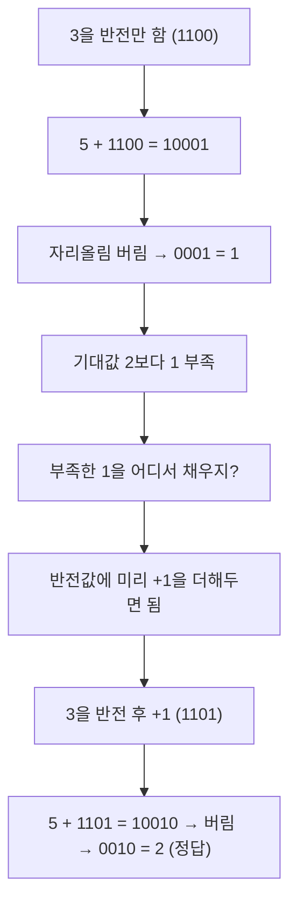

## 들어가며 (Situation)

지난 글([byte에 127+1을 더했더니 -128이 나온 이유]())에서 `byte over = 127`에 1을 더하면 `-128`이 나온다는 것까지는 확인했다. 그런데 그 글의 마지막에 이렇게 숙제를 남겨뒀었다.

> 2의 보수 표현이 왜 "반전 후 +1" 규칙으로 정의됐는지, 그리고 이 규칙이 하드웨어 덧셈 회로 설계와 어떻게 연결되는지는 이번 글에서 다루지 못했다 — 다음 학습 대상으로 남겨둔다.

이번 글은 그 숙제를 `/learning`으로 이어서 손으로 직접 검산해 본 기록이다.

## 문제 상황 (Task)

확인하고 싶었던 것은 두 가지였다.

- `10000000` 같은 비트가 왜 `-128`로 해석되는지, "반전 후 +1"이라는 규칙을 실제로 검산하면 정말 맞아떨어지는가.
- 이 규칙이 왜 하필 "반전 후 +1"인지 — 단순히 반전만 하면 안 되는 이유가 하드웨어(덧셈 회로)와 어떤 관계가 있는가.

지금까지는 결과("`10000000`은 `-128`이다")만 보고 넘어갔지, 직접 검산해 본 적은 없었다.

## 해결 과정 (Action)

### 1. "반전 후 +1"을 직접 검산하기

지난 글에서 나온 `10000000`을 규칙 그대로 따라가 봤다.

```text
1단계 (반전): 10000000 → 01111111
2단계 (+1)  : 01111111 + 1 = 10000000
3단계 (10진수로 읽기): 10000000(부호 없이) = 128
```

여기서 막힌 지점이 있었다. "반전+1의 결과가 128이 나왔는데, 그럼 원래 비트 `10000000`은 뭘 나타내는 거지?"라는 질문에 바로 답하지 못했다. ("모르겠어")

힌트를 받고 나서야 연결이 됐다: "반전 후 +1"은 **어떤 양수를 음수로 바꾸는 규칙**이다. 그러니 반대로, 어떤 비트에 이 규칙을 적용해서 `128`이 나왔다면 그 비트 자체는 `128`의 음수, 즉 `-128`을 나타낸다는 뜻이었다. ("128 앞에 마이너스가 붙는 이유를 128 자체로 설명한 것"이라고 스스로 정리했다.)

### 2. 반전만 하면 왜 안 되는지: 4비트로 `5 - 3` 직접 계산

여기서 진짜 질문이 남았다. 왜 "반전"만으로 끝내지 않고 굳이 "+1"을 더 붙였을까? 이걸 확인하려고 4비트(범위 `-8 ~ 7`)로 직접 뺄셈을 덧셈으로 바꿔봤다.

**① 2의 보수(반전 후 +1)로 `5 - 3` 계산**

```text
5  = 0101
3  = 0011
3의 반전       : 1100
반전 후 +1 (-3): 1101

  0101   (5)
+ 1101   (-3)
--------
 10010   (5비트 결과)

4비트 레지스터라 맨 왼쪽 자리올림 비트를 버림 → 0010 = 2
```

`0010`은 10진수로 `2`. 실제 `5 - 3 = 2`와 정확히 일치했다. 이 과정에서 중요한 걸 하나 확인했다 — **회로에 "이건 뺄셈이야"라고 알려준 적이 없다.** 그냥 두 비트열을 덧셈만 했을 뿐인데 뺄셈 결과가 나온 것이다. "회로를 하나만 만들면 되니까 더 간단해질 것 같다"는 게 여기서 스스로 낸 결론이었다.

**② 대조 실험: "+1" 없이 반전만 했을 때 (1의 보수 방식)**

같은 계산을 "+1" 없이, 반전만 한 값으로 다시 해봤다.

```text
3의 반전만 (1의 보수): 1100

  0101   (5)
+ 1100   (반전만 한 -3)
--------
 10001   (5비트 결과)

자리올림 비트를 버림 → 0001 = 1
```

기대값은 `2`인데 `1`이 나왔다. 정확히 `1`만큼 모자랐다. 이 차이를 보고 "반전한 값에 1을 더하면 될 것 같다"는 결론을 스스로 냈다 — 이게 바로 "+1"이 규칙에 포함된 이유였다.



### 3. 왜 "+1"을 미리 넣어두는 게 하드웨어 입장에서 이득인가

정리하면, 반전만 하는 1의 보수 방식은 계산 결과가 항상 1만큼 모자라기 때문에, 그 부족분을 나중에 별도로 채워 넣는 보정 단계(자리올림을 다시 결과에 더하는 과정, end-around carry)를 거쳐야 한다. 반면 2의 보수는 애초에 인코딩 규칙 자체에 "+1"을 박아 넣어서, 덧셈 한 번으로 끝나고 별도 보정 회로가 필요 없다.

| 방식 | 음수 만드는 법 | `5-3` 계산 시 문제 | 회로 영향 |
|------|----------------|--------------------|-----------|
| 1의 보수 | 반전만 | 결과가 1만큼 부족 (end-around carry로 별도 보정 필요) | 보정 회로/단계가 추가로 필요 |
| 2의 보수 | 반전 후 +1 | 덧셈 한 번으로 정확한 결과 | 별도 보정 없이 덧셈 회로 하나로 끝남 |

## 결과 (Result)

- `10000000`에 "반전 후 +1"을 적용하면 `128`이 나오고, 이는 원래 비트가 `-128`을 나타낸다는 뜻이라는 걸 손으로 검산해서 확인했다.
- 4비트 `5 - 3` 예제로, 2의 보수를 쓰면 뺄셈을 "그냥 덧셈"만으로 처리할 수 있다는 걸 직접 계산으로 확인했다 (회로 입장에서 뺄셈 전용 회로가 필요 없어짐).
- "+1"을 빼고 반전만 하면(1의 보수) 같은 계산에서 결과가 정확히 1만큼 모자란다는 걸 대조 실험으로 확인했고, 이게 "반전 후 +1" 규칙이 존재하는 이유임을 스스로 도출했다.
- 정량 지표 없음 — 이번 학습은 회로 성능 수치가 아니라 개념/원리 검증이 목적이었다.

## 더 학습하면 좋은 개념

- **1의 보수(one's complement)의 +0/-0 이중 표현 문제** — 1의 보수 방식은 `0000...0`과 `1111...1`이 둘 다 "0"으로 해석돼서 0이 두 가지로 존재하는 문제가 있다. 2의 보수가 왜 표준으로 굳어졌는지 이해하려면 이 문제까지 봐야 한다.
- **end-around carry (자리올림 재보정)** — 이번 글에서 "1의 보수는 부족한 1을 별도 보정 단계로 처리해야 한다"고만 짚었는데, 그 보정이 실제 회로에서 어떤 동작(캐리 비트를 다시 최하위 비트로 더하는 과정)인지 더 파고들면 좋다.
- **오버플로우 플래그(overflow flag)와 캐리 플래그(carry flag)** — 이번 예제에서 "맨 왼쪽 자리올림 비트를 버렸는데", 실제 CPU는 이 버려지는 비트를 그냥 버리지 않고 플래그로 남겨서 오버플로우 여부를 판단한다. 이 부분을 알면 이번 글의 "버림" 단계가 실제로는 어떻게 감지되는지 이어진다.

## 참고 자료

- [Cornell CS104 - Two's Complement](https://www.cs.cornell.edu/~tomf/notes/cps104/twoscomp.html)
- [ChipVerify - One's and Two's complements](https://chipverify.com/digital-fundamentals/ones-twos-complement)

---

**요약**
1. `10000000`에 "반전 후 +1"을 적용하면 `128`이 나오고, 이는 원래 비트가 `128`의 음수인 `-128`을 나타낸다는 뜻이다.
2. 2의 보수로 만든 음수를 그냥 더하면(`5 + (-3)`) 뺄셈 전용 회로 없이 덧셈 회로 하나로 `5 - 3`과 같은 결과가 나온다.
3. 반전만 하고 "+1"을 생략하면(1의 보수) 결과가 항상 1만큼 모자라기 때문에, 2의 보수는 그 부족분을 인코딩 규칙에 미리 넣어 하드웨어 보정 단계를 없앤 것이다.
