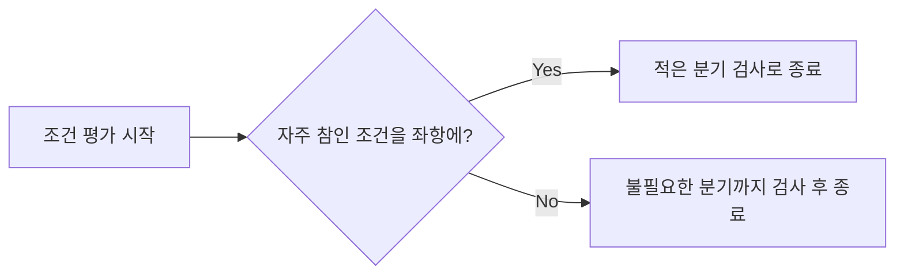
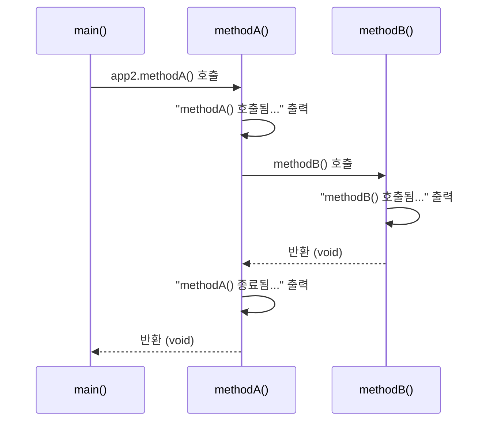

## 들어가며 (Situation)

학원 수업에서 자바 두 번째 챕터(`chap02-control-flow-and-method`)로 제어문, 반복문, 메소드를 배웠다. `a_controlflow`, `b_loop`, `c_method` 세 패키지에 걸쳐 예제를 짜면서 주석으로 필기를 남겼는데, 문법 자체는 한 줄씩 읽으면 이해가 됐다. 그런데 "왜 이 방식이 더 나은가"를 스스로 설명하려니 막히는 지점이 네 군데 있었다. 이 글은 그 네 지점을 코드와 실제 실행 결과로 확인하며 정리한 기록이다.

## 문제 상황 (Task)

수업 코드를 다시 훑어보니 아래 네 가지가 특히 얕게 이해하고 넘어갔던 부분이었다.

- `if-else` 다중 분기와 `switch`가 기능적으로 겹치는데, 언제 무엇을 쓰는 게 맞는지 기준이 없었다.
- `&&`, `||`의 **단축 평가(short-circuit evaluation)**가 조건 순서에 따라 실제로 성능 차이를 만든다는 걸 주석으로만 읽고, 직접 확인해본 적은 없었다.
- `for`, `while`, `do-while` 세 반복문이 결국 다 "반복"인데, 셋을 구분해서 써야 하는 실질적인 기준이 뭔지 말로 설명하지 못했다.
- 메소드 없이 짠 코드가 왜 문제인지는 알겠는데, `void`와 `return`의 차이, 그리고 메소드가 다른 메소드를 호출할 때 실행 순서가 실제로 어떻게 흘러가는지 머릿속에 그려지지 않았다.

## 해결 과정 (Action)

### 1. if-else 다중 분기 vs switch

`Application01`(성적 등급)과 `Application04`(월별 분기)를 나란히 놓고 보니 차이가 분명해졌다.

```java
// a_controlflow/Application01.java
if (score >= 90) {
    System.out.println("A 등급 입니다!");
} else if (score >= 80) {
    System.out.println("B 등급 입니다.");
} else if (score >= 70) {
    System.out.println("C 등급..?");
} else {
    System.out.println("재수강 확정!");
}
```

```java
// a_controlflow/Application04.java
switch (month) {
    case 1: System.out.println("1월~"); break;
    case 2: System.out.println("2월~"); break;
    case 3: System.out.println("3월~"); break;
    case 4: System.out.println("4월~"); break;
    default: System.out.println("그 외의 월입니다!"); break;
}
```

| 항목 | if-else | switch |
|------|---------|--------|
| 조건 형태 | 범위/부등호 비교 (`score >= 90`) | 특정 값과의 일치 비교 (`month == 1`) |
| 가독성 | 조건이 3개 넘어가면 분기가 길어짐 | 값이 늘어나도 `case`만 추가하면 됨 |
| 대응 경우 | 조건식이 복잡하거나 범위 비교일 때 | 정해진 값(정수, 문자열 등) 중 하나를 고를 때 |

즉 "범위를 비교"하면 `if-else`, "정해진 값 중 하나"를 고르면 `switch`가 자연스럽다는 기준이 생겼다. `default`가 `if-else`의 마지막 `else`와 같은 역할을 한다는 것도 이번에 코드로 확인했다.

### 2. 단축 평가(short-circuit evaluation) — 실제로 시간을 재보기

`Application03`의 주석에 있던 회원가입 예시가 이해에 결정적이었다.

```java
/* comment.
*   A && B
*   - 회원가입 조건
*   - A : 아이디 중복 여부 판단 (1분이 걸리는 작업)
*   - B : 비밀번호 8글자 미만 여부 판단 (0.5초 걸리는 작업)
*   - B 를 좌항에 두게 된다면 0.5초 만에 회원가입 실패를 알 수 있게 된다.
*   - A 를 좌항에 두게 된다면 1분 만에 회원가입 실패를 알 수 있게 된다.
* */
```

`&&`는 좌항이 `false`면 우항을 아예 실행하지 않는다(단축 평가). 그래서 **실패 확률이 높은 조건을 왼쪽에 두면 불필요한 연산을 건너뛸 수 있다.** 이걸 말로만 믿지 않고, 코드에 있던 `System.nanoTime()` 벤치마크를 실제로 컴파일해서 돌려봤다.

```java
// 비효율적 순서: 드문 조건(age <= 19)을 먼저 검사
if (age <= 19) { discount = "학생 할인 가능"; } else { discount = "할인 불가"; }

// 효율적 순서: 자주 발생하는 조건(age > 19)을 먼저 검사
if (age > 19) { discount = "학생 할인 가능"; } else { discount = "할인 불가"; }
```



같은 로직을 4번 반복 실행한 실제 결과는 다음과 같다.

| 실행 순서 | 시간(ns) |
|-----------|----------|
| 1회차 | 1700 |
| 2회차 | 1900 |
| 3회차 | 1400 |
| 4회차 | 1200 |

| (효율적 순서 기준) | 시간(ns) |
|-----------|----------|
| 1회차 | 1000 |
| 2회차 | 1100 |
| 3회차 | 1000 |
| 4회차 | 1000 |

측정값이 매번 조금씩 흔들리긴 했지만(JIT 워밍업, `nanoTime()`의 측정 오차 때문에 단발 측정은 원래 노이즈가 크다), 매 실행에서 일관되게 **효율적 순서(1000~1100ns)가 비효율적 순서(1200~1900ns)보다 빨랐다.** 원리로만 알던 단축 평가가 실제 숫자로 확인되니 훨씬 납득이 갔다.

### 3. 반복문 3형제: for / while / do-while

`b_loop` 패키지의 세 예제를 비교해보면 차이가 "형식"이 아니라 "언제 조건을 확인하느냐"에 있다는 걸 알 수 있었다.

```java
// for: 반복 횟수가 정해져 있을 때 (벤치프레스 5회, 홀수만 출력)
for (int i = 1; i <= 5; i++) {
    if (i % 2 == 0) { System.out.println("침묵함..."); }
    else { System.out.println("성원님 " + i + "번 했습니다~"); }
}

// while: 조건을 먼저 확인하고 반복 (반복 횟수가 불확실할 때)
int count = 0;
while (count <= 5) {
    System.out.println("카운트 : " + count);
    count++;
}

// do-while: 일단 한 번 실행하고 나서 조건을 확인
int num = 0;
do {
    System.out.println("0~2 까지 반복 출력 : " + num);
    num++;
} while (num < 3);
```

| 반복문 | 조건 확인 시점 | 최소 실행 횟수 | 쓰는 상황 |
|--------|----------------|----------------|-----------|
| `for` | 매 반복 전 | 0회 가능 | 반복 횟수를 미리 알고 있을 때 |
| `while` | 매 반복 전 | 0회 가능 | 반복 횟수가 조건에 따라 유동적일 때 |
| `do-while` | 매 반복 **후** | 최소 1회 보장 | "일단 한 번은 실행해야" 하는 로직일 때 |

`do-while`이 나머지 둘과 다른 지점은 딱 하나, **조건 확인을 실행 코드 뒤에 한다**는 것뿐이었다. 그래서 조건이 처음부터 거짓이어도 최소 1회는 실행된다는 걸 코드로 직접 확인했다.

### 4. 메소드가 필요한 이유 + void vs return + 호출 흐름

`Application01`(c_method)에는 메소드 없이 짠 코드의 문제가 그대로 드러나 있었다.

```java
// 메소드가 없을 때: 두 수를 더할 때마다 변수 선언 + 연산 + 출력이 반복된다
int num1 = 1;
int num2 = 2;
System.out.println("1번째 연산 결과 : " + (num1 + num2));

int num3 = 3;
int num4 = 4;
System.out.println("2번째 연산 결과 : " + (num3 + num4));
```

이걸 메소드로 뽑으면 호출부만 반복하면 된다.

```java
public int sumTwoNumber(int a, int b) {
    return a + b;
}
// 호출: app.sumTwoNumber(5, 6)
```

여기서 `sumTwoNumber`는 결과값을 `return`으로 돌려주지만, `Application02`의 `methodA()`, `methodB()`는 `void`라서 반환값 없이 "실행만" 하고 끝난다. `return`은 "값을 계산해서 호출한 곳으로 돌려줘야 할 때", `void`는 "출력이나 상태 변경처럼 결과값이 필요 없는 동작을 실행할 때" 쓴다는 기준이 명확해졌다.

호출 흐름도 실제로 코드에 번호를 매겨가며(`// 1.`, `// 2.` 주석) 순서를 확인했다.



실제로 컴파일해서 실행한 출력도 이 순서 그대로 나왔다.

```
main() 시작됨...
methodA() 호출됨...
methodB() 호출됨...
methodA() 종료됨...
main() 종료됨...
```

`methodB()`가 `main()`이 아니라 `methodA()` 내부에서 호출된다는 걸 코드에서만 볼 때는 헷갈렸는데, 실제 출력 순서와 다이어그램을 겹쳐보니 "호출한 메소드가 끝나야 그 메소드를 호출한 쪽으로 돌아온다"는 흐름이 눈에 들어왔다.

## 결과 (Result)

- 단축 평가 순서에 따른 실측 결과: 비효율적 순서 1200~1900ns → 효율적 순서 1000~1100ns (동일 로직, 4회 반복 측정)
- `if-else` vs `switch`, `for`/`while`/`do-while` 각각을 "왜 골라 쓰는지" 기준을 표로 정리해서 다음부터는 바로 판단할 수 있게 됐다.
- `void`와 `return`의 차이, 메소드 간 호출이 스택처럼 순서대로 되돌아온다는 흐름을 다이어그램과 실제 출력으로 같이 확인해서 더 이상 헷갈리지 않는다.
- 가장 크게 배운 점은, 주석으로 "왜 그런지" 적혀 있어도 직접 실행해서 숫자나 출력 순서로 확인하기 전까지는 진짜로 이해한 게 아니었다는 것이다.

## 더 학습하면 좋은 개념

- **JIT 컴파일과 마이크로벤치마크(JMH)** — `nanoTime()` 단발 측정은 JVM 워밍업 때문에 매번 값이 흔들린다. 제대로 성능을 재려면 JMH 같은 벤치마크 도구가 왜 필요한지 알아두면 이번 실험의 한계도 이해하게 된다.
- **호출 스택(Call Stack)** — `methodA()`가 `methodB()`를 부를 때 내부적으로 스택 프레임이 쌓였다가 반환되는 구조를 알면, 재귀 호출과 스택 오버플로우까지 자연스럽게 이어진다.
- **재귀(Recursion)** — 메소드가 자기 자신을 호출하는 패턴. 오늘 본 methodA → methodB 호출 흐름의 다음 단계로 이어지는 개념이다.
- **메소드 오버로딩(Overloading)** — `sumTwoNumber(int, int)`를 `double`이나 매개변수 개수가 다른 버전으로 확장하려 할 때 필요한 개념.
- **향상된 for문(for-each)과 Iterable** — 오늘 배운 `for`는 인덱스 기반인데, 배열/컬렉션을 순회할 때는 for-each가 왜 더 안전하고 간결한지 다음에 확인해볼 만하다.

## 참고 자료

- [Oracle Java Tutorials - The if-then-else Statement](https://docs.oracle.com/javase/tutorial/java/nutsandbolts/if.html)
- [Oracle Java Tutorials - The switch Statement](https://docs.oracle.com/javase/tutorial/java/nutsandbolts/switch.html)
- [Oracle Java Tutorials - The while and do-while Statements](https://docs.oracle.com/javase/tutorial/java/nutsandbolts/while.html)
- [Oracle Java Tutorials - The for Statement](https://docs.oracle.com/javase/tutorial/java/nutsandbolts/for.html)
- [Oracle Java Tutorials - Conditional-And / Conditional-Or Operators](https://docs.oracle.com/javase/tutorial/java/nutsandbolts/op3.html)
- [Oracle Java Tutorials - Defining Methods](https://docs.oracle.com/javase/tutorial/java/javaOO/methods.html)
- [Java SE 8 API - System.nanoTime()](https://docs.oracle.com/javase/8/docs/api/java/lang/System.html#nanoTime--)

---

**요약**
1. `if-else`는 범위 비교, `switch`는 정해진 값 중 선택일 때 쓴다.
2. `&&`의 단축 평가는 실패 확률 높은 조건을 좌항에 둘 때 실측으로도(1200~1900ns → 1000~1100ns) 더 빠르다.
3. 메소드는 `void`/`return`으로 역할이 갈리고, 호출은 부른 순서대로 되돌아오는 스택 구조로 흐른다.
