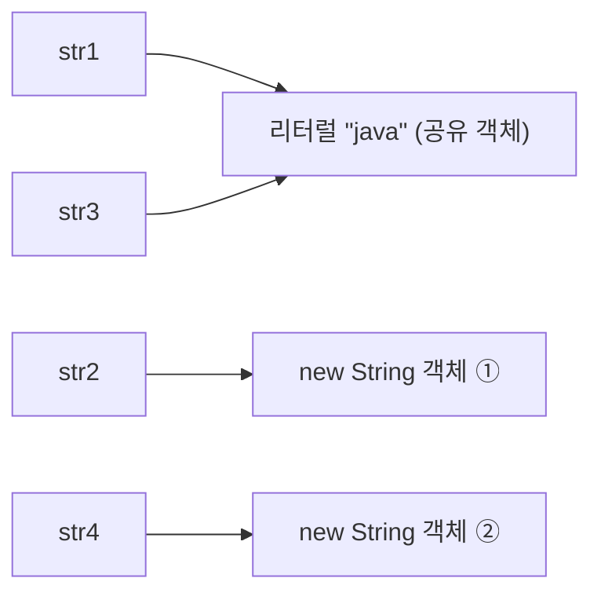
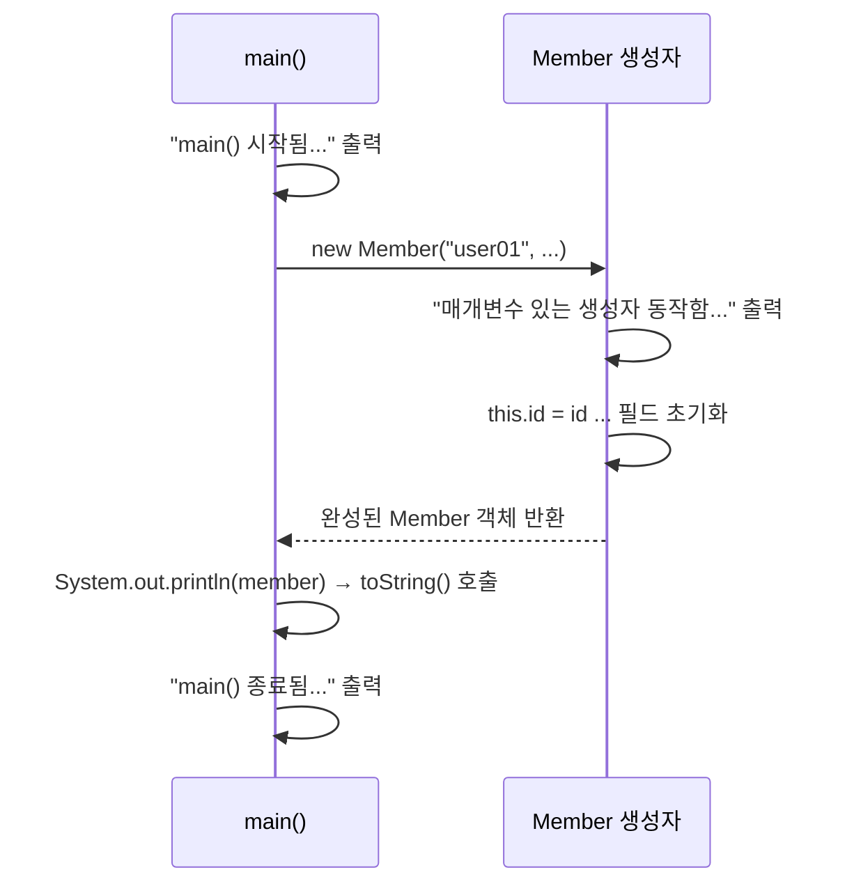

## 들어가며 (Situation)

학원 수업에서 자바 세 번째 챕터(`chap03-object-oriented-programming`)로 `String`, 배열, 그리고 객체지향의 첫걸음인 클래스와 생성자를 배웠다. 패키지는 `a_object`(`a_string`, `b_array`)와 `b_oop`(`a_user_type`, `b_constructor`)로 나뉘어 있고, 수업 중에 예제를 따라 치면서 주석으로 필기를 남겼다. 이 글은 그 필기 중 "받아 적기만 하고 넘어간" 부분을 직접 실행해서 확인한 기록이다.

## 문제 상황 (Task)

필기를 다시 읽어보니, 문장은 외웠지만 이유를 설명할 수 없는 부분이 네 곳 있었다.

- `String`을 `"java"`와 `new String("java")` 두 방식으로 만들 수 있고, `==`로 비교하면 결과가 다르다고 적혀 있는데 **왜 다른지** 설명하지 못했다.
- "배열은 값을 안 넣어도 0이 출력된다. heap은 빈 값이 존재할 수 없기 때문이다"라고 적었지만, 그 규칙이 어디까지 적용되는지(지역 변수도 그런지) 몰랐다.
- 회원 정보(아이디, 이름, 나이, 취미...)를 왜 변수나 배열로는 못 묶고 클래스가 필요한지 말로 정리하지 못했다.
- 생성자 필기 마지막 줄의 "매개변수 있는 생성자를 작성하면 컴파일러는 기본 생성자를 자동으로 만들지 않는다"는 주의사항이 실제로 어떤 에러로 나타나는지 본 적이 없었다.

## 해결 과정 (Action)

### 1. 문자열 `==` 비교가 `false`가 나오는 이유

`a_string/Application02`는 같은 `"java"`를 두 방식으로 만든 뒤 비교하는 예제다.

```java
String str1 = "java";
String str2 = new String("java");
String str3 = "java";
String str4 = new String("java");

System.out.println(str1 == str2);  // false
System.out.println(str1 == str3);  // true
System.out.println(str2 == str4);  // false
```

수업 코드를 그대로 컴파일해서 돌린 결과는 필기와 같았다(`false`, `true`, `false`). 필기에는 "`new`를 만나면 항상 새로운 공간을 만든다"고만 되어 있었는데, 반대편인 리터럴이 왜 `true`인지가 빠져 있었다. [Java 언어 명세(JLS) 3.10.5](https://docs.oracle.com/javase/specs/jls/se21/html/jls-3.html#jls-3.10.5)에 따르면 같은 내용의 문자열 리터럴은 **하나의 `String` 인스턴스를 공유**(interned)한다. 그래서 `str1`과 `str3`은 같은 객체를 가리키고, `new`로 만든 `str2`, `str4`는 각각 별개의 객체다.



여기서 `==`는 **같은 객체를 가리키는지(참조 주소)** 를 비교하고, 문자열의 **내용**을 비교하려면 `equals()`를 써야 한다는 구분이 선명해졌다. 확인용으로 따로 짠 예시 코드에서도 `str1.equals(str2)`는 `true`였고, `str1 == str2.intern()`도 `true`였다(`intern()`은 풀에 있는 공유 객체를 돌려준다).

| 비교 방식 | 비교 대상 | `"java"` vs `new String("java")` |
|-----------|-----------|----------------------------------|
| `==` | 참조(같은 객체인가) | `false` |
| `equals()` | 문자열 내용 | `true` |

`a_string/Application01`에서 배운 `length()`, `charAt(index)`, `trim()`은 같은 방식으로 출력해보며 확인했다. 수업 주석의 "외우고 → 사용해보고 → 출력해보고 → 이해한다"는 공부법을 그대로 따랐다. 예를 들어 `"   java   ".trim()`은 양 끝 공백만 제거해서 `#java#`로 출력된다(가운데 공백은 건드리지 않는다).

### 2. 배열: 기본값 0은 어디서 오는가

변수는 값 1개를 담는 공간이라 100명의 점수를 담으려면 변수 100개가 필요하다. 배열은 **같은 자료형의 묶음**이고, 인덱스(0부터 시작)로 접근하기 때문에 반복문과 궁합이 좋다.

```java
int[] iarr = new int[5];
System.out.println(iarr.length); // 5
System.out.println(iarr[0]);     // 0  ← 넣은 적 없는데 0
System.out.println(iarr);        // [I@해시값 형태
```

필기의 "heap은 빈 값이 없다. JVM이 기본값을 세팅한다"는 설명을 [JLS 4.12.5(Initial Values of Variables)](https://docs.oracle.com/javase/specs/jls/se21/html/jls-4.html#jls-4.12.5)와 대조해봤다. 배열 요소와 **필드**는 타입별 기본값으로 자동 초기화된다. 직접 확인한 결과는 아래와 같다.

| 자료형 | 기본값 | 확인 결과 |
|--------|--------|-----------|
| 정수 (`int`) | `0` | `0` |
| 실수 (`double`) | `0.0` | `0.0` |
| 논리 (`boolean`) | `false` | `false` |
| 문자 (`char`) | `'\u0000'` | 정수로 보면 `0` |
| 참조 (`String`, 배열) | `null` | `null` |

주의할 점은 이 자동 초기화가 **지역 변수에는 적용되지 않는다**는 것이다. 지역 변수는 초기화하지 않고 읽으면 컴파일 에러가 난다. 필기의 "heap"이라는 표현은 배열과 객체(필드)가 놓이는 곳이라는 맥락에서는 맞지만, 규칙의 정확한 기준은 "배열 요소와 필드"라고 이해해두는 게 안전하다.

`b_array/Application02`는 5명의 점수를 `Scanner`로 입력받아 합계와 평균을 구한다.

```java
int[] scores = new int[5];
for (int i = 0; i < scores.length; i++) {
    scores[i] = sc.nextInt();
}

double sum = 0;
for (int i = 0; i < scores.length; i++) {
    sum += scores[i];
}
double avg = sum / scores.length;
```

여기서 `sum`을 `int`가 아니라 `double`로 선언한 이유가 중요했다. `int / int`는 소수점이 버려지는 정수 나눗셈이라, 평균이 정확한 실수로 나오지 않는다. 예시로 점수 `{90, 85, 77, 100, 60}`을 넣어 계산해보면 합계 `412.0`, 평균 `82.4`가 나온다. 지난 포스트에서 다룬 자료형 변환이 여기서 그대로 쓰인 셈이다.

범위를 벗어난 인덱스는 실행 중에 `ArrayIndexOutOfBoundsException: Index 3 out of bounds for length 3`으로 터진다. `i < scores.length`처럼 `length`를 조건에 쓰는 이유가 이것이다.

### 3. 사용자 정의 자료형: 클래스가 필요한 이유

`a_user_type/Application01`은 회원 1명의 정보를 변수로 선언하는 것에서 시작한다.

```java
String id = "user01";
String pwd = "pass01";
String name = "raccoon";
int age = 20;
char gender = '남';
String[] hobby = {"괴롭히기", "웃기", "야구 하이라이트 시청"};
```

수업 필기에서 정리한 문제점은 세 가지였다. 직접 코드를 보면서 곱씹어보니 모두 실감이 났다.

| 문제 | 구체적인 불편함 |
|------|-----------------|
| 변수명 관리 | 회원 1명에 변수 6개, 회원이 늘면 `id2`, `id3`... |
| 메소드 인자 | 회원 정보를 넘기려면 매개변수 6개를 전부 나열해야 함 |
| 반환값 | `return`은 값 1개만 되돌려줄 수 있어서 회원 정보를 묶어서 반환 불가 |

배열로 묶으려 해도 "동일한 자료형"이라는 배열의 핵심 조건 때문에 `String`과 `int`와 `char`를 한 배열에 담을 수 없다. 이때 서로 다른 자료형을 하나로 묶는 도구가 클래스다.

```java
public class Member {
    String id;
    String pwd;
    String name;
    int age;
    char gender;
    String[] hobby;
}
```

```java
Member member = new Member();
System.out.println(member.name);  // null
System.out.println(member.age);   // 0
member.id = "user02";
```

`Member` 안에는 메소드가 아니라 변수만 선언했다. 이 변수가 **필드(field)** 다. 값을 대입한 적이 없는데 `null`, `0`이 출력되는 것은 앞에서 확인한 "필드는 기본값으로 초기화된다"는 규칙과 정확히 같은 현상이다.

수업 필기는 필드를 "전역변수(필드 == 인스턴스 변수 == 속성)"라고 불렀다. 자바 공식 문서([Oracle Tutorials - Variables](https://docs.oracle.com/javase/tutorial/java/nutsandbolts/variables.html))는 "전역변수"라는 용어 없이 인스턴스 변수(필드), 클래스 변수, 지역 변수로 구분한다. 시험이나 공식 자료를 읽을 때는 "필드/인스턴스 변수"를 쓰는 편이 헷갈리지 않는다.

### 4. 생성자: `new Member()`의 괄호는 메소드 호출이었다

`b_constructor/Application01`의 핵심은 `new Member()` 끝의 `()`가 사실 **생성자라는 메소드를 호출**하는 구문이라는 점이다. 앞의 `a_user_type`에서는 `Member`에 생성자를 안 썼는데도 `new Member()`가 동작했다. 컴파일러가 기본 생성자를 대신 만들어줬기 때문이다.

`b_constructor/Member`에는 생성자를 두 개 직접 작성했다.

```java
public Member() {
    System.out.println("기본생성자 동작함...");
}

public Member(String id, String pwd, String name, int age, char gender, String[] hobby) {
    System.out.println("매개변수 있는 생성자 동작함...");
    this.id = id;
    this.pwd = pwd;
    // ... 나머지 필드도 동일
}
```

`Application01`에서는 기본 생성자 호출 줄(`new Member()`)을 주석 처리하고 매개변수 있는 쪽을 호출했다.

```java
Member member = new Member(
        "user01", "pass01", "raccoon",
        20, '남', new String[] {"산책", "야구", "탁구"}
);
```



두 가지가 눈에 들어왔다. 첫째, 매개변수 이름과 필드 이름이 같을 때 `this.id = id`에서 `this.id`는 필드, 오른쪽 `id`는 매개변수를 가리킨다. `this`가 없으면 매개변수가 자기 자신에게 대입될 뿐 필드는 그대로 `null`로 남는다. 둘째, `System.out.println(member)`가 `Member@해시값`이 아니라 필드 내용을 보여주는 이유는 `Member`에서 `toString()`을 오버라이드했기 때문이다. `Arrays.toString(hobby)`를 쓴 것도, 배열을 그냥 문자열로 붙이면 `[Ljava.lang.String;@...` 같은 주소가 나오기 때문이다.

마지막으로 필기 마지막 줄의 주의사항을 에러로 직접 확인했다. 아래는 이 주제를 확인하려고 별도로 만든 **예시 코드**다.

```java
class P {
    String id;
    P(String id) { this.id = id; }   // 매개변수 있는 생성자만 작성
}
// new P();
```

`new P()`를 호출하면 컴파일 단계에서 다음 에러가 났다.

```
error: constructor P in class P cannot be applied to given types;
  required: String
  found:    no arguments
```

수업 코드의 `b_constructor/Member`에 기본 생성자를 직접 써둔 이유가 이것이다. 매개변수 있는 생성자만 쓰면 기본 생성자가 사라져서, `new Member()`를 쓰던 다른 코드가 한꺼번에 컴파일 에러가 된다([JLS 8.8.9 Default Constructor](https://docs.oracle.com/javase/specs/jls/se21/html/jls-8.html#jls-8.8.9)).

## 결과 (Result)

- 문자열 비교 4가지 조합(`str1/str2`, `str1/str3`, `str2/str4` + `equals`)의 결과 `false`, `true`, `false`, `true`를 직접 실행으로 확인하고, 이유를 "리터럴은 공유, `new`는 매번 새 객체"로 설명할 수 있게 됐다.
- 배열·필드 기본값 규칙을 자료형 5종 표로 정리했고, 지역 변수에는 적용되지 않는다는 예외를 필기에 추가했다.
- 회원 정보 6개 항목(변수 6개)을 `Member` 객체 1개로 묶는 흐름을 코드로 따라가며, 클래스가 필요한 이유 3가지를 표로 정리했다.
- 생성자를 "객체 생성 시점에 가장 먼저 실행되는 메소드"로 이해했고, 기본 생성자가 자동 생성되지 않는 조건을 컴파일 에러 메시지로 확인했다.
- 가장 크게 배운 점은 수업 필기의 문장이 맞더라도, 규칙의 **적용 범위**(예: 필기의 "heap은 비어 있을 수 없다"는 지역 변수에는 해당되지 않음)는 공식 문서와 실행 결과로 확인해야 정확해진다는 것이다.

## 더 학습하면 좋은 개념

- **String Constant Pool과 `intern()`** — 리터럴이 공유되는 구조를 알면 `==`와 `equals()`의 차이를 넘어, 문자열을 많이 만들 때의 메모리 사용까지 이해할 수 있다.
- **`String`의 불변성(Immutable)과 `StringBuilder`** — `trim()`이 원본을 바꾸지 않고 새 문자열을 돌려주는 이유가 불변성에서 나온다. 반복문에서 문자열을 이어 붙일 때 `StringBuilder`를 쓰는 이유로 이어진다.
- **JVM 메모리 구조 (Stack / Heap / Method Area)** — 변수가 가리키는 참조와 실제 객체가 어디에 놓이는지 알면 `NullPointerException`과 배열 참조를 훨씬 쉽게 이해한다.
- **캡슐화와 접근 제어자 (`private`, getter/setter)** — 이번 `Member`는 필드를 직접 대입(`member.id = ...`)했는데, 다음 단계는 필드를 숨기고 메소드로만 접근하게 만드는 것이다.
- **생성자 오버로딩과 `this(...)` 호출** — 이번에 생성자를 두 개 만들었는데, 중복되는 초기화 코드를 `this(...)`로 줄이는 방법이 바로 다음 학습 주제다.

## 참고 자료

- [Java Language Specification SE 21 - 3.10.5 String Literals](https://docs.oracle.com/javase/specs/jls/se21/html/jls-3.html#jls-3.10.5)
- [Java Language Specification SE 21 - 4.12.5 Initial Values of Variables](https://docs.oracle.com/javase/specs/jls/se21/html/jls-4.html#jls-4.12.5)
- [Java Language Specification SE 21 - 8.8.9 Default Constructor](https://docs.oracle.com/javase/specs/jls/se21/html/jls-8.html#jls-8.8.9)
- [Oracle Java Tutorials - Arrays](https://docs.oracle.com/javase/tutorial/java/nutsandbolts/arrays.html)
- [Oracle Java Tutorials - Variables](https://docs.oracle.com/javase/tutorial/java/nutsandbolts/variables.html)
- [Oracle Java Tutorials - Providing Constructors for Your Classes](https://docs.oracle.com/javase/tutorial/java/javaOO/constructors.html)

---

**요약**
1. 문자열 리터럴은 하나의 객체를 공유하고 `new String`은 매번 새 객체를 만들기 때문에, 내용 비교는 `==`가 아니라 `equals()`로 한다.
2. 배열 요소와 필드는 JVM이 기본값(`0`, `0.0`, `false`, `null`)으로 초기화하지만 지역 변수는 그렇지 않으며, 서로 다른 자료형을 묶어야 할 때 클래스가 필요하다.
3. `new Member()`의 괄호는 생성자 호출이고, 매개변수 있는 생성자만 작성하면 기본 생성자가 자동 생성되지 않아 `new Member()`가 컴파일 에러가 난다.
