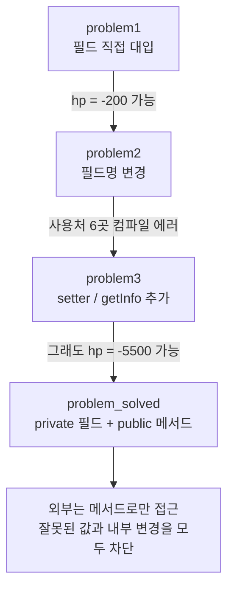
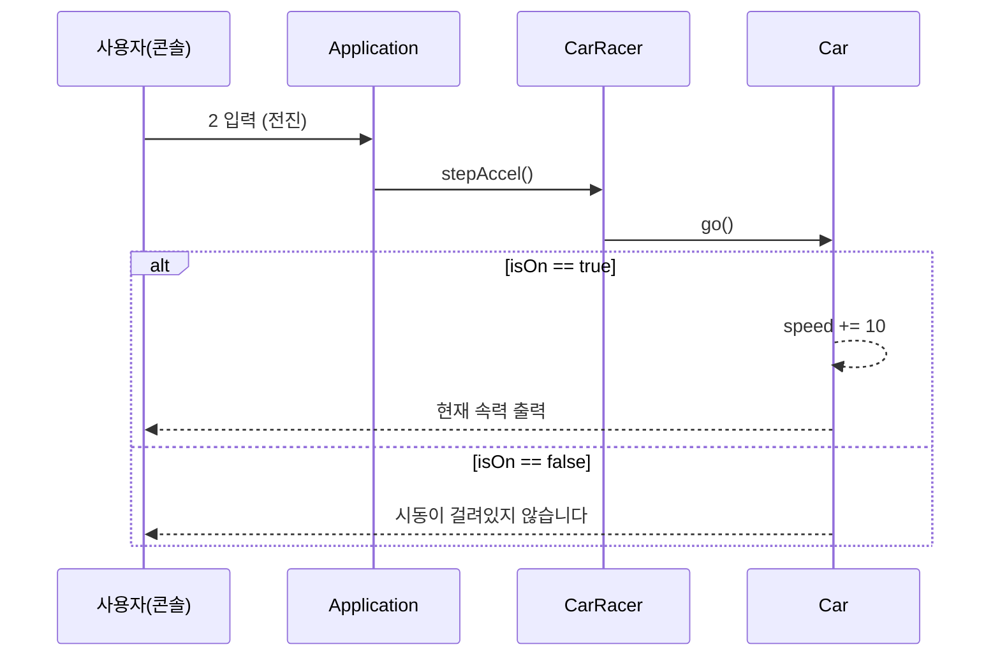

## 들어가며 (Situation)

학원 자바 수업 세 번째 챕터(`chap03-object-oriented-programming`)의 두 번째 날이다. 어제는 클래스와 생성자를 배웠고([지난 글]({{ site.baseurl }})), 오늘은 객체지향의 핵심 개념 두 가지를 실습했다.

| 패키지 | 주제 | 실습 내용 |
|--------|------|-----------|
| `c_encapsulation` | 캡슐화 | `Monster` 클래스를 `problem1` → `problem2` → `problem3` → `problem_solved` 순서로 고쳐 나가기 |
| `d_abstration` | 추상화 | 요구사항 문장에서 `Car`, `CarRacer` 클래스를 뽑아 콘솔 레이싱 프로그램 만들기 |

이 글은 수업 코드를 다시 컴파일하고 실행해서 "왜 이렇게 바꿨는지"를 확인한 기록이다. 그 과정에서 수업 코드에 숨어 있던 버그도 두 개 발견했다.

## 문제 상황 (Task)

**캡슐화 실습**의 출발점은 아주 단순한 `Monster` 클래스다.

```java
public class Monster {
    String name;
    int hp;
}
```

필드가 그대로 열려 있으면 어떤 문제가 생기는지, 그리고 이를 어떻게 막는지 단계별로 확인하는 것이 과제였다.

**추상화 실습**은 아래 요구사항을 객체로 옮기는 과제였다.

> 1. 자동차는 처음에 멈춘 상태로 대기한다.
> 2. 카레이서는 먼저 자동차에 시동을 건다. 이미 걸려있다면, 다시 시동을 걸 수 없다.
> 3. 엑셀을 밟으면 시동이 걸려있을 때 시속이 10km/h 증가한다.
> 4. 달리는 중에 브레이크를 밟으면 시속이 0으로 떨어진다.
> 5. 달리는 중이 아닐 때 브레이크를 밟으면 이미 멈춰 있다고 안내한다.
> 6. 시동을 끄면 자동차는 더 이상 움직이지 않는다.
> 7. 달리는 중에는 시동을 끌 수 없다.

## 해결 과정 (Action)

### 1. 캡슐화: 문제 1 — 검증되지 않은 값이 들어간다

`problem1`에서는 `Application`이 필드에 직접 값을 넣는다.

```java
Monster monster2 = new Monster();
monster2.name = "피카츄";
monster2.hp = -200;   // 아무도 막지 않는다
```

실행해보면 `monster2.hp = -200`이 그대로 출력된다. 체력이 음수인 몬스터는 게임 규칙상 말이 안 되지만, 필드가 열려 있으니 **어디서든 아무 값이나** 넣을 수 있다. 그래서 `Monster` 안에 `setHp()` 메서드를 만들어 값을 검사하게 했다.

여기서 `this`도 함께 배웠다. `setHp(int hp)`처럼 매개변수(지역 변수)와 필드의 이름이 같으면 지역 변수가 우선한다. 그래서 필드를 가리키려면 `this.hp`라고 써야 한다. `this`는 **메서드를 호출한 인스턴스 자기 자신**을 가리킨다. 수업 필기에는 "this는 몬스터 클래스를 말함"이라고 적었는데, 정확히는 클래스가 아니라 `monster1`, `monster2` 같은 **각각의 객체**다([Oracle Tutorials - Using the this Keyword](https://docs.oracle.com/javase/tutorial/java/javaOO/thiskey.html)).

### 2. 캡슐화: 문제 2 — 필드 이름을 바꾸면 사용하는 곳이 전부 깨진다

`problem2`에서는 요구사항이 바뀌어 `name` 필드를 `kinds`로 바꾸는 상황을 가정했다. 수업 코드는 `name`을 남겨둔 채 `kinds`를 추가해서 실제로는 에러가 나지 않았다. 그래서 `String name;` 줄을 주석 처리하고 직접 컴파일해봤다.

```bash
javac -encoding UTF-8 -d out com/wanted/oop/c_encapsulation/problem2/*.java
```

```
Application.java:14: error: cannot find symbol
        monster1.name = "성원몬";
                ^
```

`Application`에서 `name`을 쓰던 6곳이 모두 에러가 됐다. `Monster`를 쓰는 클래스가 10개였다면 10개 파일을 전부 고쳐야 한다. 필드를 직접 쓰면 **클래스 내부 구조가 외부 코드에 그대로 노출**되기 때문이다.

### 3. 캡슐화: 문제 3 — 메서드를 만들어도 필드는 여전히 열려 있다

`problem3`에서는 `setName()`, `getInfo()`를 추가해서 `Application`이 메서드로만 `Monster`를 다루게 바꿨다. 이제 내부 필드 이름을 `kinds`로 바꿔도 `Application`은 영향을 받지 않는다.

```java
public void setName(String name) {
    this.kinds = name;   // 외부는 kinds라는 이름을 모른다
}
```

하지만 마지막 줄에 이 코드가 있었다.

```java
monster3.hp = -5500;
System.out.println(monster3.getInfo());
// 몬스터의 이름은 가랴도스이고, 체력은 -5500 입니다
```

`setHp()`를 만들어도 **안 쓰면 그만**이다. 메서드는 "이걸 써주세요"라는 약속일 뿐 강제력이 없다.

### 4. 캡슐화: 해결 — `private`으로 필드 접근 자체를 막는다

`problem_solved`에서는 필드에 접근 제한자 `private`을 붙였다.

```java
public class Monster {
    private String kinds;
    private int hp;
    // setHp(), setName(), getInfo()는 public
}
```

주석 처리된 `monster3.hp = -5500;`을 다시 살려서 컴파일해보니, 이번에는 컴파일러가 막아줬다.

```
Application.java:53: error: hp has private access in Monster
monster3.hp = -5500;
        ^
```

네 단계를 정리하면 다음과 같다.



| 단계 | 필드 | 외부 접근 방법 | 남은 문제 |
|------|------|----------------|-----------|
| problem1 | `default` | `monster.hp = -200` | 잘못된 값이 들어감 |
| problem2 | `default` | 필드 직접 사용 | 필드명 변경 시 사용처 전부 에러 |
| problem3 | `default` | 메서드 + 필드 직접 사용 둘 다 가능 | 메서드를 우회할 수 있음 |
| problem_solved | `private` | 메서드만 가능 | 없음 (컴파일러가 강제) |

접근 제한자 4종은 [Oracle Tutorials - Controlling Access to Members of a Class](https://docs.oracle.com/javase/tutorial/java/javaOO/accesscontrol.html)의 표를 기준으로 정리했다.

| 제한자 | 같은 클래스 | 같은 패키지 | 하위 클래스 | 전체 |
|--------|:-:|:-:|:-:|:-:|
| `public` | O | O | O | O |
| `protected` | O | O | O | X |
| (없음, default) | O | O | X | X |
| `private` | O | X | X | X |

> 캡슐화는 **필드는 숨기고(`private`), 동작은 공개(`public` 메서드)** 하는 것이다. 외부는 "무엇을 할 수 있는지"만 알고 "어떻게 저장되는지"는 모른다.

### 5. 시행착오: `setHp()`의 조건이 반대로 되어 있었다

정리하려고 `problem_solved`를 실행했는데, 결과가 이상했다.

```
삐빅.. 오류 발생 잘못된 값이 탐지되어 hp를 0으로 강제합니다.   ← setHp(50)
정상 값입니다. 몬스터의 체력을 -200로 설정합니다.              ← setHp(-200)
```

정상 값 `50`을 넣으면 오류라고 하고, `-200`을 넣으면 정상이라고 한다. 수업에서 따라 친 코드를 다시 보니 `if`의 메시지와 동작이 서로 바뀌어 있었다.

```java
public void setHp(int hp) {
    if (hp < 0) {
        System.out.println("정상 값입니다. ...");   // 음수인데 "정상"
        this.hp = 0;
    } else {
        System.out.println("삐빅.. 오류 발생 ...");  // 양수인데 "오류"
        // this.hp = hp; 가 없어서 양수를 넣어도 hp는 0
    }
}
```

음수를 0으로 만드는 결과는 우연히 맞지만, 양수를 넣어도 `hp`가 저장되지 않아 `monster1`의 체력이 0이 된다. 게다가 `problem1`, `problem2` 버전은 음수 분기에서 `this.hp = hp;`로 음수를 그대로 저장하고 있었다. 검증 메서드를 만들어 놓고도 검증이 안 되고 있었던 것이다. 의도대로 고치면 다음과 같다(예시 코드).

```java
public void setHp(int hp) {
    if (hp >= 0) {
        System.out.println("정상 값입니다. 몬스터의 체력을 " + hp + "로 설정합니다.");
        this.hp = hp;
    } else {
        System.out.println("삐빅.. 오류 발생 잘못된 값이 탐지되어 hp를 0으로 강제합니다.");
        this.hp = 0;
    }
}
```

이 실수에서 배운 점은, **캡슐화는 검증을 한 곳에 모아줄 뿐 검증 로직이 맞는지까지 보장하지는 않는다**는 것이다. 대신 검증이 `setHp()` 한 곳에만 있으니 고칠 곳도 한 곳뿐이다. 필드를 직접 쓰는 코드였다면 사용처마다 찾아다녀야 했을 것이다.

### 6. 추상화: 요구사항 문장에서 클래스 뽑기

수업에서 정의한 추상화는 이렇다.

> 공통된 부분을 추출하고, 공통되지 않는 부분은 제거한다. 복잡한 현실 세계를 프로그램의 목적에 맞게 단순화하는 것이다.

실제 자동차에는 색상, 연비, 타이어, 에어컨 등 수많은 속성이 있다. 하지만 이 프로그램의 목적은 "시동, 전진, 정지"뿐이므로 `Car`에는 **속력(`speed`)과 시동 여부(`isOn`)** 두 상태만 남겼다.

클래스를 찾는 요령도 배웠다. 요구사항 문장에서 **"은/는, 이/가" 앞에 오는 명사가 대부분 클래스 후보**다. "**자동차는** 멈춘 상태로 대기한다", "**카레이서는** 시동을 건다"에서 `Car`와 `CarRacer`가 나온다. 각 객체가 해야 할 일은 그 객체가 받을 **메시지(메서드)** 가 된다.

| 객체 | 상태(필드) | 받는 메시지(메서드) |
|------|-----------|-------------------|
| `CarRacer` | `private Car car` | `startUp()`, `stepAccel()`, `stopBreak()`, `turnOff()` |
| `Car` | `private int speed`, `private boolean isOn` | `startUp()`, `go()`, `stop()`, `turnOff()` |

여기서 캡슐화가 다시 등장한다. `CarRacer`가 `Car`를 `private` 필드로 가지고 있어서, `Application`은 자동차에 직접 접근할 수 없고 카레이서에게만 명령한다. 수업 주석 그대로 "car는 carracer만 접근해야 한다. Application은 car에 접근하면 안 된다."



`Car`의 메서드는 요구사항 번호와 그대로 대응된다. 예를 들어 요구사항 7번 "달리는 중에는 시동을 끌 수 없다"는 `turnOff()`의 중첩 `if`가 된다.

```java
public void turnOff() {
    if (isOn) {
        if (speed > 0) {
            System.out.println("달리는 상태에서는 시동을 끌 수 없습니다. 차를 먼저 멈춰주세요.");
        } else {
            this.isOn = false;
            System.out.println("시동이 꺼집니다.");
        }
    } else {
        System.out.println("이미 시동이 꺼져있습니다");
    }
}
```

### 7. 추상화: `CarRacer` 객체는 왜 반복문 밖에서 만들까

`Application`의 `while` 메뉴 루프에서 처음에는 `case 1:` 안에서 `new CarRacer()`를 하려고 했다. 수업 주석에는 "계속 만들어지므로 메모리적으로 손해"라고 적었는데, 실제로 더 큰 문제는 **상태가 사라진다**는 것이다. 메뉴를 고를 때마다 새 `CarRacer`, 그 안의 새 `Car`가 생기면 방금 건 시동(`isOn = true`)은 이전 객체에 남아 있다. 그러면 "시동 걸기 → 전진"을 해도 항상 "시동이 걸려있지 않습니다"가 나온다. 객체 하나가 프로그램 내내 상태를 유지해야 하므로 반복문 밖에서 한 번만 만든다.

### 8. 시행착오: 엑셀 한 번에 20km/h가 올라간다

메뉴를 `2 → 1 → 2 → 2 → 4 → 3 → 3 → 4 → 4 → 9` 순서로 입력해서 요구사항을 하나씩 확인했다.

```bash
printf "2\n1\n2\n2\n4\n3\n3\n4\n4\n9\n" | java -cp out com.wanted.oop.d_abstration.run.Application
```

| 입력 | 기대 (요구사항) | 실제 출력 | 결과 |
|------|----------------|-----------|:-:|
| 2 (시동 전 전진) | 시동이 안 걸려 있다고 안내 | 시동이 걸려있지 않습니다 | O |
| 1 | 시동 걸기 | 시동걸기 완료 | O |
| 2 | 속력 10km/h | **속력 20km/h** | X |
| 2 | 속력 20km/h | **속력 40km/h** | X |
| 4 (달리는 중 시동 끄기) | 끌 수 없다고 안내 | 시동을 끌 수 없습니다 | O |
| 3 | 정지 | 차는 멈췄습니다 | O |
| 3 | 이미 멈춰 있다고 안내 | 차는 이미 멈춰있습니다 | O |
| 4 | 시동 끄기 | 시동이 꺼집니다 | O |
| 4 | 이미 꺼져 있다고 안내 | 이미 시동이 꺼져있습니다 | O |

원인은 `go()`에서 같은 의미의 코드를 두 번 쓴 것이었다.

```java
this.speed = speed + 10;
this.speed += 10;        // 같은 동작을 한 번 더 → +20
```

`this.speed = speed + 10`과 `this.speed += 10`은 같은 동작이다. 수업 중에 두 가지 표현을 다 적어두다가 하나를 지우지 않았다. 둘 중 한 줄만 남기면 된다.

코드를 읽다가 정리할 점도 두 가지 더 찾았다.

- `Car`에 `stopBreak()`와 `stop()`이 **완전히 같은 코드**로 두 번 있고, `CarRacer`는 `stop()`만 쓴다. 쓰지 않는 `stopBreak()`는 지워도 된다.
- `stop()`은 시동이 꺼져 있을 때 `else`가 없어서 아무것도 출력하지 않는다. 요구사항 5번 "멈춰 있다고 안내한다"에 맞추려면 `else`에 안내 문구를 넣어야 한다.

## 결과 (Result)

| 항목 | Before | After |
|------|--------|-------|
| `Monster.hp`에 외부에서 `-5500` 대입 | 컴파일 성공, 체력 -5500 | `hp has private access` 컴파일 에러 |
| 필드명 `name` → `kinds` 변경 영향 | `Application` 6곳 컴파일 에러 | 0곳 (`setName()` 내부만 수정) |
| `setHp(50)` 결과 (수업 코드) | 체력 0, "오류 발생" 출력 | 조건 수정 시 체력 50 (예시 코드) |
| 엑셀 1회 속력 증가 (수업 코드) | +20km/h | 중복 줄 제거 시 +10km/h |
| 요구사항 7개 중 실행으로 확인한 항목 | — | 7개 중 6개 통과, 3번(속력 증가)만 버그 |

배운 점은 다음과 같다.

- **캡슐화**는 필드를 `private`으로 숨기고 메서드로만 접근하게 해서, 잘못된 값과 내부 구조 변경의 영향을 클래스 안에 가둔다. 강제하는 것은 메서드가 아니라 **접근 제한자와 컴파일러**다.
- **추상화**는 목적에 필요한 상태와 동작만 남기는 것이다. 요구사항 문장의 주어에서 클래스를, 해야 할 일에서 메서드를 뽑으면 설계가 문장과 1:1로 대응된다.
- 따라 친 코드도 **요구사항과 하나씩 대조하며 실행**해봐야 한다. 이번에 찾은 `setHp()` 조건 반전과 `go()`의 +20 버그는 모두 컴파일은 되지만 동작이 틀린 버그였다.

## 더 학습하면 좋은 개념

- **getter/setter와 불변 객체(Immutable Object)** — setter를 만들면 결국 값을 바꿀 수 있다. 생성자에서만 값을 받고 setter를 두지 않는 불변 객체는 캡슐화를 한 단계 더 강하게 만든다.
- **생성자에서의 유효성 검사** — 지금은 `new Monster()` 직후 `hp`가 0이다. 생성자에서 `setHp()`처럼 검증하면 처음부터 잘못된 객체가 만들어지지 않는다.
- **예외(Exception) 던지기** — 잘못된 값을 조용히 0으로 바꾸는 대신 `IllegalArgumentException`을 던지면 호출한 쪽이 실수를 바로 알 수 있다.
- **인터페이스와 추상 클래스** — `CarRacer`가 `Car`가 아닌 "운전할 수 있는 것"에 의존하게 만들면, 자동차 대신 오토바이로 바꿔도 레이서 코드를 고치지 않아도 된다. 추상화의 다음 단계다.
- **상태 패턴(State Pattern) / `enum`** — `isOn`과 `speed`로 상태를 조합하는 중첩 `if`는 상태가 늘면 복잡해진다. 상태를 `enum`으로 표현하면 더 읽기 쉬워진다.

## 참고 자료

- [Oracle Java Tutorials - Controlling Access to Members of a Class](https://docs.oracle.com/javase/tutorial/java/javaOO/accesscontrol.html)
- [Oracle Java Tutorials - Using the this Keyword](https://docs.oracle.com/javase/tutorial/java/javaOO/thiskey.html)
- [Oracle Java Tutorials - What Is an Object?](https://docs.oracle.com/javase/tutorial/java/concepts/object.html)
- [Java Language Specification SE 21 - 6.6 Access Control](https://docs.oracle.com/javase/specs/jls/se21/html/jls-6.html#jls-6.6)

---

**요약**
1. 필드를 열어두면 잘못된 값이 들어가고 필드명 변경이 사용처 전체에 퍼지므로, `private` 필드 + `public` 메서드로 감싸는 캡슐화로 컴파일러가 접근을 막게 한다.
2. 추상화는 프로그램 목적에 필요한 상태(`speed`, `isOn`)와 동작만 남기는 것이고, 요구사항 문장의 주어에서 클래스, 해야 할 일에서 메서드를 뽑는다.
3. 수업 코드를 실행해보니 `setHp()`의 조건 반전과 `go()`의 +20km/h 버그가 있었고, 컴파일되는 코드도 요구사항과 대조하며 실행해야 한다는 것을 배웠다.
