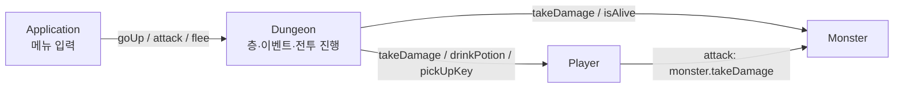
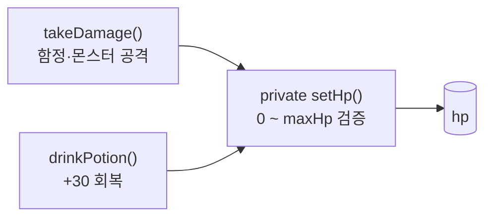
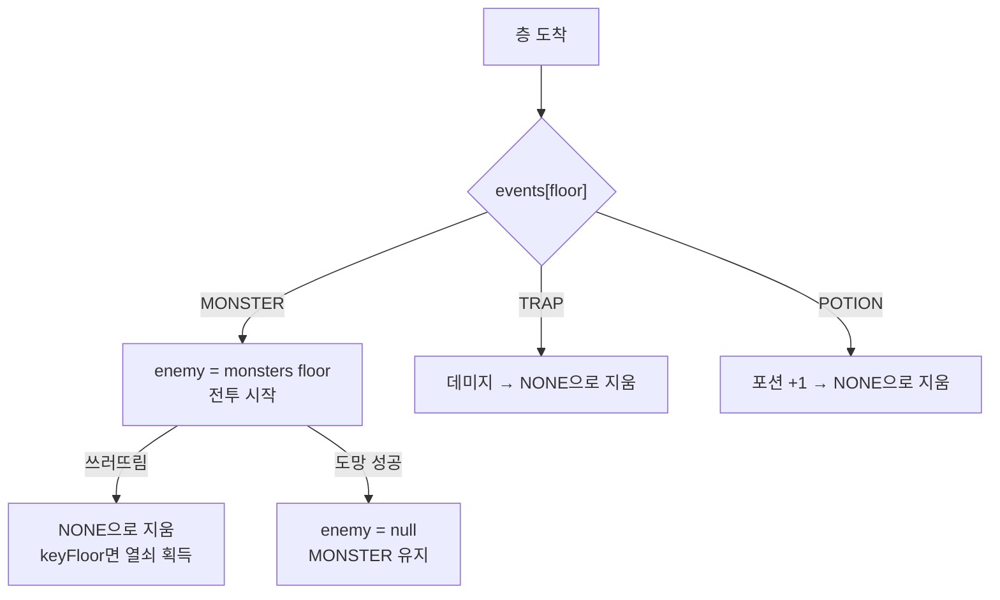

## 들어가며 (Situation)

자바 챕터3에서 캡슐화와 추상화를 배우면서([지난 글]({{ site.baseurl }})) `Monster` 클래스로 체력 검증을, `Car`·`CarRacer`로 요구사항에서 객체를 뽑는 연습을 했다. 둘을 따로 연습하다 보니, 객체가 여러 개 얽힌 프로그램에서도 같은 원칙이 지켜지는지 확인하고 싶었다.

그래서 `d_abstration/practice_dungeon` 패키지에 **포켓 던전 탈출기**라는 콘솔 게임을 만들었다. 캡슐화 실습의 `Monster`를 발전시켜 재사용했다.

| 클래스 | 역할 |
|--------|------|
| `Application` | 메뉴 출력, 숫자 입력 |
| `Dungeon` | 층·이벤트 배치, 전투 진행 |
| `Player` | 주인공 (이름, 체력, 포션, 열쇠) |
| `Monster` | 1세대 포켓몬 (이름, 체력, 공격력) |

## 문제 상황 (Task)

요구사항은 이렇다.

> 1. 주인공은 게임 시작 시 이름을 정한다.
> 2. 주인공은 지하 5층에서 시작해 한 층씩 올라가 출구로 탈출한다.
> 3. 층마다 몬스터(1세대 포켓몬), 함정, 포션 중 하나가 있다.
> 4. 몬스터를 만나면 공격 / 포션 / 도망 중 선택한다. 도망은 50% 확률이다.
> 5. 함정을 밟으면 체력이 깎이고, 포션은 주우면 가방에 들어간다.
> 6. 체력은 0 아래로, 최대 체력 위로 바뀔 수 없다.
> 7. 어느 한 몬스터가 열쇠를 가지고 있고, 쓰러뜨리면 열쇠를 얻는다.
> 8. 열쇠 없이 출구에 오면 문이 열리지 않고, 열쇠를 가지고 다시 오라고 안내한다.
> 9. 체력이 0이 되면 게임 오버.

카레이서 실습은 객체가 2개였지만 이번에는 3개 이상이다. 그래서 해결해야 할 문제는 두 가지였다.

- 객체가 늘어나도 **누가 누구에게 메시지를 보내는지** 흐름이 꼬이지 않게 할 것
- 요구사항 6번(체력 범위) 같은 규칙을 **여러 곳에서 깨지 않게** 할 것

## 해결 과정 (Action)

### 1. 요구사항에서 객체 3개 뽑기

카레이서 실습처럼 문장의 주어에서 객체를 뽑았다. 주인공(`Player`), 몬스터(`Monster`), 그리고 "층마다 ~가 있다", "출구에 오면"처럼 장소와 진행을 다루는 던전(`Dungeon`)이다.

처음에는 `Application`의 `main`에서 층 이동과 전투를 모두 처리하는 방법도 생각했다. 하지만 그러면 `main`이 `Player`와 `Monster`의 메서드를 직접 호출해야 해서, 화면 입력과 게임 규칙이 한 곳에 섞인다. 그래서 진행 규칙을 `Dungeon`에 맡기고 `Application`은 입력만 받게 했다.

| 방식 | `main`이 아는 객체 | 게임 규칙 위치 |
|------|--------------------|----------------|
| `main`에서 전부 처리 | `Player`, `Monster`, 층 배열 | `main` 안에 입력 처리와 섞임 |
| `Dungeon`에 위임 (선택) | `Dungeon` 하나 | `Dungeon` 안에 모임 |



`Application`은 `Dungeon`에게만 말을 건다. 메뉴도 `Dungeon`이 알려주는 상태(`isInBattle()`, `isAtDoor()`, `isOver()`)를 보고 고른다.

```java
while (!dungeon.isOver()) {
    if (dungeon.isInBattle()) {
        // 1. 공격  2. 포션 마시기  3. 도망치기
    } else if (dungeon.isAtDoor()) {
        // 1. 아래층으로 돌아가기  9. 포기하기
    } else {
        // 1. 위층  2. 아래층  3. 포션  4. 내 상태  9. 포기하기
    }
}
```

### 2. 체력 규칙을 한 곳에 가두기

`Player`와 `Monster`의 필드는 모두 `private`이라서 `Dungeon`도 메서드로만 다룰 수 있다. 특히 `Player`의 `setHp()`는 바깥에서 부를 일이 없어서 아예 `private`으로 숨겼다.

```java
// Player.java — 체력은 0 ~ maxHp 범위를 벗어날 수 없다
private void setHp(int hp) {
    if (hp < 0) {
        this.hp = 0;
    } else if (hp > maxHp) {
        this.hp = maxHp;
    } else {
        this.hp = hp;
    }
}

public void takeDamage(int damage) { setHp(this.hp - damage); }
```



체력을 바꾸는 길은 `takeDamage()`와 `drinkPotion()` 두 개뿐이고, 둘 다 `setHp()`를 거친다. 그래서 요구사항 6번을 **한 곳에서만** 지키면 된다. 함정 데미지가 남은 체력보다 커도 0에서 멈추고, 체력이 90일 때 포션을 마셔도 100을 넘지 않는다. 포션 메서드는 실제 회복량을 `this.hp - before`로 계산해서 보여준다.

```java
potion--;
int before = this.hp;
setHp(this.hp + 30);
System.out.println("🧪 꿀꺽꿀꺽! 체력이 " + (this.hp - before) + " 회복됐어요. (HP " + this.hp + "/" + maxHp + ")");
```

이름도 같은 방식으로 `setName()` 안에서 검증했다. 빈 문자열이면 "이름없는 트레이너"로 바꾼다.

### 3. 숫자가 아닌 입력 막기

`nextInt()`는 숫자가 아닌 글자가 들어오면 `InputMismatchException`으로 프로그램이 멈춘다. 그래서 `hasNextInt()`로 먼저 확인하고, 숫자가 아니면 그 글자를 버린 뒤 `-1`을 돌려 `switch`의 `default`로 보냈다.

```java
private static int readNo(Scanner sc) {
    if (sc.hasNextInt()) {
        return sc.nextInt();
    }
    sc.next();   // 숫자가 아닌 입력을 버린다
    return -1;
}
```

`sc.next()`로 버리지 않으면 잘못된 입력이 버퍼에 그대로 남아서, 다음 `hasNextInt()`도 계속 `false`가 되어 무한 반복에 빠진다([Java SE 21 API - Scanner](https://docs.oracle.com/en/java/javase/21/docs/api/java.base/java/util/Scanner.html)).

### 4. 도망쳐도 몬스터는 남아있다

요구사항 8번("열쇠를 가지고 다시 오라")이 성립하려면, 열쇠 몬스터에게서 도망친 뒤 돌아왔을 때 그 몬스터가 그대로 있어야 한다. 그래서 몬스터를 층별 배열 `monsters[]`에 **객체로** 저장하고, 도망칠 때는 `enemy = null`만 했다.

```java
public void flee() {
    if (Math.random() < 0.5) {
        System.out.println("💨 걸음아 날 살려라! 도망치는 데 성공했다.");
        enemy = null;   // 몬스터는 그 층에 그대로 남아있다.
    } else {
        System.out.println("🙅 " + enemy.getName() + "이(가) 앞을 막았다! 도망 실패!");
        enemyTurn();
    }
}
```

`events[floor]`가 `MONSTER`로 남아 있으니 그 층에 다시 오면 같은 `Monster` 객체가 `enemy`가 된다. 몬스터는 깎인 체력을 그대로 가지고 있다. 객체가 자기 상태를 기억한다는 게 무슨 뜻인지 실감한 부분이다. 반대로 함정과 포션은 한 번 발동하면 `events[floor] = NONE`으로 지워서 다시 밟지 않게 했다.



### 5. 실행 결과

"계속 위로 올라가기(1)"만 입력해서 실행한 결과 일부다. 이번 판에는 지하 2층의 디그다가 열쇠를 갖고 있었다.

```text
========== 지하 4층 ==========
💥 바나나 껍질을 밟고 미끄러졌다! 13 데미지!
🧑 이름 | HP 87/100 | 포션 2개 | 열쇠 없음
...
========== 지하 2층 ==========
야생의 디그다이(가) 나타났다! ⚔️
어...? 목에 반짝이는 열쇠🔑를 걸고 있다!
👾 디그다 | HP 46 | 공격력 12
...
🏆 디그다은(는) 쓰러졌다!
🔑 디그다이(가) 떨어뜨린 열쇠를 주웠다!
...
========== 🚪 출구 ==========
🔑 철컥! 문이 열렸다! 눈부신 햇빛이...☀️
```

### 6. 다시 읽으며 발견한 점

- `Dungeon`의 이벤트 상수가 `private final int MONSTER = 1;`처럼 `static` 없이 선언되어 있다. 모든 `Dungeon` 객체가 똑같이 가지는 상수라면 객체마다 따로 둘 이유가 없으니 `private static final`이 더 맞다. 참고로 `static`이 없어도 `case MONSTER:`가 컴파일되는 이유는, 상수식으로 초기화된 `final` 기본형 변수는 **상수 변수(constant variable)**로 취급되기 때문이다([JLS 4.12.4](https://docs.oracle.com/javase/specs/jls/se21/html/jls-4.html#jls-4.12.4)).
- 전투 중 포션이 없을 때 "포션이 없어요"가 출력되지만, `Dungeon.drinkPotion()`은 그래도 `enemyTurn()`을 호출한다. 포션도 못 마셨는데 한 대 맞는 셈이다. `Player.drinkPotion()`이 성공 여부를 `boolean`으로 돌려주게 하면 고칠 수 있다.
- 몬스터 이름 조사가 "디그다이(가)", "디그다은(는)"처럼 받침과 상관없이 붙는다. 기능에는 문제가 없지만 읽을 때 어색하다.

## 결과 (Result)

| 항목 | 결과 |
|------|------|
| 클래스 수 | 4개 (`Application`, `Dungeon`, `Player`, `Monster`) |
| `Application`이 직접 아는 게임 객체 | 1개 (`Dungeon`) |
| `Player.hp`를 바꾸는 경로 | 2개 (`takeDamage`, `drinkPotion`) → 검증은 `setHp()` 1곳 |
| 요구사항 9개 | 실행으로 지하 5층 → 열쇠 획득 → 출구 탈출 확인 |
| 숫자 아닌 입력 | 예외 없이 "잘못된 번호 입력!" |
| 발견한 개선점 | 3개 (상수 `static`, 포션 없을 때 턴 소모, 조사 처리) |

배운 점은 다음과 같다.

- 객체가 많아질수록 **메시지 흐름을 한 방향으로** 정해두는 것이 중요하다. `Application → Dungeon → Player/Monster`로 정하니 각 클래스가 무엇을 알아야 하는지가 분명해졌다.
- 검증 규칙은 필드를 바꾸는 **유일한 통로**(`private setHp()`)에 두면 한 번만 지키면 된다.
- 객체를 배열에 보관하면 상태(깎인 체력)가 그대로 유지된다. 도망 후 재전투 기능을 따로 만들 필요가 없었다.

## 더 학습하면 좋은 개념

- **`enum`** — `NONE`, `MONSTER`, `TRAP`, `POTION`을 `int` 상수 대신 `enum`으로 만들면 엉뚱한 숫자가 들어갈 수 없고 `switch`에서도 그대로 쓸 수 있다.
- **상속과 다형성** — `Player`와 `Monster`는 이름·체력·`takeDamage()`·`isAlive()`가 겹친다. 공통 부모 클래스(예: `Character`)로 묶으면 중복이 줄어든다.
- **단일 책임 원칙(SRP)** — 지금 `Dungeon`은 층 배치, 전투, 출력을 모두 맡는다. 클래스가 바뀌는 이유가 하나가 되도록 나누는 기준을 배우면 다음 설계가 쉬워진다.
- **`Random` 클래스와 시드(seed)** — `Math.random()` 대신 `new Random(seed)`를 쓰면 같은 판을 재현할 수 있어 버그를 찾기 쉬워진다.

## 참고 자료

- [Oracle Java Tutorials - Controlling Access to Members of a Class](https://docs.oracle.com/javase/tutorial/java/javaOO/accesscontrol.html)
- [Oracle Java Tutorials - What Is an Object?](https://docs.oracle.com/javase/tutorial/java/concepts/object.html)
- [Java SE 21 API - Scanner](https://docs.oracle.com/en/java/javase/21/docs/api/java.base/java/util/Scanner.html)
- [Java Language Specification SE 21 - 4.12.4 final Variables](https://docs.oracle.com/javase/specs/jls/se21/html/jls-4.html#jls-4.12.4)

---

**요약**
1. 요구사항 문장에서 `Player`, `Monster`, `Dungeon`을 뽑고 `Application → Dungeon → Player/Monster`로 메시지 흐름을 한 방향으로 정했다.
2. 체력을 바꾸는 통로를 `private setHp()` 하나로 모아 0 ~ 최대 체력 규칙을 한 곳에서만 지켰고, `hasNextInt()`로 잘못된 입력에도 멈추지 않게 했다.
3. 몬스터를 배열에 객체로 보관해 도망 후에도 상태가 유지되게 했고, 상수 `static` 누락 등 개선점 3개를 찾았다.
