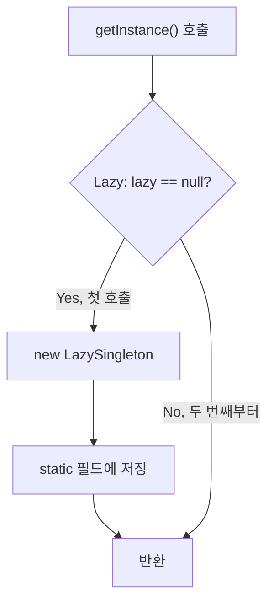
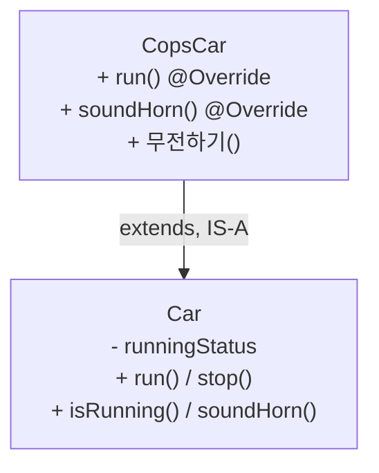
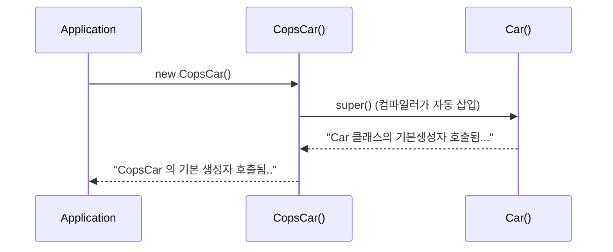

## 들어가며 (Situation)

학원 자바 수업 세 번째 챕터(`chap03-object-oriented-programming`)의 세 번째 날이다. 지난 시간에 캡슐화와 추상화를 배웠고([지난 글]({{ site.baseurl }})), 오늘은 진도가 많이 나갔다.

| 패키지 | 주제 | 실습 내용 |
|--------|------|-----------|
| `e_overloading` | 오버로딩 | 메서드 시그니처가 무엇인지 컴파일 에러로 확인 |
| `f_keyword.a_static` | `static` | 인스턴스 변수와 클래스 변수 비교 |
| `f_keyword.b_singleton` | 싱글톤 패턴 | 이른 초기화(Eager) / 게으른 초기화(Lazy) |
| `f_keyword.c_final` | `final` | 한 번만 대입할 수 있는 필드 |
| `c_inheritance.extend` | 상속 | `Car` → `CopsCar`, 오버라이딩 |
| `d_polymorphism` | 다형성 | `Animal` → `Raccoon`, `Koala`, 동적 바인딩, 인터페이스 |

이 글은 오늘 작성한 코드를 JDK 21로 다시 컴파일하고 실행해서 "주석에 적은 설명이 실제로 맞는지"를 확인한 기록이다.

## 문제 상황 (Task)

오늘 배운 개념은 각각 따로 보면 짧지만, 하루에 몰아서 받아 적다 보니 주석에 적어둔 설명 중 **확인하지 않은 문장**이 몇 개 있었다.

- `static`은 "어플리케이션 시작 시점에 초기화된다"
- 이른 초기화 싱글톤은 "run 되는 시점에" 인스턴스를 만든다
- 인터페이스는 "구현부가 있는 메서드를 못 쓴다"
- 경찰차(`CopsCar`)는 `run()`을 오버라이딩해도 차로서 똑같이 동작한다

과제는 오늘 배운 키워드와 상속·다형성 코드를 실행해서, 위 문장들이 공식 문서와 실행 결과에 맞는지 확인하는 것이었다.

## 해결 과정 (Action)

### 1. 오버로딩 — "시그니처"가 무엇인지 컴파일러에게 물어보기

같은 이름의 메서드를 여러 개 만드는 것이 오버로딩이다. 어떤 경우에 허용되는지는 **메서드 시그니처**로 결정된다. 공식 명세에서 시그니처는 **메서드 이름 + 매개변수 타입(순서 포함)**이다([JLS 8.4.2](https://docs.oracle.com/javase/specs/jls/se21/html/jls-8.html#jls-8.4.2)).

`OverloadingTest`에서 `test()`를 기준으로 하나씩 바꿔가며 컴파일러 반응을 확인했다.

| 바꾼 것 | 예시 | 결과 | 이유 |
|---------|------|------|------|
| 접근 제한자 | `private void test()` | 에러 | 시그니처에 포함 안 됨 |
| 반환 타입 | `private int test()` | 에러 | 시그니처에 포함 안 됨 |
| 매개변수 이름 | `test(int num2)` vs `test(int num)` | 에러 | 이름은 시그니처에 포함 안 됨 |
| 매개변수 유무 | `test(int num)` | 성립 | 매개변수 타입 목록이 다름 |
| 매개변수 개수 | `test(int num, String str)` | 성립 | 타입 목록이 다름 |
| 매개변수 순서 | `test(String str, int num)` | 성립 | 순서가 다르면 타입 목록이 다름 |
| 메서드 이름 | `test2()` | 성립 | 이름이 다르면 애초에 다른 메서드 |

처음에는 "반환 타입이 다르면 다른 메서드 아닌가?"라고 생각했다. 하지만 `obj.test();`처럼 반환값을 쓰지 않고 호출하면 컴파일러는 어느 쪽을 부를지 고를 수 없다. 호출하는 쪽에서 구분할 수 있는 정보(이름과 인자)만 시그니처가 된다고 이해하니 표가 자연스럽게 외워졌다. `System.out.println()`이 `int`, `String`, `boolean` 등 무엇을 넣어도 동작하는 것도 오버로딩 덕분이다.

### 2. static — 객체가 아니라 클래스에 하나

`StaticFieldTest`에는 필드가 두 개 있다.

```java
private int nonStaticInt;        // 인스턴스 변수: 객체마다 하나
private static int staticInt;    // 클래스 변수: 클래스에 하나
```

`st1`으로 둘 다 1씩 올린 뒤, 새 객체 `st2`를 만들어 값을 확인했다. 실행 결과는 이렇다.

```text
non-static 변수 값 확인 : 0
static 변수 값 확인 : 0
non-static 변수 값 확인 : 1
static 변수 값 확인 : 1
st2 = non-static 변수 값 확인 : 0
st2 = static 변수 값 확인 : 1
```

| 항목 | `nonStaticInt` | `staticInt` |
|------|----------------|-------------|
| 저장 위치 | 각 객체 안 | 클래스에 하나 |
| `st2` 생성 직후 값 | 0 (새 객체라 새로 시작) | 1 (`st1`이 올린 값 공유) |
| 접근 방법 | `this.nonStaticInt` | `StaticFieldTest.staticInt` |
| `this` 사용 | 가능 | 불가 (특정 객체가 없음) |

`static` 메서드인 `getStaticInt()`는 `StaticFieldTest.getStaticInt()`처럼 **객체 없이 클래스 이름으로** 호출한다. 그래서 `static` 메서드 안에서는 "어느 객체의" `this`인지 정할 수 없어 `this`를 쓸 수 없다([Oracle Tutorials - Understanding Class Members](https://docs.oracle.com/javase/tutorial/java/javaOO/classvars.html)).

**주석 수정**: 수업 주석에는 "static은 어플리케이션 시작 시점에 초기화된다"고 적었다. 그런데 공식 명세를 보면 클래스는 **처음 사용되는 순간**(인스턴스 생성, static 메서드 호출, static 필드 접근 등) 초기화된다([JLS 12.4.1](https://docs.oracle.com/javase/specs/jls/se21/html/jls-12.html#jls-12.4.1)). 프로그램이 시작될 때 모든 클래스의 static 변수가 한꺼번에 준비되는 것은 아니다. 이 차이는 바로 다음 싱글톤에서 실험으로 확인했다.

### 3. 싱글톤 — 생성자를 막고 static으로 하나만 공유

싱글톤은 "인스턴스를 하나만 만들어서 공유"하는 디자인 패턴이다. 수업에서는 TV 리모컨에 비유했다. 핵심은 두 가지다.

1. 생성자를 `private`으로 막아 바깥에서 `new`를 못 하게 한다.
2. 하나뿐인 인스턴스를 `static` 필드에 두고 `static` 메서드로 꺼내 준다.

```java
// 이른 초기화 (Eager)
public class EagerSingleton {
    private static EagerSingleton eager = new EagerSingleton();
    private EagerSingleton() {}
    public static EagerSingleton getInstance() { return eager; }
}

// 게으른 초기화 (Lazy)
public class LazySingleton {
    private static LazySingleton lazy;
    private LazySingleton() {}
    public static LazySingleton getInstance() {
        if (lazy == null) {
            lazy = new LazySingleton();
        }
        return lazy;
    }
}
```

`getInstance()`를 두 번 호출해 `hashCode()`를 비교했다. 같은 객체라면 같은 값이 나온다.

```text
eager1 의 hashcode() = 1421795058
eager2 의 hashcode() = 1421795058
lazy1 의 hashcode() = 471910020
lazy2 의 hashcode() = 471910020
```



| 항목 | Eager | Lazy |
|------|-------|------|
| 인스턴스 생성 시점 | 클래스 초기화 시 (static 필드 초기화) | `getInstance()` 첫 호출 시 |
| `getInstance()` 내용 | 반환만 | `null` 검사 후 생성 |
| 멀티스레드 | 안전 (클래스 초기화는 JVM이 한 번만 수행) | 지금 코드는 두 스레드가 동시에 `null`을 보면 두 개 생길 수 있음 |

**궁금해서 해본 실험**: 수업 주석에 "Eager는 run 되는 시점에 느리다"라고 적었는데, 3번에서 본 대로 클래스는 처음 사용될 때 초기화된다면 Eager도 결국 `getInstance()`를 처음 부를 때 만들어지는 것 아닐까? 생성자에 출력문을 넣어 확인해봤다. (아래는 확인용 **예시 코드**다.)

```java
class Eager {
    static Eager e = new Eager();
    private Eager() { System.out.println("  Eager 인스턴스 생성!"); }
    static Eager get() { return e; }
}

public class T {
    public static void main(String[] a) {
        System.out.println("main 시작");
        System.out.println("getInstance 호출 직전");
        Eager.get();
    }
}
```

```text
main 시작
getInstance 호출 직전
  Eager 인스턴스 생성!
```

프로그램 시작이 아니라 **`get()`을 처음 부른 순간** 인스턴스가 만들어졌다. 클래스에 다른 static 멤버가 없다면 Eager와 Lazy의 생성 시점 차이는 생각보다 작다. 둘의 진짜 차이는 "클래스가 초기화될 때 무조건 만드느냐, 정말 필요할 때 `null` 검사 후 만드느냐"와 위 표의 스레드 안전성이다.

### 4. final — 딱 한 번만 대입

`final` 필드는 값을 한 번 넣으면 바꿀 수 없다. 관례상 이름을 대문자와 `_`로 쓴다. 초기화 방법은 두 가지다.

```java
private final int NON_STATIC_NUM = 1;   // 1. 선언과 동시에 초기화
private final int NON_STATIC_NUM2;      // 2. 선언만 하고

public FinalFieldTest(int num) {
    this.NON_STATIC_NUM2 = num;         //    생성자에서 반드시 초기화
}
```

수업 주석에는 "final은 무조건 선언과 동시에 초기화"라고 적었다가 바로 아래에 생성자 방식이 나와서 헷갈렸다. 정확히는 **객체 생성이 끝나기 전까지 반드시 한 번** 대입되어야 한다([JLS 8.3.1.2](https://docs.oracle.com/javase/specs/jls/se21/html/jls-8.html#jls-8.3.1.2)). 둘 다 하지 않으면 컴파일러가 막는다.

```text
F.java:1: error: variable A not initialized in the default constructor
public class F { private final int A; }
```

final 필드에는 값을 다시 넣는 setter도 만들 수 없다. 지난 글에서 "더 학습하면 좋은 개념"으로 적었던 **불변 객체**가 바로 이 `final` + 생성자 초기화 + setter 없음의 조합이다.

### 5. 상속 — 경찰차는 차다 (IS-A)

`CopsCar extends Car`로 `Car`의 `run()`, `stop()`, `soundHorn()`, `isRunning()`을 물려받고, 다르게 동작해야 하는 `run()`과 `soundHorn()`만 `@Override`로 다시 썼다. 경찰차만의 `무전하기()`도 추가했다.



`new CopsCar()`의 실행 결과 첫 두 줄이 흥미로웠다.

```text
Car 클래스의 기본생성자 호출됨...
CopsCar 의 기본 생성자 호출됨..
```

`CopsCar` 생성자에는 `super()`를 쓰지 않았는데 부모 생성자가 먼저 실행됐다. 생성자 첫 줄에 `this(...)`나 `super(...)`가 없으면 컴파일러가 **`super();`를 자동으로 넣기** 때문이다([JLS 8.8.7](https://docs.oracle.com/javase/specs/jls/se21/html/jls-8.html#jls-8.8.7)). 자식 객체 안에 부모 부분이 먼저 만들어져야 자식이 그 위에 덧붙일 수 있다고 생각하면 순서가 이해된다.



**실행하다 발견한 버그**: `CopsCar.run()`에서 `super.run();`을 주석 처리했다. 그런데 `runningStatus = true`로 바꾸는 코드는 부모의 `run()` 안에만 있다. 게다가 `runningStatus`는 `private`이라 자식이 직접 바꿀 수도 없다. 확인해보니 정말로 달린 뒤에도 달리지 않는 상태였다.

```text
🚔 경찰차는 삐용삐용~~ 하면서 달립니다! 🚔
  run() 후 isRunning = false
```

수업 코드에서는 `soundHorn()`까지 오버라이딩해서 상태를 확인하지 않으니 티가 나지 않았을 뿐이다. 만약 `soundHorn()`을 물려받은 그대로 썼다면 경찰차가 "삐용삐용 달린다"고 출력한 직후 "주행 중이 아니여서 경적을 울릴 수 없습니다"가 나왔을 것이다. 부모의 동작(상태 변경)은 유지하면서 출력만 바꾸고 싶다면 `super.run();`을 호출한 뒤 내 코드를 덧붙여야 한다([Oracle Tutorials - Using the Keyword super](https://docs.oracle.com/javase/tutorial/java/IandI/super.html)).

```java
// 수정 예시 코드
@Override
public void run() {
    super.run();   // 부모가 runningStatus = true 처리
    System.out.println("🚔 경찰차는 삐용삐용~~ 하면서 달립니다! 🚔");
}
```

오버라이딩은 부모 메서드를 **통째로 대체**하는 것이라, 부모가 그 안에서 하던 일을 자식이 책임져야 한다는 것을 배웠다.

### 6. 다형성 — 부모 타입 변수에 자식 객체 담기

`Animal`을 상속한 `Raccoon`과 `Koala`가 각각 `eat()`, `run()`, `bark()`를 오버라이딩했다. 핵심은 이 한 줄이다.

```java
Animal a1 = new Raccoon();   // 너구리는 동물이다 (O)
// Raccoon r1 = new Animal(); // 동물은 너구리다 (X) → 컴파일 에러
a1.bark();                   // 출력: 너굴너굴 너굴맨..
```

변수 타입은 `Animal`인데 `a1.bark()`를 호출하면 `Animal`의 "동물이 울부짖습니다.."가 아니라 `Raccoon`의 "너굴너굴 너굴맨.."이 나온다. 컴파일할 때는 `Animal`에 `bark()`가 있는지만 검사하고, 실행할 때 **실제 객체(`Raccoon`)의 메서드**가 호출되기 때문이다. 이것을 동적 바인딩이라고 한다([Oracle Tutorials - Polymorphism](https://docs.oracle.com/javase/tutorial/java/IandI/polymorphism.html)).

```mermaid
flowchart LR
    A["a1.bark()"] --> B{"컴파일 시점<br/>변수 타입 Animal에<br/>bark()가 있나?"}
    B -->|있음| C{"실행 시점<br/>실제 객체는?"}
    B -->|없음, 예: bite()| X[컴파일 에러]
    C -->|Raccoon| D["Raccoon.bark()<br/>너굴너굴 너굴맨.."]
    C -->|Koala| E["Koala.bark()<br/>코알코알"]
```

같은 이유로 `a1.bite()`는 컴파일 에러다. `bite()`는 `Raccoon`에만 있고, 컴파일러는 `a1`을 `Animal`로만 알기 때문이다. 쓰고 싶으면 `((Raccoon) a1).bite();`처럼 형 변환을 해야 한다.

| 구분 | 컴파일 시점 기준 | 실행 시점 기준 |
|------|------------------|----------------|
| 호출할 수 있는 메서드 목록 | 변수 타입 (`Animal`) | — |
| 실제로 실행되는 코드 | — | 객체 타입 (`Raccoon`) |
| `a1.bark()` | 허용 | `Raccoon.bark()` 실행 |
| `a1.bite()` | 에러 | — |
| `((Raccoon) a1).bite()` | 허용 | `Raccoon.bite()` 실행 |

형 변환은 실제 객체가 그 타입일 때만 안전하다. `a1`에 `Koala`가 들어 있는데 `(Raccoon)`으로 바꾸면 컴파일은 되지만 실행 중 `ClassCastException`이 난다. 그래서 실무에서는 `instanceof`로 먼저 확인한다고 한다(다음 수업 범위로 보인다).

### 7. 인터페이스 — "할 수 있는 것(Can-Do)"을 강제

마지막으로 `Animal`을 `class` 대신 `interface`로 만들었다.

```java
public interface Animal {
    void run();
    void eat();
    void bark();
}

public class Raccoon implements Animal {   // extends 가 아니라 implements
    @Override public void run() { System.out.println("너구리가 폴짝폴짝 뛰어댕깁니다.."); }
    @Override public void eat() {}
    @Override public void bark() {}
}
```

`Raccoon`이 세 메서드 중 하나라도 구현하지 않으면 컴파일 에러가 난다. 인터페이스는 "이 메서드들은 반드시 갖고 있어라"라는 약속이다. 인터페이스 자체는 `new Animal()`로 만들 수 없고, `Animal animal = new Raccoon();`처럼 구현 클래스 객체를 담는 타입으로 쓴다. 7번의 다형성이 그대로 적용된다.

| 항목 | 상속 (`extends`) | 인터페이스 (`implements`) |
|------|------------------|---------------------------|
| 관계 | IS-A (경찰차는 차다) | Can-Do (뛸 수 있다) |
| 부모의 구현 물려받기 | O | 기본적으로 X (메서드 선언만) |
| 객체 생성 | 부모도 `new` 가능 | 인터페이스는 `new` 불가 |
| 생성자 | 있음 | 없음 |

**주석 수정**: 수업 주석에 "인터페이스는 구현부가 있는 메서드를 못 쓴다"고 적었다. 실제로 `public void test() {}`는 에러가 나지만, Java 8부터는 `default` 키워드를 붙이면 구현부가 있는 메서드를 둘 수 있다([Oracle Tutorials - Default Methods](https://docs.oracle.com/javase/tutorial/java/IandI/defaultmethods.html)). JDK 21에서 확인해보니 잘 동작했다. (확인용 **예시 코드**)

```java
interface Can {
    void run();
    default void hello() { System.out.println("  default 메서드 OK"); }
}
class R implements Can { public void run() {} }

// new R().hello();  →  출력: default 메서드 OK
```

그러니 정확한 표현은 "인터페이스의 일반 메서드는 구현부를 가질 수 없고, 구현부를 쓰려면 `default`(또는 `static`)를 붙여야 한다"이다.

## 결과 (Result)

오늘 코드를 모두 컴파일·실행하고, 주석에 적은 문장을 실행 결과와 공식 문서로 대조했다.

| 확인한 내용 | 실행 결과 | 판정 |
|-------------|-----------|------|
| 오버로딩 기준 7가지 | 성립 4개, 에러 3개 | 시그니처 = 이름 + 매개변수 타입 |
| `st2` 생성 직후 값 | non-static 0, static 1 | static은 클래스에 하나 |
| 싱글톤 `getInstance()` 2회 | `hashCode()` 동일 (Eager, Lazy 모두) | 인스턴스 1개 |
| "static은 앱 시작 시 초기화" | Eager 인스턴스가 `get()` 첫 호출 때 생성 | **수정**: 클래스 첫 사용 시 |
| `final` 필드 미초기화 | 컴파일 에러 | 선언 또는 생성자에서 1회 |
| `new CopsCar()` 출력 순서 | `Car` 생성자 → `CopsCar` 생성자 | `super()` 자동 삽입 |
| `CopsCar.run()` 후 `isRunning()` | `false` | **버그**: `super.run()` 누락 |
| `Animal a1 = new Raccoon(); a1.bark()` | 너굴너굴 너굴맨.. | 동적 바인딩 |
| "인터페이스는 구현부 메서드 불가" | `default` 메서드 동작 | **수정**: Java 8부터 `default` 가능 |

배운 점은 다음과 같다.

- **static**은 "객체마다"가 아니라 "클래스에 하나"다. 싱글톤도 결국 `private` 생성자 + `static` 필드 조합일 뿐이다.
- **상속**은 코드를 물려받지만, 오버라이딩은 부모 메서드를 통째로 대체한다. 부모가 하던 상태 변경이 필요하면 `super.메서드()`를 불러야 한다.
- **다형성**은 "컴파일러는 변수 타입을 보고, 실행은 실제 객체를 따른다"로 정리된다. 그래서 하나의 `Animal` 타입으로 너구리도 코알라도 다룰 수 있다.
- 수업 주석 중 3곳(static 초기화 시점, Eager 시점, 인터페이스 구현부)이 공식 문서 기준으로 고쳐야 할 표현이었다. 받아 적은 문장도 실행해보고 명세와 대조해야 한다.

## 더 학습하면 좋은 개념

- **추상 클래스(abstract class)** — 오늘 배운 일반 클래스 상속과 인터페이스의 중간이다. 공통 구현은 물려주면서 일부 메서드는 자식에게 강제할 수 있어, `Animal` 같은 "직접 만들 일 없는 부모"에 잘 맞는다.
- **`instanceof`와 패턴 매칭** — `((Raccoon) a1)` 같은 다운캐스팅을 안전하게 하는 방법이다. Java 16부터는 `if (a1 instanceof Raccoon r)`처럼 확인과 형 변환을 한 번에 쓸 수 있다.
- **스레드 안전한 싱글톤 (holder 패턴, `enum` 싱글톤)** — 오늘 만든 Lazy 싱글톤은 멀티스레드에서 인스턴스가 두 개 생길 수 있다. 클래스 초기화가 한 번만 일어난다는 JVM 성질을 이용하면 `synchronized` 없이 해결된다.
- **상속보다 합성(Composition over Inheritance)** — 오늘 `CopsCar`에서 본 것처럼 자식은 부모 내부 동작에 강하게 묶인다. "IS-A"가 확실하지 않으면 필드로 갖는(HAS-A) 쪽이 변경에 더 안전하다.
- **`Object` 클래스와 `hashCode()`/`equals()`** — 싱글톤 확인에 쓴 `hashCode()`는 모든 클래스의 부모인 `Object`에서 물려받은 메서드다. 상속의 맨 꼭대기를 알면 오버라이딩을 왜 하는지 더 잘 보인다.

## 참고 자료

- [Oracle Java Tutorials - Defining Methods (Overloading)](https://docs.oracle.com/javase/tutorial/java/javaOO/methods.html)
- [Oracle Java Tutorials - Understanding Class Members](https://docs.oracle.com/javase/tutorial/java/javaOO/classvars.html)
- [Oracle Java Tutorials - Inheritance](https://docs.oracle.com/javase/tutorial/java/IandI/subclasses.html)
- [Oracle Java Tutorials - Using the Keyword super](https://docs.oracle.com/javase/tutorial/java/IandI/super.html)
- [Oracle Java Tutorials - Polymorphism](https://docs.oracle.com/javase/tutorial/java/IandI/polymorphism.html)
- [Oracle Java Tutorials - Default Methods](https://docs.oracle.com/javase/tutorial/java/IandI/defaultmethods.html)
- [Java Language Specification SE 21 - 8.4.2 Method Signature](https://docs.oracle.com/javase/specs/jls/se21/html/jls-8.html#jls-8.4.2)
- [Java Language Specification SE 21 - 12.4.1 When Initialization Occurs](https://docs.oracle.com/javase/specs/jls/se21/html/jls-12.html#jls-12.4.1)
- [Java Language Specification SE 21 - 8.3.1.2 final Fields](https://docs.oracle.com/javase/specs/jls/se21/html/jls-8.html#jls-8.3.1.2)
- [Java Language Specification SE 21 - 8.8.7 Constructor Body](https://docs.oracle.com/javase/specs/jls/se21/html/jls-8.html#jls-8.8.7)

---

**요약**
1. 오버로딩은 이름 + 매개변수 타입(시그니처)으로 구분하고, `final` 필드는 선언 또는 생성자에서 딱 한 번 대입된다.
2. `static`은 객체가 아니라 클래스에 하나라서 싱글톤의 기반이 되며, static 초기화는 앱 시작이 아니라 클래스 첫 사용 시점이었다.
3. 상속에서 오버라이딩은 부모 메서드를 통째로 대체하므로 `CopsCar`처럼 `super.run()`을 빼면 상태가 바뀌지 않고, 다형성은 컴파일러는 변수 타입을, 실행은 실제 객체를 따른다.
