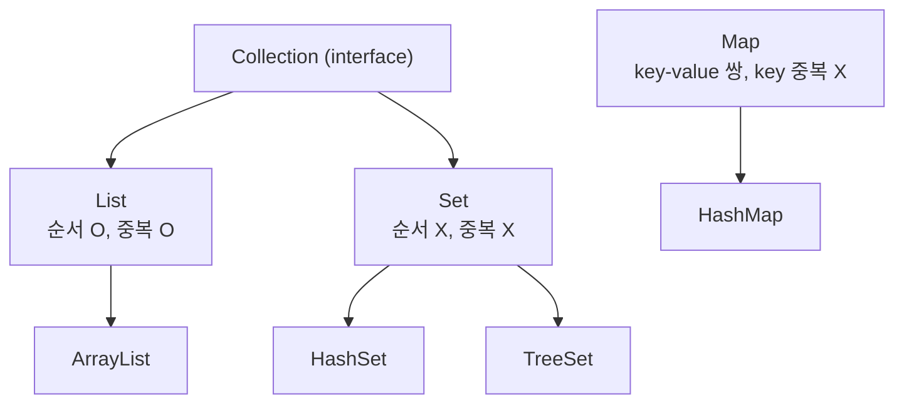
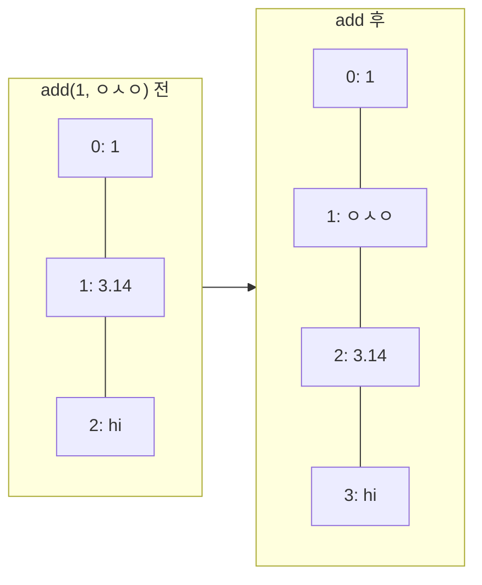

## 들어가며 (Situation)

챕터4의 두 번째 주제는 **컬렉션(Collection)**이다. 앞에서 배운 제네릭([기초]({{ site.baseurl }}), [타입 제한과 와일드카드]({{ site.baseurl }}))이 실제로 가장 많이 쓰이는 곳이 바로 컬렉션이라, 제네릭 다음에 배우는 순서가 자연스러웠다.

오늘 `b_collection/a_list` 패키지에서 작성한 파일은 세 개다.

| 파일 | 내용 |
|------|------|
| `run/Application01.java` | 컬렉션 종류, raw `List`, `add`/`remove`, `Collections.sort` |
| `dto/BookDTO.java` | 책 정보를 담는 DTO 클래스 |
| `run/Application02.java` | `List<BookDTO>`에 책 5권 저장, `for`문 두 가지로 출력 |

## 문제 상황 (Task)

챕터1에서 배운 배열은 크기를 처음에 정해야 하고, 중간에 값을 끼워 넣거나 빼려면 뒤의 값을 직접 한 칸씩 옮겨야 했다. 수업 주석에도 "배열의 단점: 고정크기, 기존 값 수정"이라고 적었다.

오늘의 과제는 `Application02`의 주석에 적힌 그대로다.

> - 책은 책번호, 제목, 저자, 가격이 있다.
> - 5권의 책을 하나의 변수에 저장을 한다.
> - 가격 오름차순으로 정렬을 해본다.

그런데 코드를 다시 실행해보니 **세 번째 항목(가격 정렬)은 구현되어 있지 않았다.** 수업 시간 안에 저장과 출력까지만 하고 끝난 것이다. 그래서 이 글에서는 수업 코드를 검증하면서 마지막 과제까지 직접 마무리해봤다.

## 해결 과정 (Action)

### 1. 컬렉션 지도 — List, Set, Map

수업 주석에 정리한 세 가지를 공식 튜토리얼의 인터페이스 구조와 맞춰 그려봤다([Oracle Tutorials - Collection Interfaces](https://docs.oracle.com/javase/tutorial/collections/interfaces/index.html)).



그리면서 하나 알게 된 점은 `Map`이 `Collection`의 하위가 **아니라는** 것이다. `List`와 `Set`은 값 하나씩을 담지만 `Map`은 키와 값 한 쌍을 담기 때문에 별도의 인터페이스 계층이다.

### 2. `List`는 인터페이스, `ArrayList`는 구현체

```java
List list = new ArrayList();
```

수업 주석대로 `List`는 인터페이스라서 `new List()`를 할 수 없다. 지난 챕터에서 `Animal animal = new Raccoon();`으로 인터페이스 타입 변수에 구현 클래스 객체를 담았던 것과 같은 구조다. `ArrayList` 공식 문서는 자신을 "**크기를 조절할 수 있는 배열(Resizable-array)** 기반의 `List` 구현"이라고 소개한다([Java SE 21 API - ArrayList](https://docs.oracle.com/en/java/javase/21/docs/api/java.base/java/util/ArrayList.html)). 내부는 배열이지만 꽉 차면 알아서 더 큰 배열로 옮겨주기 때문에 고정 크기 문제가 사라진다.

변수 타입을 `ArrayList`가 아니라 `List`로 쓰는 이유도 다형성이다. 나중에 다른 `List` 구현체로 바꾸더라도 `new` 오른쪽만 고치면 된다.

### 3. raw `List` — 아무거나 들어가는 대신 경고 8개

수업 코드는 일부러 타입 인자 없이 `List`를 만들고 서로 다른 타입을 넣었다.

```java
list.add(1);
list.add(3.14);
list.add("hi");
list.add(false);
list.add(new Date());
```

```text
list = [1, 3.14, hi, false, Wed Oct 07 15:05:10 KST 2026]
list.size() = 5
```

정수, 실수, 문자열, 불리언, 날짜가 한 리스트에 다 들어갔다. 하지만 [제네릭 기초 글]({{ site.baseurl }})에서 본 raw type 문제가 그대로 있다. `-Xlint:all`로 컴파일하니 이 파일에서만 경고가 **8개**(`rawtypes` 2개, `unchecked` 6개) 나왔다. 꺼낼 때 무엇이 들어 있는지 알 수 없으니 `(String) list.get(0)` 같은 캐스팅이 실행 중에 터질 수 있다.

바로 아래 코드는 `List<Character>`로 타입을 지정했고, 경고가 하나도 나오지 않았다. 실무에서는 항상 이렇게 타입을 지정한다고 한다.

### 4. `add(index, 값)`과 `remove(index)` — 배열이라면 직접 했을 일

```java
list.add(1, "ㅇㅅㅇ");   // 1번 위치에 끼워 넣기
list.remove(2);          // 2번 위치 삭제
```

```text
list = [1, ㅇㅅㅇ, 3.14, hi, false, Wed Oct 07 ...]
list = [1, ㅇㅅㅇ, hi, false, Wed Oct 07 ...]
```



끼워 넣으면 뒤의 값들이 한 칸씩 밀리고, 삭제하면 당겨진다. 배열이었다면 `for`문으로 직접 옮겨야 했던 일을 `ArrayList`가 내부에서 대신 해준다. (대신 내부적으로는 여전히 값을 옮기므로, 맨 앞에 자주 넣고 빼는 작업에는 느릴 수 있다.)

**궁금해서 해본 실험**: `remove(2)`의 `2`는 "값 2"일까 "2번 위치"일까? 수업 코드는 raw `List`라서 위치로 동작했는데, `List<Integer>`라면 헷갈릴 것 같아 확인했다. (확인용 **예시 코드**)

```java
List<Integer> n = new ArrayList<>(List.of(10, 20, 30, 2));
n.remove(2);                    // ?
// 다시 [10, 20, 30, 2]로 초기화 후
n.remove(Integer.valueOf(2));   // ?
```

```text
remove(2) -> [10, 20, 2]
remove(Integer.valueOf(2)) -> [10, 20, 30]
```

`remove(2)`는 값 `2`가 아니라 **2번 위치의 `30`**을 지웠다. `List`에는 `remove(int index)`와 `remove(Object o)`가 오버로딩되어 있는데([Java SE 21 API - List](https://docs.oracle.com/en/java/javase/21/docs/api/java.base/java/util/List.html#remove(int))), `int` 값을 넣으면 오토박싱보다 정확히 맞는 `remove(int)`가 먼저 선택되기 때문이다. 값을 지우려면 `Integer.valueOf(2)`처럼 객체로 넘겨야 한다. 지난 챕터에서 배운 **오버로딩**과 이번 챕터의 **오토박싱**이 만나는 함정이었다.

### 5. `Collections.sort()` — 그리고 IntelliJ의 기울임꼴

```java
List<Character> strings = new ArrayList<>();
strings.add('a'); strings.add('c'); strings.add('b'); strings.add('d');
Collections.sort(strings);
```

```text
strings = [a, c, b, d]
strings = [a, b, c, d]
```

`Collections`(끝에 s)는 컬렉션을 다루는 도구 메서드를 모아둔 클래스다. 수업에서 "IntelliJ에서 기울임꼴로 보이는 메서드는 static 메서드"라고 배웠는데, `Collections.sort()`처럼 객체 없이 클래스 이름으로 호출하는 것이 지난 챕터의 `static`과 연결된다.

### 6. DTO — 데이터를 담아 나르는 클래스

책 한 권의 정보를 담기 위해 `BookDTO`를 만들었다.

```java
public class BookDTO {
    private int no;         // 책 번호
    private String title;   // 책 제목
    private String author;  // 책 저자
    private int price;      // 책 가격

    public BookDTO() {}
    public BookDTO(int no, String title, String author, int price) { ... }

    // getter, setter, toString
}
```

DTO(Data Transfer Object)는 기능(메서드)보다 **데이터를 담아 옮기는 것**이 목적인 클래스다. 수업 주석에 적은 구성 요소는 6가지다.

| 구성 요소 | 역할 | 챕터3 연결 |
|-----------|------|------------|
| `private` 필드 | 데이터 저장 | 캡슐화 |
| 기본 생성자 | 빈 객체 생성 | 생성자 |
| 모든 필드 초기화 생성자 | 한 줄로 값 채워 생성 | 생성자 오버로딩 |
| getter | 값 조회 | 캡슐화 |
| setter | 값 변경 | 캡슐화 |
| `toString()` | 내용 출력 | 오버라이딩 |

수업 주석에 "메서드가 아닌 필드들로만 이루어져 있으며"라고 적었는데, 표에서 보듯 getter/setter/`toString()`도 메서드다. 정확히는 "비즈니스 로직 메서드 없이, 데이터를 다루는 메서드만 가진다"가 맞는 표현인 것 같다.

### 7. 책 5권 저장과 두 가지 `for`문

처음엔 `book1`~`book5` 변수 5개를 만들었다가(주석으로 남아 있다), `List<BookDTO>` 하나에 담는 방식으로 바꿨다.

```java
List<BookDTO> bookList = new ArrayList<>();
bookList.add(new BookDTO(1, "홍길동전", "허균", 50000));
bookList.add(new BookDTO(2, "목민심서", "정약용", 45000));
// ... 5권

// 1) 인덱스 for문
for (int i = 0; i < bookList.size(); i++) {
    System.out.println((i+1) + "번째 책 : " + bookList.get(i));
}

// 2) 향상된 for문
for (BookDTO book : bookList) {
    System.out.println(book.getNo() + "번째 책 : " + book);
}
```

두 `for`문 모두 같은 5줄을 출력했다.

```text
1번째 책 : BookDTO{no=1, title='홍길동전', author='허균', price=50000}
2번째 책 : BookDTO{no=2, title='목민심서', author='정약용', price=45000}
...
```

| 항목 | 인덱스 `for` | 향상된 `for` |
|------|--------------|--------------|
| 문법 | `for (int i = 0; i < size(); i++)` | `for (BookDTO book : bookList)` |
| 인덱스 사용 | 가능 | 불가 |
| 실수 여지 | `<=` 같은 경계 실수 가능 | 적음 |
| 적합한 상황 | 위치가 필요할 때 | 전체를 한 번씩 볼 때 |

향상된 `for`문은 배열과 컬렉션을 순회할 때 더 간결하고 읽기 쉽다는 것이 공식 튜토리얼의 권장이다([Oracle Tutorials - The for Statement](https://docs.oracle.com/javase/tutorial/java/nutsandbolts/for.html)).

### 8. 끝내지 못한 과제 — 가격 오름차순 정렬

5번에서 `Collections.sort()`로 문자를 정렬했으니 책도 똑같이 될 거라 생각하고 시도해봤다. (확인용 **예시 코드**)

```java
Collections.sort(bookList);
```

```text
error: no suitable method found for sort(List<BookDTO>)
    (inference variable T#1 has incompatible bounds
      upper bounds: Comparable<? super T#1>)
```

컴파일 에러다. 에러 메시지에 오늘 배운 `? super`가 그대로 나와서 반가웠다. `Collections.sort(List<T>)`는 `T extends Comparable<? super T>`, 즉 "**스스로 크기 비교를 할 줄 아는 타입**"만 받는다([Java SE 21 API - Collections.sort](https://docs.oracle.com/en/java/javase/21/docs/api/java.base/java/util/Collections.html#sort(java.util.List))). `Character`는 알파벳 순서를 알지만, `BookDTO`는 번호로 비교할지 가격으로 비교할지 정해진 적이 없다.

해결 방법은 두 가지다.

| 방법 | 방식 | 장단점 |
|------|------|--------|
| `Comparable` 구현 | `BookDTO`에 `compareTo()` 추가 | 기준이 하나로 고정됨 |
| `Comparator` 전달 | 정렬할 때 기준을 따로 넘김 | 가격순, 제목순 등 상황마다 바꿀 수 있음 |

정렬 기준이 가격 말고도 생길 수 있으니 `Comparator` 방식을 골랐다. (**예시 코드**, 수업 코드에는 없음)

```java
bookList.sort(Comparator.comparingInt(BookDTO::getPrice));
```

```text
25000 마법천자문
30000 삼국지
35000 그리스로마신화
45000 목민심서
50000 홍길동전
```

`Comparator.comparingInt()`는 "각 책에서 `int` 값(가격)을 꺼내 그걸로 비교하라"는 비교 기준을 만들어준다([Java SE 21 API - Comparator.comparingInt](https://docs.oracle.com/en/java/javase/21/docs/api/java.base/java/util/Comparator.html#comparingInt(java.util.function.ToIntFunction))). `BookDTO::getPrice`는 메서드 참조라는 문법인데 아직 수업에서 배우지 않았다. 지금은 "각 책의 `getPrice()`를 기준으로"라고 읽으면 충분하고, 람다를 배운 뒤에 다시 정리할 예정이다.

## 결과 (Result)

| 확인한 내용 | 결과 |
|-------------|------|
| raw `List`에 5가지 타입 저장 | 동작, 경고 8개 |
| `List<Character>` | 경고 0개 |
| `add(1, 값)` / `remove(2)` | 값이 밀리고 당겨짐 (size 5 → 6 → 5) |
| `List<Integer>.remove(2)` | 값 2가 아니라 2번 위치 삭제 |
| `Collections.sort(List<Character>)` | `[a, c, b, d]` → `[a, b, c, d]` |
| 두 가지 `for`문 | 같은 5줄 출력 |
| `Collections.sort(List<BookDTO>)` | 컴파일 에러 (`Comparable` 아님) |
| `Comparator.comparingInt(getPrice)` | 25000 → 50000 오름차순, **과제 완료** |

배운 점은 다음과 같다.

- `ArrayList`는 크기 조절과 끼워 넣기·삭제를 대신 해주는 배열이고, 변수는 인터페이스인 `List`로 받는다.
- `remove(int)`와 `remove(Object)`처럼 오버로딩과 오토박싱이 겹치는 곳은 직접 실행해봐야 함정이 보인다.
- 정렬은 "무엇을 기준으로 비교할지"를 알아야 가능하다. 직접 만든 클래스는 `Comparable`이나 `Comparator`로 그 기준을 알려줘야 한다.
- 수업 주석에 적힌 과제가 실제로 끝났는지 실행 결과로 확인하는 습관이 필요하다.

## 더 학습하면 좋은 개념

- **`Comparable`과 `Comparator`** — 8번에서 맛만 본 정렬 기준 정의 방법이다. `thenComparing()`으로 "가격이 같으면 제목순" 같은 다중 기준도 만들 수 있다.
- **람다와 메서드 참조** — `BookDTO::getPrice`, `(a, b) -> a.getPrice() - b.getPrice()` 같은 문법이다. 컬렉션을 다루는 코드가 훨씬 짧아진다.
- **`LinkedList`와 `ArrayList`의 차이** — 4번에서 본 "끼워 넣으면 뒤가 밀린다"는 비용이 `LinkedList`에서는 어떻게 달라지는지 비교해보면 자료구조 선택 기준이 생긴다.
- **`Iterator`와 `ConcurrentModificationException`** — 향상된 `for`문이 내부적으로 `Iterator`를 쓴다는 것과, 순회 중에 `remove()`하면 왜 에러가 나는지 알 수 있다.

## 참고 자료

- [Oracle Java Tutorials - Collection Interfaces](https://docs.oracle.com/javase/tutorial/collections/interfaces/index.html)
- [Oracle Java Tutorials - The List Interface](https://docs.oracle.com/javase/tutorial/collections/interfaces/list.html)
- [Oracle Java Tutorials - The for Statement](https://docs.oracle.com/javase/tutorial/java/nutsandbolts/for.html)
- [Java SE 21 API - ArrayList](https://docs.oracle.com/en/java/javase/21/docs/api/java.base/java/util/ArrayList.html)
- [Java SE 21 API - List.remove(int)](https://docs.oracle.com/en/java/javase/21/docs/api/java.base/java/util/List.html#remove(int))
- [Java SE 21 API - Collections.sort](https://docs.oracle.com/en/java/javase/21/docs/api/java.base/java/util/Collections.html#sort(java.util.List))
- [Java SE 21 API - Comparator.comparingInt](https://docs.oracle.com/en/java/javase/21/docs/api/java.base/java/util/Comparator.html#comparingInt(java.util.function.ToIntFunction))

---

**요약**
1. `ArrayList`는 크기 조절과 끼워 넣기·삭제를 대신 해주는 배열 기반 `List`이고, raw `List`는 아무 타입이나 들어가는 대신 경고 8개를 받았다.
2. `List<Integer>.remove(2)`는 값 2가 아니라 2번 위치를 지웠다. `remove(int)`와 `remove(Object)` 오버로딩에 오토박싱이 겹치는 함정이다.
3. 책 5권은 `BookDTO` + `List`로 저장했고, 수업에서 못 끝낸 가격 정렬은 `Collections.sort()`가 컴파일 에러를 내서 `Comparator.comparingInt()`로 마무리했다.
