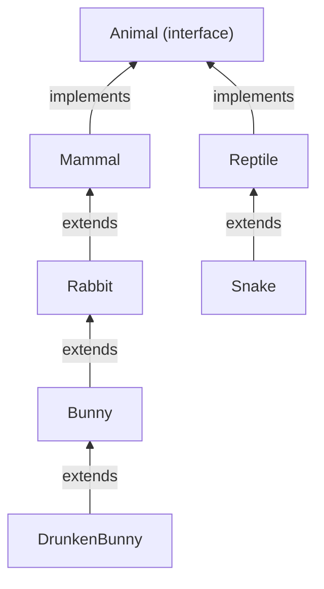
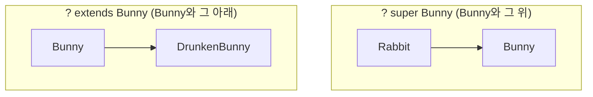

## 들어가며 (Situation)

[제네릭 기초]({{ site.baseurl }})에서 `<T>`에 아무 타입이나 넣을 수 있는 `GenericTest`를 만들었다. 이어서 수업에서는 `a_generic/b_use` 패키지에 동물 클래스들을 만들고 "토끼 농장"을 제네릭으로 만들었다.

| 파일 | 역할 |
|------|------|
| `Animal` (interface), `Mammal`, `Reptile` | 동물 / 포유류 / 파충류 |
| `Rabbit` → `Bunny` → `DrunkenBunny` | 토끼 3대, 각자 `cry()` 오버라이딩 |
| `Snake` | 파충류 |
| `RabbitFarm<T extends Rabbit>` | 토끼만 들어오는 농장 |
| `WildcardFarm` | 농장을 매개변수로 받는 메서드 3개 (`?`, `? extends`, `? super`) |
| `run/Application01`, `run/Application02` | 타입 제한 / 와일드카드 실습 |

지난 챕터의 상속 계층을 그대로 활용하는 실습이라, 상속을 제네릭과 어떻게 엮는지가 핵심이었다.



## 문제 상황 (Task)

`GenericTest<T>`처럼 `T`에 제한이 없으면 `RabbitFarm<Snake>`, 심지어 `RabbitFarm<String>`도 만들 수 있다. 토끼 농장인데 뱀이 들어올 수 있는 셈이다. 게다가 농장 안의 동물에게 `cry()`를 시키고 싶어도, `T`가 무엇인지 모르니 컴파일러는 `cry()`가 있는지 보장할 수 없다.

그래서 오늘의 과제는 두 가지였다.

1. **농장을 만들 때** `T`에 토끼 계열만 들어오도록 제한하기 (`<T extends Rabbit>`)
2. **농장을 메서드로 전달받을 때** 어떤 농장까지 받을지 제한하기 (와일드카드 `?`)

## 해결 과정 (Action)

### 1. `<T extends Rabbit>` — 타입 변수에 상한선 긋기

```java
public class RabbitFarm<T extends Rabbit> {

    private T animal;

    public T getAnimal() { return animal; }
    public void setAnimal(T animal) { this.animal = animal; }

    public RabbitFarm() {}
    public RabbitFarm(T animal) { this.animal = animal; }
}
```

`T extends Rabbit`은 "`T`에는 `Rabbit`이거나 `Rabbit`을 상속받은 클래스만 올 수 있다"는 뜻이다. 이것을 **제한된 타입 매개변수(bounded type parameter)**라고 한다([Oracle Tutorials - Bounded Type Parameters](https://docs.oracle.com/javase/tutorial/java/generics/bounded.html)). 여기서 `extends`는 클래스 상속뿐 아니라 인터페이스 구현에도 똑같이 쓴다.

수업에서 주석 처리한 줄을 풀어 컴파일해봤다.

```java
RabbitFarm<Mammal> farm1 = new RabbitFarm<>();
```

```text
error: type argument Mammal is not within bounds of type-variable T
```

`Mammal`은 `Rabbit`의 **부모**라서 범위 밖이다. "토끼 계열"이 아니라 "포유류 전체"가 들어올 수 있게 되면 안 되기 때문이다.

| 타입 인자 | 결과 | 이유 |
|-----------|------|------|
| `RabbitFarm<Rabbit>` | 성립 | `Rabbit` 자신 |
| `RabbitFarm<Bunny>` | 성립 | `Rabbit`의 자식 |
| `RabbitFarm<DrunkenBunny>` | 성립 | `Rabbit`의 손자 |
| `RabbitFarm<Mammal>` | 에러 | `Rabbit`의 부모 |
| `RabbitFarm<Snake>` | 에러 | 상속 관계 없음 |

이렇게 제한했을 때 얻는 이점이 하나 더 있다. 컴파일러가 `T`는 **최소한 `Rabbit`**이라는 것을 알게 되므로, `farm.getAnimal().cry()`처럼 `Rabbit`의 메서드를 바로 부를 수 있다. 제한이 없는 `GenericTest<T>`였다면 `getValue()`의 타입을 `Object`로만 알 수 있어서 `cry()`를 호출할 수 없다.

### 2. 농장 안에 무엇을 넣을 수 있나 — 다형성은 그대로

`Application01`에서 `Bunny` 농장(`farm2`)에 두 동물을 넣어봤다.

```java
RabbitFarm<Bunny> farm2 = new RabbitFarm<>();

Rabbit rabbit = new Rabbit();
farm2.setAnimal(rabbit);          // 에러

DrunkenBunny drunkenBunny = new DrunkenBunny();
farm2.setAnimal(drunkenBunny);    // 성립
farm2.getAnimal().cry();
```

```text
error: incompatible types: Rabbit cannot be converted to Bunny
```

```text
바니바ㅣㄴㅂ.. 당그ㄴ
```

`farm2`의 `setAnimal()`은 `Bunny`를 받는다. `DrunkenBunny`는 `Bunny`의 자식이니 **다형성**으로 `Bunny` 자리에 들어갈 수 있고, `Rabbit`은 부모라서 못 들어간다. 지난 챕터의 `Animal a = new Raccoon();`과 같은 규칙이다. 출력도 `Bunny`의 "바니바니 당근당근"이 아니라 실제 객체인 `DrunkenBunny`의 `cry()`가 실행됐다(동적 바인딩).

### 3. 헷갈렸던 부분 — `RabbitFarm<Bunny>`는 `RabbitFarm<Rabbit>`의 자식이 아니다

2번을 보고 "그럼 `Bunny`가 `Rabbit`의 자식이니까 `RabbitFarm<Bunny>`도 `RabbitFarm<Rabbit>` 자리에 넣을 수 있겠지?"라고 생각했다. 그런데 공식 튜토리얼은 정반대라고 설명한다. `Integer`가 `Number`의 자식이어도 `Box<Integer>`는 `Box<Number>`의 자식이 **아니다**([Oracle Tutorials - Generics, Inheritance, and Subtypes](https://docs.oracle.com/javase/tutorial/java/generics/inheritance.html)).

이유를 생각해보면 이렇다. 만약 `RabbitFarm<Bunny>`를 `RabbitFarm<Rabbit>` 변수에 담을 수 있다면, 그 변수로 `setAnimal(new Rabbit())`을 호출해 Bunny 전용 농장에 일반 토끼를 넣을 수 있게 된다. 2번에서 막았던 일이 뒷문으로 가능해지는 것이다.

그런데 이러면 "토끼 계열 농장이면 아무거나 받는 메서드"를 만들 수가 없다. 이 문제를 푸는 것이 **와일드카드 `?`**다.

### 4. 와일드카드 세 가지 — 농장을 받는 범위 정하기

`WildcardFarm`에는 농장을 매개변수로 받는 메서드가 세 개 있다.

```java
public class WildcardFarm {

    public void anyType(RabbitFarm<?> farm) {
        farm.getAnimal().cry();
    }

    public void extendsType(RabbitFarm<? extends Bunny> farm) {
        farm.getAnimal().cry();
    }

    public void superType(RabbitFarm<? super Bunny> farm) {
        farm.getAnimal().cry();
    }
}
```

`Application02`에서 세 종류 농장을 각각 넘겼고, 주석 처리된 두 줄을 풀어 에러도 확인했다.

```text
error: incompatible types: RabbitFarm<Rabbit> cannot be converted to RabbitFarm<? extends Bunny>
error: incompatible types: RabbitFarm<DrunkenBunny> cannot be converted to RabbitFarm<? super Bunny>
```

| 메서드 | 와일드카드 | `<Rabbit>` 농장 | `<Bunny>` 농장 | `<DrunkenBunny>` 농장 |
|--------|------------|:---:|:---:|:---:|
| `anyType` | `<?>` 제한 없음 | O | O | O |
| `extendsType` | `<? extends Bunny>` 상한 제한 | X | O | O |
| `superType` | `<? super Bunny>` 하한 제한 | O | O | X |



`extends`는 "`Bunny`부터 아래로", `super`는 "`Bunny`부터 위로"다. 둘 다 `Bunny` 자신은 포함한다.

**실행하다 발견한 점**: `superType()`에서 `farm.getAnimal().cry()`가 컴파일되는 것이 처음엔 이상했다. `? super Bunny`는 "Bunny의 부모 중 무엇"이니, 이론상 `Mammal`이나 `Object`일 수도 있고 그러면 `cry()`가 없어야 한다. 그런데 `RabbitFarm` 자체가 `<T extends Rabbit>`으로 선언되어 있어서, `?`가 무엇이든 **`Rabbit`보다 위로는 못 올라간다**. 그래서 컴파일러는 꺼낸 값을 최소 `Rabbit`으로 볼 수 있고 `cry()` 호출이 허용된다. 실제 출력도 이랬다.

```text
=====================와일드 카드 하한 제한====================
토끼가 울부짖습니다. 끼끾
바니바니 당근당근
=====================와일드 카드 하한 제한====================
```

만약 `List<? super Bunny>`처럼 제한 없는 제네릭 타입이었다면 꺼낸 값은 `Object`로밖에 볼 수 없다. 같은 와일드카드라도 클래스 선언의 제한과 함께 동작한다는 것을 알게 됐다.

### 5. 그럼 `extends`와 `super`는 언제 골라 쓰나 — 넣기 vs 꺼내기

수업 코드는 세 메서드 모두 꺼내서(`getAnimal()`) 울리기만 해서 차이가 "받는 범위"뿐이었다. 넣기(`setAnimal()`)를 해보면 차이가 확실해진다. (확인용 **예시 코드**)

```java
// 1) extends: 넣기 불가
void addToExtends(RabbitFarm<? extends Bunny> farm) {
    farm.setAnimal(new Bunny());
}
```

```text
error: incompatible types: Bunny cannot be converted to CAP#1
```

```java
// 2) super: 넣기 가능
RabbitFarm<? super Bunny> sf = new RabbitFarm<Rabbit>(new Rabbit());
sf.setAnimal(new DrunkenBunny());
sf.getAnimal().cry();
```

```text
바니바ㅣㄴㅂ.. 당그ㄴ
```

`? extends Bunny` 농장은 실제로 `DrunkenBunny` 전용 농장일 수도 있다. 그러니 그냥 `Bunny`를 넣으면 안 된다. 컴파일러가 에러 메시지에서 `CAP#1`이라고 부르는 것이 바로 "정체를 모르는 그 타입"이다. 반대로 `? super Bunny` 농장은 `Bunny` 농장이거나 그 부모 농장이니, `Bunny`나 그 자식을 넣는 것은 항상 안전하다.

| 와일드카드 | 꺼내기 (`get`) | 넣기 (`set`) | 주 용도 |
|------------|----------------|--------------|---------|
| `<? extends Bunny>` | `Bunny`로 꺼낼 수 있음 | 불가 | 읽기 전용으로 받을 때 |
| `<? super Bunny>` | 선언 제한 타입까지만 보장 | `Bunny`와 자식 가능 | 값을 넣어줄 때 |
| `<?>` | 선언 제한 타입까지만 보장 | 불가 | 타입과 무관한 작업 |

공식 튜토리얼은 이것을 "in 변수(데이터를 제공)는 `extends`, out 변수(데이터를 받음)는 `super`"로 정리한다([Oracle Tutorials - Guidelines for Wildcard Use](https://docs.oracle.com/javase/tutorial/java/generics/wildcardGuidelines.html)).

## 결과 (Result)

오늘 코드를 실행하고, 수업에서 주석 처리한 4줄과 직접 추가한 넣기·꺼내기 실험을 모두 컴파일해 확인했다.

| 확인한 내용 | 결과 |
|-------------|------|
| `RabbitFarm<Mammal>` | 컴파일 에러 (범위 밖) |
| `RabbitFarm<Bunny>`에 `Rabbit` 넣기 | 컴파일 에러 |
| `RabbitFarm<Bunny>`에 `DrunkenBunny` 넣기 | 성립, `DrunkenBunny.cry()` 실행 |
| `extendsType(RabbitFarm<Rabbit>)` | 컴파일 에러 |
| `superType(RabbitFarm<DrunkenBunny>)` | 컴파일 에러 |
| `superType()` 안에서 `cry()` 호출 | 성립 (선언 제한 `T extends Rabbit` 덕분) |
| `? extends` 농장에 `setAnimal()` | 컴파일 에러 (`CAP#1`) |
| `? super` 농장에 `setAnimal()` | 성립 |

8개 경우 중 5개는 컴파일 에러, 3개는 정상 실행으로, 주석에 적은 설명과 모두 일치했다.

배운 점은 다음과 같다.

- `<T extends Rabbit>`은 **클래스를 만들 때** 타입 변수의 범위를 정하고, 덕분에 클래스 안에서 `Rabbit`의 메서드를 쓸 수 있다.
- `Bunny`가 `Rabbit`의 자식이어도 `RabbitFarm<Bunny>`는 `RabbitFarm<Rabbit>`의 자식이 아니다. 그래서 **메서드 매개변수로 받을 때** 와일드카드가 필요하다.
- `extends`는 꺼내기 좋고 `super`는 넣기 좋다. 수업 코드처럼 꺼내기만 하면 차이가 잘 안 보이니 넣기까지 해봐야 이해된다.

## 더 학습하면 좋은 개념

- **PECS (Producer-Extends, Consumer-Super)** — 5번의 "넣기 vs 꺼내기"를 한 단어로 외우는 규칙이다. `Collections.copy(List<? super T> dest, List<? extends T> src)` 같은 표준 라이브러리 시그니처를 읽을 수 있게 된다.
- **타입 소거와 캡처 변환** — 에러 메시지의 `CAP#1`이 무엇인지, 실행 시점에는 `RabbitFarm<Bunny>`와 `RabbitFarm<Rabbit>`이 사실상 같은 클래스라는 점을 이해할 수 있다.
- **제네릭 메서드와 다중 제한 (`<T extends A & B>`)** — 타입 변수에 클래스와 인터페이스를 동시에 요구하는 방법이다.
- **배열의 공변성과 `ArrayStoreException`** — 배열은 `Bunny[]`를 `Rabbit[]`에 담을 수 있어서(공변) 실행 중 에러가 난다. 제네릭이 왜 일부러 이걸 막았는지 비교해보면 3번이 더 잘 이해된다.

## 참고 자료

- [Oracle Java Tutorials - Bounded Type Parameters](https://docs.oracle.com/javase/tutorial/java/generics/bounded.html)
- [Oracle Java Tutorials - Generics, Inheritance, and Subtypes](https://docs.oracle.com/javase/tutorial/java/generics/inheritance.html)
- [Oracle Java Tutorials - Wildcards](https://docs.oracle.com/javase/tutorial/java/generics/wildcards.html)
- [Oracle Java Tutorials - Upper Bounded Wildcards](https://docs.oracle.com/javase/tutorial/java/generics/upperBounded.html)
- [Oracle Java Tutorials - Lower Bounded Wildcards](https://docs.oracle.com/javase/tutorial/java/generics/lowerBounded.html)
- [Oracle Java Tutorials - Guidelines for Wildcard Use](https://docs.oracle.com/javase/tutorial/java/generics/wildcardGuidelines.html)

---

**요약**
1. `<T extends Rabbit>`은 클래스 선언 시 타입 변수에 상한선을 그어 토끼 계열만 받고, 그 덕분에 안에서 `cry()`를 바로 호출할 수 있다.
2. `RabbitFarm<Bunny>`는 `RabbitFarm<Rabbit>`의 자식이 아니라서, 메서드로 여러 농장을 받으려면 와일드카드 `?`, `? extends`(아래로), `? super`(위로)를 쓴다.
3. 넣기까지 실험해보니 `? extends` 농장에는 값을 못 넣고 `? super` 농장에는 넣을 수 있어서, extends는 꺼내기용, super는 넣기용이었다.
