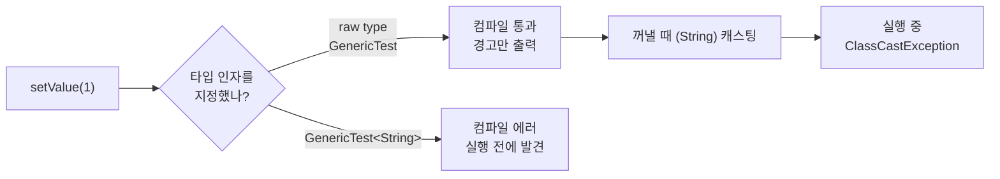

## 들어가며 (Situation)

학원 자바 수업이 네 번째 챕터(`chap04-generic-and-collection`)로 넘어갔다. 지난 챕터에서 상속과 다형성을 배웠고([지난 글]({{ site.baseurl }})), 이번 챕터의 첫 주제는 **제네릭(Generic)**이다.

오늘 제네릭 기초 시간에 만든 파일은 두 개다.

| 파일 | 내용 |
|------|------|
| `a_generic/a_basic/GenericTest.java` | 타입 변수 `<T>`를 가진 클래스, getter/setter, `toString()` |
| `a_generic/a_basic/Application.java` | 제네릭 없이 쓰기 / `<String>` 지정 / `<Integer>` 지정 비교 |

이 글은 오늘 코드를 JDK 21로 다시 컴파일하고, 주석으로 막아둔 줄을 하나씩 풀어서 컴파일러가 실제로 무엇을 막는지 확인한 기록이다.

## 문제 상황 (Task)

수업 주석에는 제네릭을 이렇게 적었다.

> 클래스나 메소드에서 사용할 내부 데이터 타입을 컴파일 시점에 지정하는 방법. 컴파일 시점에 미리 타입 검사를 진행하여 타입 안정성을 높일 수 있다.

문장은 외웠지만 "타입 안정성이 높아진다"는 게 구체적으로 어떤 상황을 막아준다는 건지 와닿지 않았다. 그래서 다음 세 가지를 확인하는 것을 과제로 잡았다.

1. `<T>`를 안 쓰고 `new GenericTest()`로 만들면 무슨 일이 생기는가?
2. `GenericTest<int>`는 왜 안 되고 `GenericTest<Integer>`는 되는가?
3. 주석에 적은 `toString()` 설명("변수 출력 시 주소값이 출력된다")이 정확한가?

## 해결 과정 (Action)

### 1. 타입 변수 `<T>` — 타입을 "나중에" 정하는 자리

`GenericTest`는 값 하나를 담는 단순한 클래스다. 핵심은 클래스 이름 뒤의 `<T>`다.

```java
public class GenericTest<T> {

    private T value;

    public T getValue() {
        return value;
    }

    public void setValue(T value) {
        this.value = value;
    }
}
```

`T`는 **타입 변수**다. 클래스를 만들 때는 아직 어떤 타입인지 정하지 않고, 객체를 만드는 쪽에서 `GenericTest<String>`처럼 정한다. 그 순간 클래스 안의 `T`가 전부 `String`으로 바뀐 것처럼 동작한다. `T`라는 이름은 Type의 머리글자로 붙이는 관례일 뿐이고, 공식 튜토리얼에는 `E`(Element), `K`(Key), `V`(Value), `N`(Number) 같은 관례도 함께 소개되어 있다([Oracle Tutorials - Generic Types](https://docs.oracle.com/javase/tutorial/java/generics/types.html)).

| 객체 생성 코드 | `T`가 되는 타입 | `setValue()`에 넣을 수 있는 값 |
|----------------|-----------------|-------------------------------|
| `new GenericTest<String>()` | `String` | 문자열만 |
| `new GenericTest<Integer>()` | `Integer` | 정수만 |
| `new GenericTest()` | 정하지 않음 (raw type) | 아무거나 |

`new GenericTest<>()`처럼 오른쪽 `<>`를 비워도 되는 것은 왼쪽 변수 타입을 보고 컴파일러가 추론해주기 때문이다. 이 빈 `<>`를 **다이아몬드**라고 부른다.

### 2. 제네릭 없이 쓰면 — 실행은 되지만 경고가 뜬다

수업 코드의 첫 부분은 일부러 `<T>`를 지정하지 않았다.

```java
GenericTest gt = new GenericTest();
gt.setValue(1);
System.out.println("gt = " + gt.getValue());
gt.setValue("안녕하세요");
System.out.println("gt = " + gt.getValue());
```

실행하면 문제없이 출력된다.

```text
gt = 1
======================
gt = 안녕하세요
```

같은 변수에 정수도 넣고 문자열도 넣었는데 잘 돌아가니 "제네릭 안 써도 되는 거 아냐?"라는 생각이 들었다. 그런데 `-Xlint:all` 옵션으로 경고를 켜고 컴파일해보니 이 네 줄에서만 경고가 **4개** 나왔다.

```bash
javac -encoding UTF-8 -Xlint:all -d out $(find . -name "*.java")
```

```text
Application.java:16: warning: [rawtypes] found raw type: GenericTest
        GenericTest gt = new GenericTest();
        ^
  missing type arguments for generic class GenericTest<T>
Application.java:16: warning: [rawtypes] found raw type: GenericTest
Application.java:17: warning: [unchecked] unchecked call to setValue(T) as a member of the raw type GenericTest
Application.java:20: warning: [unchecked] unchecked call to setValue(T) as a member of the raw type GenericTest
```

타입 인자를 빼고 쓴 `GenericTest`를 **raw type**이라고 한다. 공식 튜토리얼은 raw type이 제네릭 이전(Java 5 이전) 코드와의 호환을 위해 남아 있을 뿐이고, 타입 검사를 건너뛰므로 피해야 한다고 설명한다([Oracle Tutorials - Raw Types](https://docs.oracle.com/javase/tutorial/java/generics/rawTypes.html)).

"검사를 건너뛴다"가 왜 위험한지 직접 확인해봤다. raw type에 정수를 넣고, 꺼낼 때 문자열이라고 착각하는 상황이다. (확인용 **예시 코드**)

```java
GenericTest gt = new GenericTest();
gt.setValue(1);
String s = (String) gt.getValue();   // 컴파일은 통과
```

```text
ClassCastException
```

컴파일은 통과하고, **실행 중에** 프로그램이 터졌다. 반면 `<String>`을 지정한 `gt2`에 정수를 넣는 줄(수업에서 주석 처리한 줄)을 풀면 컴파일 단계에서 바로 막힌다.

```java
GenericTest<String> gt2 = new GenericTest<>();
gt2.setValue(1);
```

```text
error: incompatible types: int cannot be converted to String
```



이걸 보고 나서야 "타입 안정성"이 무슨 뜻인지 이해됐다. **같은 실수를 실행 중이 아니라 컴파일할 때 발견하게 해주는 것**이다. 실행 중 에러는 그 코드가 실제로 실행될 때까지 숨어 있지만, 컴파일 에러는 프로그램을 돌려보기도 전에 빨간 줄로 알려준다.

### 3. `<int>`는 안 되고 `<Integer>`는 되는 이유

수업에서 주석 처리한 또 다른 줄은 기본 자료형을 넣는 코드다.

```java
GenericTest<int> gt3 = new GenericTest<int>();
```

```text
error: unexpected type
```

공식 튜토리얼의 제네릭 제약 사항 첫 번째가 바로 "기본 타입으로 제네릭 타입을 인스턴스화할 수 없다"이다([Oracle Tutorials - Restrictions on Generics](https://docs.oracle.com/javase/tutorial/java/generics/restrictions.html)). 타입 변수 자리에는 **참조 타입(클래스)**만 들어갈 수 있다. 그래서 기본 자료형을 객체로 감싼 **Wrapper 클래스**를 쓴다.

| 기본 자료형 | Wrapper 클래스 | 주의 |
|-------------|----------------|------|
| `byte` | `Byte` | |
| `short` | `Short` | |
| `int` | `Integer` | 이름이 다름 |
| `long` | `Long` | |
| `float` | `Float` | |
| `double` | `Double` | |
| `char` | `Character` | 이름이 다름 |
| `boolean` | `Boolean` | |

수업 주석에는 `long`, `float`, `double`이 빠져 있어서 표에 같이 정리했다. 대부분 첫 글자만 대문자로 바꾸면 되고 `int`와 `char` 두 개만 이름이 다르다.

그런데 이상한 점이 하나 있었다. `GenericTest<Integer>`의 `setValue()`는 `Integer`를 받는데, 수업 코드는 `gt3.setValue(1);`처럼 그냥 `int` 값 `1`을 넣었고 잘 동작했다. 컴파일러가 `int`를 `Integer` 객체로 **자동으로 감싸주기** 때문이다. 이것을 **오토박싱(autoboxing)**이라고 하고, 반대로 `Integer`를 `int`로 꺼내는 것을 언박싱이라고 한다([Oracle Tutorials - Autoboxing and Unboxing](https://docs.oracle.com/javase/tutorial/java/data/autoboxing.html)). 덕분에 Wrapper 클래스를 쓰더라도 코드에서는 숫자를 그대로 쓸 수 있다.

### 4. `toString()` 주석 다시 보기 — 정말 "주소값"일까?

`GenericTest`에는 IntelliJ가 만들어준 `toString()`이 있다. 수업 주석에는 이렇게 적었다.

> 클래스 자료형은 참조자료형이기 때문에 변수 출력 시 주소값이 출력되게 된다.

`toString()`이 없는 클래스를 출력해봤다. (확인용 **예시 코드**)

```java
class Plain { int v = 1; }

System.out.println(new Plain());
```

```text
x.Run$Plain@77459877
```

`클래스이름@16진수`가 나왔다. 이게 메모리 주소처럼 보이지만, `Object.toString()` 공식 문서를 보면 정확히는 `getClass().getName() + "@" + Integer.toHexString(hashCode())`, 즉 **클래스 이름과 해시코드를 16진수로 바꾼 값**이다([Java SE 21 API - Object.toString()](https://docs.oracle.com/en/java/javase/21/docs/api/java.base/java/lang/Object.html#toString())). 해시코드가 주소에서 만들어질 수도 있지만 명세가 보장하는 것은 아니어서 "주소값"이라고 단정하면 틀린 설명이 된다.

| 상황 | 출력 | 이유 |
|------|------|------|
| `toString()` 없음 | `Plain@77459877` | `Object`에게 물려받은 기본 `toString()` |
| `toString()` 오버라이딩 | `GenericTest{value=1}` | 내가 정의한 형식 |

지난 챕터에서 배운 **오버라이딩**이 여기서 다시 나온다. 모든 클래스는 `Object`를 상속하고, `println()`은 객체의 `toString()`을 호출한다. 그래서 `toString()`을 오버라이딩하면 내가 원하는 형식으로 출력된다.

## 결과 (Result)

오늘 제네릭 기초 코드를 모두 컴파일·실행하고, 주석 처리한 줄을 풀어서 컴파일러 반응을 확인했다.

| 확인한 내용 | 결과 | 의미 |
|-------------|------|------|
| raw type `GenericTest` 사용 | 경고 4개 (`rawtypes` 2, `unchecked` 2) | 타입 검사 건너뜀 |
| raw type에서 꺼내 `(String)` 캐스팅 | 실행 중 `ClassCastException` | 실수가 실행 때까지 숨음 |
| `GenericTest<String>`에 `1` 넣기 | 컴파일 에러 | 실수를 실행 전에 발견 |
| `GenericTest<int>` | 컴파일 에러 `unexpected type` | 타입 인자는 참조 타입만 |
| `GenericTest<Integer>`에 `1` 넣기 | 정상 | 오토박싱 |
| `toString()` 없는 객체 출력 | `클래스명@해시코드(16진수)` | **주석 수정**: 주소값이 아니라 해시코드 |

배운 점은 다음과 같다.

- 제네릭의 "타입 안정성"은 **실행 중 에러를 컴파일 에러로 앞당기는 것**이다. raw type은 돌아가긴 하지만 그 보호를 포기하는 셈이다.
- 타입 변수 자리에는 클래스만 들어가므로 `int` 대신 `Integer`를 쓰고, 값을 넣을 때는 오토박싱 덕분에 숫자를 그대로 쓸 수 있다.
- `toString()`의 기본 출력은 "주소"가 아니라 "클래스명@해시코드"다. 받아 적은 설명도 공식 문서로 확인해야 한다.

## 더 학습하면 좋은 개념

- **타입 소거(Type Erasure)** — 컴파일러는 타입 검사가 끝나면 `<T>` 정보를 지우고 `Object`(또는 제한 타입)로 바꾼다. raw type이 왜 여전히 동작하는지, 왜 `new T()`를 못 하는지 이해할 수 있다.
- **제네릭 메서드** — 클래스 전체가 아니라 메서드 하나에만 `<T>`를 붙이는 방법이다. `Collections.sort()` 같은 표준 라이브러리 메서드가 이렇게 만들어져 있다.
- **`equals()`와 `hashCode()`** — `toString()`에서 본 해시코드가 무엇인지, 두 메서드를 왜 함께 오버라이딩해야 하는지 알면 다음 시간의 `HashSet`이 훨씬 잘 이해된다.
- **오토박싱의 함정 (`Integer` 비교, `null` 언박싱)** — `Integer`끼리 `==`로 비교하면 값이 아니라 객체를 비교하고, `null`을 언박싱하면 `NullPointerException`이 난다. 편리한 만큼 주의할 점이 있다.

## 참고 자료

- [Oracle Java Tutorials - Generics](https://docs.oracle.com/javase/tutorial/java/generics/index.html)
- [Oracle Java Tutorials - Generic Types](https://docs.oracle.com/javase/tutorial/java/generics/types.html)
- [Oracle Java Tutorials - Raw Types](https://docs.oracle.com/javase/tutorial/java/generics/rawTypes.html)
- [Oracle Java Tutorials - Restrictions on Generics](https://docs.oracle.com/javase/tutorial/java/generics/restrictions.html)
- [Oracle Java Tutorials - Autoboxing and Unboxing](https://docs.oracle.com/javase/tutorial/java/data/autoboxing.html)
- [Java SE 21 API - Object.toString()](https://docs.oracle.com/en/java/javase/21/docs/api/java.base/java/lang/Object.html#toString())

---

**요약**
1. 제네릭은 `<T>` 자리에 타입을 나중에 정하는 문법이고, 타입 안정성이란 실행 중 `ClassCastException`이 날 실수를 컴파일 에러로 앞당기는 것이다.
2. 타입 인자를 빼고 쓴 raw type은 실행은 되지만 경고 4개를 받았고, 꺼낼 때 잘못 캐스팅하면 실행 중에 터졌다.
3. 타입 인자에는 참조 타입만 들어가서 `int` 대신 `Integer`를 쓰며(오토박싱으로 값은 그대로), `toString()` 기본 출력은 주소가 아니라 `클래스명@해시코드`다.
