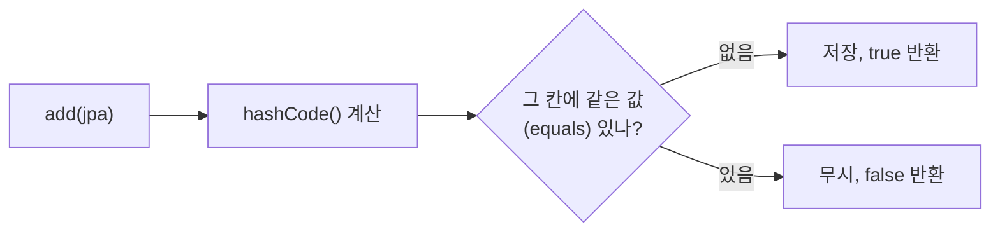
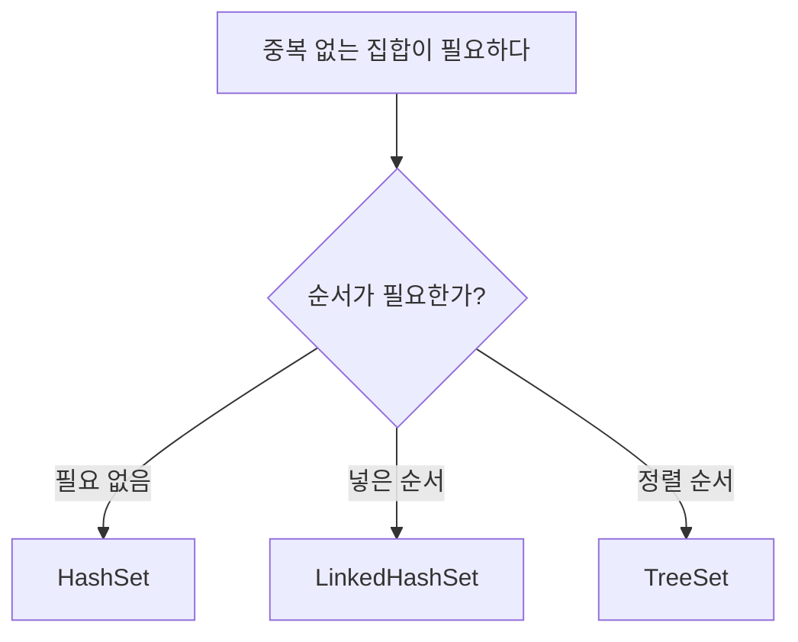

## 들어가며 (Situation)

[ArrayList 실습]({{ site.baseurl }})에 이어 수업 마지막에는 `b_collection/b_set` 패키지에서 `Set`을 다뤘다.

| 파일 | 내용 |
|------|------|
| `Application01.java` | `HashSet`에 과목 이름 저장, 중복 넣기 |
| `Application02.java` | `TreeSet`으로 1~45 중 숫자 7개를 뽑는 로또 추첨기 |

## 문제 상황 (Task)

수업 주석에 적은 `Set`의 특징은 두 가지다.

> 1. 요소의 저장 순서를 유지하지 않는다.
> 2. 같은 요소의 중복 저장을 허용하지 않는다.

`TreeSet`에는 이렇게 적었다.

> HashSet과의 차이는 이진 검색 트리 구조로 데이터의 정렬을 보장한다. 이진 검색 트리 구조의 장점은 데이터를 순회하면서 조회 시 매우 빠르다.

코드를 다시 실행하면서 확인하고 싶은 것이 세 가지 생겼다.

1. 중복을 넣으면 정확히 어떻게 되는가? 에러가 나는가, 조용히 무시되는가?
2. "순서를 유지하지 않는다"면, 순서를 유지하는 `Set`은 없는가?
3. `TreeSet`이 `HashSet`보다 "조회가 매우 빠르다"는 설명이 맞는가?

## 해결 과정 (Action)

### 1. HashSet — 다섯 번 넣고 중복 하나

```java
Set<String> hset = new HashSet<>();
hset.add("java");
hset.add("db");
hset.add("servlet");
hset.add("spring");
hset.add("jpa");
hset.add("jpa");   // 중복

System.out.println("hset = " + hset);
```

```text
hset = [spring, java, servlet, jpa, db]
```

여섯 번 넣었는데 다섯 개만 남았고, 넣은 순서(`java, db, servlet, spring, jpa`)와 출력 순서가 완전히 다르다. 주석에 적은 두 특징이 그대로 보인다.

**1번 질문 확인**: 중복을 넣을 때 에러는 나지 않았다. 그럼 실패했다는 걸 어떻게 알 수 있을까? `Set.add()`의 반환값을 찍어봤다. (확인용 **예시 코드**)

```java
Set<String> h = new HashSet<>();
System.out.println(h.add("jpa") + " " + h.add("jpa"));
```

```text
true false
```

`add()`는 **새로 들어갔으면 `true`, 이미 있어서 무시됐으면 `false`**를 돌려준다([Java SE 21 API - Set.add](https://docs.oracle.com/en/java/javase/21/docs/api/java.base/java/util/Set.html#add(E))). 수업 코드는 반환값을 쓰지 않아서 중복이 조용히 무시된 것처럼 보였을 뿐이다.

### 2. 순서가 섞이는 이유 — 해시

`HashSet` 공식 문서는 "반복 순서에 대해 어떤 보장도 하지 않는다"고 명시한다([Java SE 21 API - HashSet](https://docs.oracle.com/en/java/javase/21/docs/api/java.base/java/util/HashSet.html)). 내부적으로 `HashMap`을 사용하는데, 값의 `hashCode()`로 저장할 칸을 계산하기 때문에 넣은 순서가 아니라 **해시값이 가리키는 칸 순서**로 저장된다.



그림처럼 "같은 값인가"를 `hashCode()`와 `equals()`로 판단한다. 문자열은 `String`이 이 두 메서드를 내용 기준으로 오버라이딩해 두어서 `"jpa"`와 `"jpa"`가 같다고 판단된다.

**궁금해서 해본 실험**: 그럼 내가 만든 `BookDTO`도 중복이 걸러질까? 내용이 똑같은 책 두 권을 넣어봤다. (확인용 **예시 코드**)

```java
Set<BookDTO> bs = new HashSet<>();
bs.add(new BookDTO(1, "홍길동전", "허균", 50000));
bs.add(new BookDTO(1, "홍길동전", "허균", 50000));
System.out.println("size = " + bs.size());
```

```text
size = 2
```

걸러지지 않았다. `BookDTO`는 `equals()`와 `hashCode()`를 오버라이딩하지 않았으므로 `Object`의 기본 구현을 쓰고, 기본 구현은 **같은 객체인지**만 본다. `new`로 두 번 만들었으니 내용이 같아도 다른 객체다. 직접 만든 클래스를 `HashSet`에 넣으려면 두 메서드를 함께 오버라이딩해야 한다는 것을 알게 됐다([Java SE 21 API - Object.equals](https://docs.oracle.com/en/java/javase/21/docs/api/java.base/java/lang/Object.html#equals(java.lang.Object))).

### 3. 순서를 유지하는 Set — LinkedHashSet

**2번 질문 확인**: 중복은 막고 넣은 순서는 지키고 싶을 때가 있다. 공식 튜토리얼은 `Set` 구현체로 `HashSet`, `TreeSet`, `LinkedHashSet` 세 가지를 소개한다([Oracle Tutorials - The Set Interface](https://docs.oracle.com/javase/tutorial/collections/interfaces/set.html)). 같은 과목 이름으로 `LinkedHashSet`을 만들어봤다. (확인용 **예시 코드**)

```java
Set<String> l = new LinkedHashSet<>(List.of("java", "db", "servlet", "spring", "jpa"));
```

```text
[java, db, servlet, spring, jpa]
```

넣은 순서 그대로 나왔다. 그러니 주석의 "Set은 순서를 유지하지 않는다"는 정확히는 "**`Set` 인터페이스는 순서를 약속하지 않고, 구현체에 따라 다르다**"가 맞다.

### 4. TreeSet 로또 추첨기 — 정렬은 덤

```java
Set<Integer> lotto = new TreeSet<>();

while (lotto.size() < 7) {
    lotto.add((int)(Math.random() * 45) + 1);
}

System.out.println("lotto = " + lotto);
```

두 번 실행한 결과다.

```text
lotto = [1, 10, 11, 29, 32, 34, 41]
lotto = [3, 10, 22, 24, 30, 34, 37]
```

매번 다른 숫자가 나오지만 항상 **오름차순**이다. 정렬하는 코드를 한 줄도 쓰지 않았는데 `TreeSet`이 넣을 때마다 정렬된 위치에 저장하기 때문이다.

난수 식도 한 단계씩 풀어봤다. `Math.random()`은 0.0 이상 1.0 **미만**의 `double`을 돌려준다([Java SE 21 API - Math.random](https://docs.oracle.com/en/java/javase/21/docs/api/java.base/java/lang/Math.html#random())).

| 단계 | 식 | 범위 |
|------|----|------|
| 1 | `Math.random()` | 0.0 ≤ x < 1.0 |
| 2 | `* 45` | 0.0 ≤ x < 45.0 |
| 3 | `(int)` | 0 ~ 44 (소수점 버림) |
| 4 | `+ 1` | 1 ~ 45 |

수업 주석에는 `* 45`를 "난수의 최대값"이라고 적었는데, 정확히는 **나올 수 있는 값의 개수**(45개)이고 `+ 1`이 시작값이다. 1.0 미만이라 `(int)` 후 최대가 44이므로 `+ 1`을 해야 45까지 나온다.

이 코드가 `for (int i = 0; i < 7; i++)`가 아니라 `while (lotto.size() < 7)`인 이유도 실험으로 확인했다. 반복 횟수를 세어보니 이렇게 나왔다.

```text
[7, 15, 17, 24, 27, 29, 43] tries=8
```

7개를 얻는 데 8번이 걸렸다. 중간에 한 번 이미 뽑힌 숫자가 나와서 `add()`가 `false`로 무시된 것이다. `for`문으로 7번만 돌렸다면 6개만 남았을 수 있다. **중복을 알아서 버리는 Set의 성질과 "개수가 찰 때까지 반복"하는 `while`이 짝을 이루는 코드**였다.

### 5. "TreeSet은 조회가 매우 빠르다"는 맞을까?

**3번 질문 확인**: 공식 문서의 성능 설명을 나란히 놓고 비교했다.

| 항목 | `HashSet` | `LinkedHashSet` | `TreeSet` |
|------|-----------|-----------------|-----------|
| 내부 구조 | 해시 테이블 (`HashMap`) | 해시 테이블 + 연결 리스트 | 레드-블랙 트리 (`TreeMap`) |
| 반복 순서 | 보장 안 함 | 넣은 순서 | 정렬 순서 |
| `add` / `remove` / `contains` | 상수 시간 | 상수 시간 | log(n) 시간 |
| `null` 저장 | 가능 | 가능 | 기본 정렬 시 불가 |

[`HashSet`](https://docs.oracle.com/en/java/javase/21/docs/api/java.base/java/util/HashSet.html) 문서는 기본 연산이 **상수 시간**이라고 하고, [`TreeSet`](https://docs.oracle.com/en/java/javase/21/docs/api/java.base/java/util/TreeSet.html) 문서는 **log(n) 시간**을 보장한다고 한다. 즉 "특정 값이 있는지 찾기"는 오히려 `HashSet`이 더 빠르다. `TreeSet`이 내부에서 쓰는 [`TreeMap`](https://docs.oracle.com/en/java/javase/21/docs/api/java.base/java/util/TreeMap.html)은 이진 검색 트리 중에서도 균형을 스스로 맞추는 **레드-블랙 트리**다.

`TreeSet`의 진짜 장점은 속도가 아니라 **정렬된 상태를 유지한다**는 것이다. 그래서 로또처럼 "정렬된 결과"가 필요하거나, "가장 작은 값", "30보다 큰 첫 값" 같은 범위 조회가 필요할 때 고른다. 주석은 이렇게 고쳐 적었다.

> ~~이진 검색 트리 구조의 장점은 데이터를 순회하면서 조회 시 매우 빠르다~~
> → 정렬 순서로 순회할 수 있고, 최솟값·범위 조회에 강하다. 단순 포함 여부 확인은 `HashSet`이 더 빠르다.



## 결과 (Result)

| 확인한 내용 | 결과 |
|-------------|------|
| `HashSet`에 6번 `add` (중복 1개) | 5개 저장, 순서 섞임 |
| 중복 `add()` 반환값 | `true` → `false`, 에러 없음 |
| 내용 같은 `BookDTO` 2개를 `HashSet`에 | size 2 (중복 안 걸러짐) |
| `LinkedHashSet` | 넣은 순서 유지 |
| `TreeSet` 로또 2회 실행 | 매번 다른 7개, 항상 오름차순 |
| 로또 7개 뽑기 반복 횟수 | 8회 (중복 1회 무시) |
| "TreeSet 조회가 매우 빠르다" | **주석 수정**: `TreeSet` log(n), `HashSet` 상수 시간 |

배운 점은 다음과 같다.

- `Set`의 중복 판단은 `hashCode()`와 `equals()`로 한다. 그래서 `String`은 걸러지고, 두 메서드를 오버라이딩하지 않은 `BookDTO`는 걸러지지 않았다.
- "순서를 유지하지 않는다"는 `Set` 인터페이스 이야기이고, 구현체를 고르면 넣은 순서(`LinkedHashSet`)나 정렬 순서(`TreeSet`)를 얻을 수 있다.
- `TreeSet`을 고르는 이유는 속도가 아니라 정렬이다. 받아 적은 성능 설명도 공식 문서의 시간 복잡도로 확인해야 한다.

## 더 학습하면 좋은 개념

- **`equals()`와 `hashCode()` 규약** — 2번 실험에서 `BookDTO`가 걸러지지 않은 이유다. 둘 중 하나만 오버라이딩하면 `HashSet`, `HashMap`이 이상하게 동작한다.
- **`HashMap`과 해시 충돌** — `HashSet`의 내부가 바로 `HashMap`이다. 다음 수업의 `Map`을 배우기 전에 "칸이 겹치면 어떻게 되나"를 알아두면 좋다.
- **시간 복잡도(Big-O)** — 상수 시간 O(1), log(n) 시간 O(log n)이 무엇을 뜻하는지 알면 컬렉션 문서를 읽고 바로 선택할 수 있다.
- **`NavigableSet`의 범위 메서드** — `TreeSet`의 `first()`, `ceiling()`, `headSet()` 같은 메서드가 정렬된 집합의 진짜 쓸모를 보여준다.

## 참고 자료

- [Oracle Java Tutorials - The Set Interface](https://docs.oracle.com/javase/tutorial/collections/interfaces/set.html)
- [Java SE 21 API - Set.add](https://docs.oracle.com/en/java/javase/21/docs/api/java.base/java/util/Set.html#add(E))
- [Java SE 21 API - HashSet](https://docs.oracle.com/en/java/javase/21/docs/api/java.base/java/util/HashSet.html)
- [Java SE 21 API - TreeSet](https://docs.oracle.com/en/java/javase/21/docs/api/java.base/java/util/TreeSet.html)
- [Java SE 21 API - TreeMap](https://docs.oracle.com/en/java/javase/21/docs/api/java.base/java/util/TreeMap.html)
- [Java SE 21 API - Object.equals](https://docs.oracle.com/en/java/javase/21/docs/api/java.base/java/lang/Object.html#equals(java.lang.Object))
- [Java SE 21 API - Math.random](https://docs.oracle.com/en/java/javase/21/docs/api/java.base/java/lang/Math.html#random())

---

**요약**
1. `HashSet`은 해시값 칸 순서로 저장해서 넣은 순서가 섞이고, 중복은 에러 없이 `add()`가 `false`를 돌려주며 무시된다.
2. 중복 판단은 `hashCode()`와 `equals()`로 하므로, 두 메서드를 오버라이딩하지 않은 `BookDTO`는 내용이 같아도 2개 저장됐다.
3. `TreeSet` 로또는 정렬된 7개를 뽑아줬지만 기본 연산은 log(n)으로 `HashSet`(상수 시간)보다 느리다. 고르는 이유는 속도가 아니라 정렬이다.
